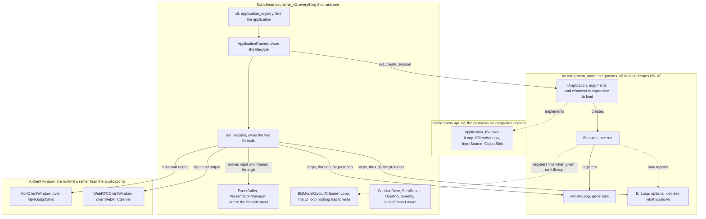
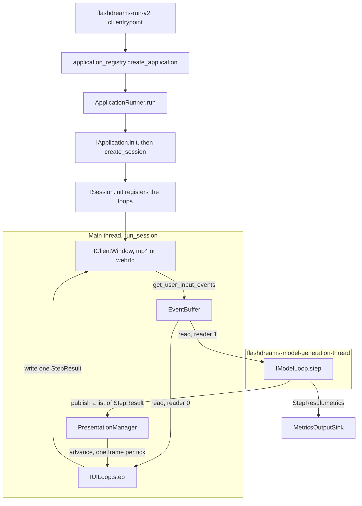

<!--
SPDX-FileCopyrightText: Copyright (c) 2026 NVIDIA CORPORATION & AFFILIATES. All rights reserved.
SPDX-License-Identifier: Apache-2.0
-->

# Architecture

How a FlashDreams application is put together, and what happens when one runs.

This is the mental model the v2 packages assume. Each package documents its own
surface in detail; the job here is to say how they fit together and why the seams
are where they are.

- [`flashdreams.api_v2`](flashdreams/flashdreams/api_v2/README.md) - the
  protocols an application implements.
- [`flashdreams.runtime_v2`](flashdreams/flashdreams/runtime_v2/README.md) - the
  machinery that runs one.
- [`integrations_v2`](integrations_v2/README.md) - how to write an application.
- [`flashdreams.t2v_v2`](flashdreams/flashdreams/t2v_v2/README.md) - the
  text-to-video layer built on all of it.

The model side has a mental model of its own, warmup, CUDA-graph capture, the
autoregressive-step body, ring attention, finalize, described in the
[inference pipeline overview](docs/source/developer_guides/inference_pipeline_overview.rst).
That covers what happens inside one generation step; this covers what drives the
steps.

## The shape of it

Four layers, each of which only knows about the one below.

An integration knows the protocols and the runtime knows the protocols, and
neither knows the other: every arrow crossing between them is a call through
`api_v2`. The runtime holds the only reference to a window, and an integration
holds none.

**An application** is what someone writes, and it names nothing beyond the two
protocols it implements — no windows, no sinks, no threads.

**A session** is one run of that application. It owns the state for the run and
registers the loops that do the work: a model loop that generates, and
optionally a UI loop that turns what was generated into what is shown.

**The runtime** owns everything else. It finds the application, decides which
session to ask for, creates the window, starts the threads, moves frames between
them, and closes it all down in the right order when the run ends.

**A client window** is where the run goes and where input comes from — an MP4
file, or a browser over WebRTC. Being the runtime's rather than the
application's is what lets one application write a file in a benchmark and
stream to a browser in a demo without knowing which is happening.

The seam that matters is between the session and the runtime. An application
describes what it would generate, the runtime honours that description, and from
then on the two communicate only through `StepResult` objects going one way and
input events going the other.

## A run, end to end

The same pieces again, but as calls rather than as layers: what happens in what
order, and on which thread.

Starting a run is ordered so that the cheap ways to fail happen first. The
command line resolves the application slug before it builds a window, so a name
nothing installed matches costs nothing to discover. It validates the window
arguments while it can still print usage, rather than after a checkpoint has
loaded. And an application is asked what it would generate before it is asked to
load anything, so a layout it was never going to accept is refused in
milliseconds rather than gigabytes.

Which session gets asked for is settled once, before the run: the application
says what it would generate, and the frame arguments on the command line are laid
over the top. An application that describes nothing gets the arguments alone.
After that the description is fixed, and both the session and the window are
configured from the same copy of it.

## Two threads

Generation and presentation run at different rates and cannot wait for each
other, so they get a thread each.

The **main thread**, whichever one called `run_session`, reads input from the
window, advances the presentation buffer, runs the UI loop, and writes the result
back to the window. It ticks at the session's UI rate, and it paces itself by
waiting on the shutdown event rather than sleeping, so a client closing is
noticed immediately rather than up to a tick later.

The **model thread** runs the model loop and publishes each result. It paces
itself to the session's step rate. Nothing else runs there, and it is the only
thread that touches model state.

This is the reason for most of the runtime's design. A window is only ever
touched from the main thread, so window implementations need no locking except
where their own backend delivers input from elsewhere. Model state is only ever
touched from the model thread, so a model needs none either. The two places the
threads do meet — input going one way, frames going the other — are the two
buffers below, and they are the only synchronised objects in the system.

Loops that genuinely need to reach across send a message instead of sharing
memory: `invoke_async` queues an operation against the other loop's state, and
that loop runs it on its own thread before its next step.

## Where the threads meet

**Input** is collected once, on the main thread, but both loops need it and they
read at different rates. `EventBuffer` holds a flat list of events plus a cursor
per reader, hands each reader only what it has not seen, and drops what they have
all passed.

**Frames** go the other way through `PresentationManager`, a bounded queue of
generated chunks. The UI thread takes one frame per tick, walking through the
frames within a chunk before taking another, so a step that generated twelve
frames is presented over twelve ticks rather than eleven being thrown away.

Because the queue is bounded, something has to give when the rates diverge, and
which thing gives is a session's choice rather than the runtime's. A session
declares whether a fast model should be held back or should drop old frames, and
whether a fast UI should re-present the newest frame or wait for a new one. A run
whose output has to be compared frame by frame picks the combination that keeps
every frame and shows each exactly once; an interactive run picks the one that
favours latency. The runtime does not decide this because the right answer
depends on what the run is for.

## Resets and failures

A **reset** is a client asking to start over without closing the window. It
arrives as an input event, and the event buffer turns it into a generation
number. Every loop and the presentation manager compare that number against
their own: loops reset their state and restart their step index, and frames
generated before the reset are discarded rather than shown. One counter is the
whole mechanism — none of those components has to know about the others.

A **failure** ends the run, and a loop's failure is the one reported: a loop
raised on either thread outranks one the main thread raised itself, whichever
happened first. A model-thread exception is handed to the session and sets the
shutdown event; the main thread then joins the thread, shuts the loops down,
closes every sink it opened, closes the session, closes the application, and only
then raises. Failures that happen during that cleanup are logged rather than
raised over the top of the failure that caused them, so a run always reports the
thing that actually went wrong.

A run ends normally in one of two ways: the client closes the window, or the
model loop reports itself finished and the last frames are shown. Both matter,
because one of the two windows has no client to close it — a run writing an MP4
depends entirely on the session knowing when it is done.

## Not built yet

- A third fixed-rate thread for game logic.
- A result field for the number of dropped frames.
- Slowing model generation before the presentation buffer fills.
