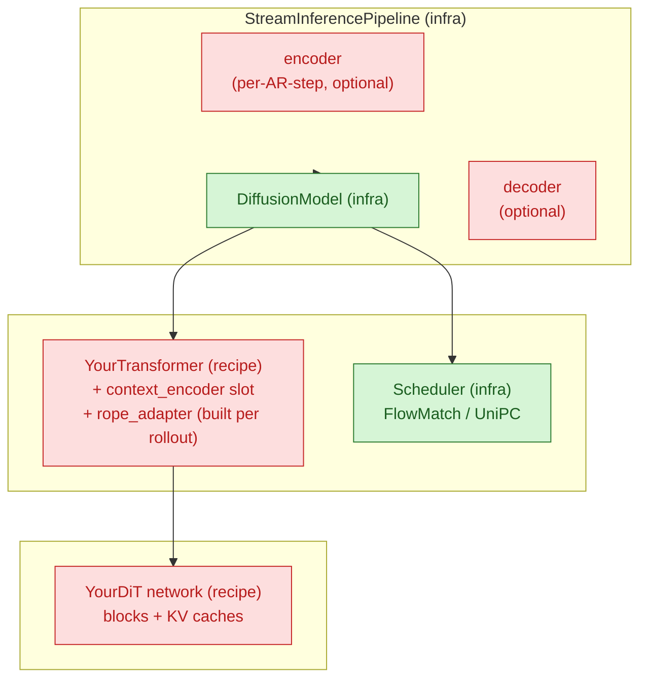

# flashdreams recipe architecture

A map of how `flashdreams/` is organized and how a single rollout flows through the framework. Read once before adding a recipe under `flashdreams/flashdreams/recipes/` or restructuring an existing one. Keep docstrings consistent with the `python-docstring-style` skill.

> **The fastest way to learn this codebase is to clone the structure of `recipes/template/`.** It is the reference recipe — every contract this skill describes is wired up there in its minimal form. Skim it side-by-side with this document.

## TL;DR

- Three layers, strict dependency direction: `core` → `infra` → `recipes`. `infra` and `core` never import from `recipes`. Recipes may import from each other to reuse a sibling recipe's transformer/encoder/decoder.
- A recipe = a `Pipeline` that owns a `DiffusionModel` + optional `Encoder` / `StreamingDecoder`. The `DiffusionModel` owns a `Transformer` + a `Scheduler`. You author the recipe-specific subclasses of these and a `build_*(...)` config builder.
- Per-rollout state lives in nested `*Cache` dataclasses that mirror the same containment tree.
- Lifecycle: `pipeline.initialize_cache(...)` once, then a loop of `pipeline.generate(ar_idx, ...)` + `pipeline.finalize(ar_idx, ...)`.
- Two shape regimes, separated by `transformer.patchify_and_maybe_split_cp`: pre-patchify `[B, C, T, H, W]` outside, post-patchify `[B, L/cp, C]` inside.

## 1. Codebase layout

```
flashdreams/
├── core/        reusable numerical primitives (no recipe-specific code, no infra deps)
├── infra/       framework contracts + orchestration (ABCs, base configs, pipeline glue)
└── recipes/     concrete model bindings that satisfy the infra contracts
```

| Layer    | Owns                                                                                                                                                                                                                                | Imports from |
|----------|--------------------------------------------------------------------------------------------------------------------------------------------------------------------------------------------------------------------------------------|--------------|
| `core/`  | `attention/` (`NativeAttention`, `RingAttention`, `BlockKVCache`, `RotaryPositionEmbedding3D`, `apply_rope_freqs`), `checkpoint/load.py`, `distributed/` (`split_inputs_cp`, `cat_outputs_cp`, `*_object_list`), `io/`             | nothing in flashdreams |
| `infra/` | `config` (`InstantiateConfig`, `derive_config`), `pipeline` (`StreamInferencePipeline*`), `diffusion.{model, scheduler, transformer}` (ABCs + base impls), `encoder` (`Encoder` + `StreamingEncoder` + `StreamingVideoEncoder` + `NullEncoder`), `decoder` (`StreamingDecoder` + `StreamingVideoDecoder`), `compile`, `cuda_graph`, `profiler` | `core`       |
| `recipes/<name>/` | concrete model: `transformer/`, optional `encoder.py` / `decoder.py` / `pipeline.py`, `config.py` builders                                                                                                                  | `core`, `infra` |

### Where does this code go?

| Question                                                | Layer                              |
|---------------------------------------------------------|------------------------------------|
| New attention kernel or shared CUDA utility             | `core/`                            |
| Reusable text/CLIP encoder any recipe could use         | `infra/encoder/<kind>/`            |
| New ABC or generic orchestrator                         | `infra/`                           |
| Model-specific DiT, control encoder, or VAE             | `recipes/<name>/`                  |
| CLI entry point or profiling script                     | `flashdreams/examples/run_*.py`    |

If you're tempted to add a recipe-specific branch in `infra/` or `core/` — expose a config slot or override hook instead.

## 2. What a pipeline contains

The whole framework is built around three nested objects: pipeline, diffusion model, transformer. Each layer (a) holds the next layer down and (b) holds a per-rollout cache that mirrors the same shape.



**Containment, top-down:**

- `StreamInferencePipeline` (use as-is in most cases)
  - `encoder: StreamingEncoder | None` (optional; per-AR-step control like HDMap, camera, first-frame VAE)
  - `diffusion_model: DiffusionModel`
    - `transformer: YourTransformer` ← you write this
      - `network: YourDiT` ← you write this
      - `context_encoder: Encoder` (one-shot encoder slot — text / CLIP-image / `NullEncoder`)
      - `rope_adapter: RotaryPositionEmbedding3D` (built per rollout, lives on the cache)
    - `scheduler: FlowMatchScheduler | UniPCScheduler` (pick from `infra.diffusion.scheduler`)
  - `decoder: StreamingDecoder | None` (optional; latent → pixels). Use `StreamingVideoDecoder` when the decoder is a pixel-video VAE.

**The per-rollout cache mirrors that tree** (`StreamInferencePipelineCache` → `transformer_cache` → `network_cache`). Each level forwards `before_update` / `after_update` to the level below.

### One-shot context vs per-AR-step control input

There are **two encoder slots**, and they take different base classes. Confusing them is the most common pitfall.

| Slot                                          | Runs                                | Base class                  | Input                              | Disable             |
|-----------------------------------------------|-------------------------------------|-----------------------------|------------------------------------|---------------------|
| `transformer.context_encoder` (one-shot)      | once, in `initialize_autoregressive_cache` | `Encoder` (stateless)       | text prompts, reference image      | `NullEncoderConfig()` |
| `pipeline.encoder` (per-AR-step)              | every AR step, in `pipeline.generate` | `StreamingEncoder` (stateful, has cache) | per-step control (HDMap, camera, hand-crafted control latent) | `encoder=None`      |

Text encoders (subclass `Encoder`) go on `context_encoder`. Per-AR-step controls (subclass `StreamingEncoder`) go on `pipeline.encoder`. Putting a text encoder on the per-AR-step slot reruns it every step; putting a streaming encoder on the one-shot slot drops its cache.

The decoder slot (`pipeline.decoder`) takes a `StreamingDecoder` (stateful, `forward(input, ar_idx, cache)`). Use `StreamingVideoDecoder` for pixel-video VAEs (WAN VAE, TAEHV) — it adds the spatial / temporal compression contracts the pipeline needs to size pixel I/O. Stateless decoders just return an empty `StreamingDecoderCache` from `initialize_autoregressive_cache` and ignore `autoregressive_index` / `cache` in `forward` (see `template/decoder.py`).

**Where the per-AR-step control tensor flows.** This is the path a new control input (HDMap, camera trajectory, ...) takes through the framework. Defining a new control = author one `StreamingEncoder` subclass under `recipes/<name>/encoder.py` and consume the `control` arg inside your network's forward.

```
user passes raw control as `pipeline.generate(ar_idx, cache, input=hdmap)`
          │     [B, C_ctrl, T, H, W]
          ▼
pipeline.encoder.forward(input, ar_idx, cache.encoder_cache)        ← recipes/<name>/encoder.py
          │     [B, C_latent, T, H, W]   (still pre-patchify; same T/H/W as the noisy latent)
          ▼
diffusion_model.generate(ar_idx, transformer_cache, input=encoded)
          │
          ├── transformer.patchify_and_maybe_split_cp(encoded)
          │     [B, L/cp, C]
          │
          └── scheduler loop:
                transformer.predict_flow(noisy, t, cache, input=patchified_control)
                  └── network.forward(noisy, ..., control=patchified_control)
                        └── x = input_proj(noisy) + input_proj(control)   # additive bias
```

Two corollaries:

- **The encoder's output shape must match the noisy latent's pre-patchify shape** so the same `patchify_and_maybe_split_cp` call works on both, and so the network can fuse them as an additive bias on the per-token channel dim.
- **`encoder=None` round-trips `input=None` end-to-end.** Your network's `forward` should treat `control=None` as "skip the control bias" — `recipes/template/transformer/network.py` is the reference. This lets the same recipe support both controlled and uncontrolled rollouts without a separate config.

## 3. Anatomy of a recipe

A minimum viable recipe (what `recipes/template/` ships) is **3 files and 4 classes**:

```
recipes/<name>/
├── transformer/
│   ├── __init__.py          YourTransformerConfig + YourTransformerCache + YourTransformer
│   └── network.py           YourDiTConfig + YourDiTCache + YourDiT
└── config.py                build_<variant>(...) → StreamInferencePipelineConfig
                             <NAME>_CONFIG_BUILDERS dict
```

Add files only when you actually need them:

| File                | When to add                                                         |
|---------------------|---------------------------------------------------------------------|
| `encoder.py`        | recipe needs a per-AR-step control input                            |
| `decoder.py`        | recipe owns the latent → pixel stage                                |
| `pipeline.py`       | rare — only when `pipeline.initialize_cache(...)` needs a custom signature (e.g. derive per-rollout `(height, width)` from an input image, accept text strings instead of pre-encoded embeddings) |
| `transformer/impl/` | network is large enough to split (`modules.py`, `network.py`, ...)  |
| `config/`           | many shipped variants — split `config.py` into a package            |
| `transformer/constants.py` | transformer-scoped constants (e.g. CFG negative prompt). Recipe-wide URIs go in `<recipe>/constants.py`; subpackage-specific constants live with the consumer. |

### What you have to implement

The contracts are all under `flashdreams.infra`. Subclass and override.

- **`Transformer[YourCache]`** (`infra.diffusion.transformer`)
  - `__init__(config)` — **single argument**. Don't take a `device` kwarg; the caller does `model.to(device)` (or `pipeline.setup().to(device)`). Keep `__init__` cheap: build sub-modules, derive `_cuda_graph_capture_ar_idx`, leave `_output_height = _output_width = None` until cache build time.
  - `latent_shape` (property) — **per-rank** post-patchify shape (already CP-divided). Asserts `_output_height` / `_output_width` are set; reading before `initialize_autoregressive_cache` must fail loudly.
  - `patchify_and_maybe_split_cp(x)` / `unpatchify_and_maybe_gather_cp(x)` — the only place the pre/post-patchify boundary crosses.
  - `predict_flow(noisy_latent, timestep, cache, input=None)` — one flow-match forward, with CFG merge when `cache.network_cache_uncond` is populated.
  - `initialize_autoregressive_cache(*, height, width, **transformer_context)` — receives the per-rollout spatial layout, stashes it as `self._output_height` / `self._output_width`, runs context encoders, allocates KV buffers, builds the `RotaryPositionEmbedding3D` adapter, lazy-builds `CUDAGraphWrapper`s, and returns `YourCache`. Do all divisibility checks here (`H % patch_spatial == 0`, `L % cp_size == 0`, ...).
  - Optional: `postprocess_clean_latent` (e.g. I2V first-frame pin), `finalize_kv_cache` (default runs one extra `predict_flow` to advance the cache).

- **`YourTransformerCache(TransformerAutoregressiveCache)`** — an `@dataclass(kw_only=True)` carrying `network_cache`, `network_cache_uncond | None`, `rope_adapter`, `rope_freqs | None`, `autoregressive_index`. Its `start(ar_idx)` and `finalize(ar_idx)` hoist KV `before_update` / `after_update` and the RoPE shift out of the (potentially graph-captured) network forward. See `recipes/template/transformer/__init__.py`.

- **`YourTransformerConfig(InstantiateConfig[YourTransformer])`** — exposes the standard knobs (see §5).

- **`Encoder` / `StreamingEncoder` / `StreamingDecoder`** (only if you ship them — pick the right base class for the slot):
  - **`Encoder`** (stateless, slim `forward(self, input)`) — `transformer.context_encoder` only. Text encoders (UMT5, Cosmos-Reason1), CLIP image encoders, identity (`NullEncoder`).
  - **`StreamingEncoder[YourCache]`** (`forward(self, input, autoregressive_index, cache)` + `initialize_autoregressive_cache(**encoder_context)`) — `pipeline.encoder` only. Per-AR-step controls (HDMap, camera, I2V first-frame VAE).
  - **`StreamingVideoEncoder[YourCache]`** (subclass of `StreamingEncoder`) — pixel-video encoders. Adds the `spatial_compression_ratio` / `temporal_compression_ratio` properties plus the AR-step-aware `get_output_temporal_size(ar_idx, input_T)` / `get_input_temporal_size(ar_idx, output_T)` mappers. Subclass this whenever the pipeline needs to size pixel I/O without knowing the encoder's causal-padding topology — e.g. WAN VAE encoder, PixelShuffle pseudo-VAE, the I2V wrappers around them.
  - **`StreamingDecoder[YourCache]`** (`forward(self, input, autoregressive_index, cache)` + `initialize_autoregressive_cache(**decoder_context)`) — `pipeline.decoder`. Stateful decoders (e.g. WAN VAE) thread a per-rollout cache across AR steps; stateless decoders (e.g. `template/decoder.py`'s 1×1 Conv3d) just return an empty `StreamingDecoderCache` and ignore the cache argument.
  - **`StreamingVideoDecoder[YourCache]`** (subclass of `StreamingDecoder`) — pixel-video decoders. Adds the `spatial_compression_ratio` / `temporal_compression_ratio` properties plus the AR-step-aware `get_output_temporal_size(ar_idx, input_T)` / `get_input_temporal_size(ar_idx, output_T)` mappers. Subclass this (instead of plain `StreamingDecoder`) whenever the pipeline needs to size pixel I/O without knowing the decoder's causal-padding / sliding-window topology — e.g. WAN VAE, TAEHV.

- **Pipeline subclass** — almost never. Use `StreamInferencePipelineConfig` directly and plug encoders into the slots above.

## 4. The rollout lifecycle

A "rollout" = build a cache once, then loop AR steps. Bidirectional models are N=1; streaming AR is N≥2.

```
pipeline.initialize_cache(*, image=None, height=None, width=None, ...)
  ├── derive (height, width) from image.shape[-2:] OR from explicit kwargs
  ├── pack into transformer_context = {"height": H, "width": W, ...}
  └── transformer.initialize_autoregressive_cache(**transformer_context)
        ├── self._output_height, self._output_width = height, width
        ├── assert H % patch_spatial == 0, (T*H*W) % cp_size == 0, ...
        ├── context_encoder(context) → context_embeddings
        ├── if guidance_scale > 1.0: context_encoder(negative_context)
        ├── allocate KV slots (cond + optional uncond)
        ├── build RotaryPositionEmbedding3D for this (height, width, head_dim)
        └── if use_cuda_graph: build two CUDAGraphWrapper(network)

for ar_idx in range(N):
    pipeline.generate(ar_idx, cache, input)
      ├── encoder.forward(input, ar_idx, ...)        # optional, per-AR-step control
      ├── diffusion_model.generate(ar_idx, ...)
      │     ├── transformer.patchify_and_maybe_split_cp(input)
      │     ├── cache.start(ar_idx)                  # rope_freqs = shift_t; KV before_update
      │     ├── noisy = randn(transformer.latent_shape)
      │     ├── for _ in range(num_inference_steps):
      │     │     scheduler.step(noisy, t, predict_flow)
      │     │       └── transformer.predict_flow(...)         # CFG merge inside
      │     ├── transformer.postprocess_clean_latent(...)     # e.g. I2V pin
      │     └── transformer.unpatchify_and_maybe_gather_cp(clean)
      └── decoder.forward(clean, ar_idx, ...)        # optional, latent → pixels

    pipeline.finalize(ar_idx, cache)
      └── diffusion_model.finalize(...)
            ├── if context_noise > 0: scheduler.add_noise(clean, context_noise)
            ├── transformer.finalize_kv_cache(noisy, ...)     # one extra predict to advance KV
            └── cache.finalize(ar_idx)                        # KV after_update
```

### The shape boundary

There are exactly two shape regimes, separated by patchify:

- **Pre-patchify** (user, pipeline, encoder, decoder): `[B, C, T, H, W]` for video, `[B, N_ctx, D]` for context.
- **Post-patchify** (network, scheduler, KV cache): `[B, L/cp, C]` with `L = T*H*W`.

`patchify_and_maybe_split_cp` is the only place that boundary crosses. Never CP-split or gather at a call site.

## 5. Cross-cutting conventions

Compressed reference. The first time you touch one of these, also read the matching code in `recipes/template/`.

### Configs and builders

- Every config: `@dataclass(kw_only=True)` extending `InstantiateConfig[Target]`, with `_target = field(default_factory=lambda: Target)`. **Never** use a bare instance as a default — always `field(default_factory=...)`.
- **Avoid `__post_init__`.** It's a smell:
  - *Derived sub-config fields* (e.g. `network.in_dim = base + control_channels`) belong in the **builder** — set the final value when you construct the sub-config. Fold conditional channel math into the builder so `network.in_dim` is the actual integer the network sees.
  - *Cross-field constants* derived purely from config (e.g. `_cuda_graph_capture_ar_idx`) belong on the **transformer instance**, computed in `__init__`. The config should be pure data.
  - *Per-rollout shape checks* (divisibility, etc.) belong in `initialize_autoregressive_cache`, not on the config — `(height, width)` aren't config fields.
  - If you can't move it, the validation probably belongs at instantiation time anyway. Keeping configs `__post_init__`-free makes them trivially serializable and `derive_config`-friendly.
- One `build_<variant>(...) -> StreamInferencePipelineConfig` per shipped variant in `config.py`. Keyword-only, sensible defaults.
- Register them in `<NAME>_CONFIG_BUILDERS: dict[str, Callable[..., StreamInferencePipelineConfig]]`.
- Derive variants with `derive_config(base, **changes)` instead of duplicating builder bodies. Publish reusable derive-patches as helpers (template ships `with_compile_and_cuda_graph(base)`).
- Export builder-side spatial defaults (`DEFAULT_VIDEO_HEIGHT`, `DEFAULT_VIDEO_WIDTH`, `<NAME>_VAE_SPATIAL_COMPRESSION`) as **module-level constants without leading underscore** in `config.py`. Examples and integrations import these to compute latent dimensions; keeping them private forces every caller to hard-code the same numbers.

### Standard transformer config knobs

Keep these names stable across recipes — tests and tooling look for them:

`network`, `context_encoder` (defaults to `NullEncoderConfig()`), `dtype`, `checkpoint_path` (`None` → random init), `len_t`, `window_size_t`, `sink_size_t`, `guidance_scale`, `compile_network`, `use_cuda_graph`, `cuda_graph_warmup_iters`, `h_extrapolation_ratio`, `w_extrapolation_ratio`. Plus a `requires_negative_context_embeddings` property → `guidance_scale > 1.0`.

**Not config fields:** `height`, `width`, `cp_size`, `device`. These are per-rollout (`height`/`width` → `initialize_autoregressive_cache`), launch-time (`cp_size` → auto-detect from `torch.distributed`), or call-site (`device` → `model.to(device)`).

### Per-rollout spatial layout (`height`, `width`)

`(height, width)` are **pre-patchify pixel-latent dimensions** for the rollout. They belong on `initialize_autoregressive_cache`, not the config:

- The pipeline derives them and forwards them inside `transformer_context`. For I2V the pipeline reads them off `image.shape[-2:]`; for T2V the pipeline accepts explicit `height`/`width` kwargs (see `recipes/wan/pipeline.py` for the I2V-or-explicit-fallback pattern).
- The transformer stashes them as `self._output_height` / `self._output_width` — **raw pre-patchify dims, not divided by `patch_spatial`**. Compute `pH = _output_height // network.patch_spatial` inline at the use site (`latent_shape`, `unpatchify_and_maybe_gather_cp`, `_build_network_cache`). Storing the pre-patchify value keeps the variable's meaning unambiguous and matches what the user passed in.
- Builders (`config.py`, `conditioning_wrapper.py`) **never set `network.height`/`width`** on the transformer config — they're not there. They configure the *static* fields of `network` (`additional_concat_ch`, `enable_cross_view_attn`, `in_dim`, ...) and let `initialize_autoregressive_cache` thread the per-rollout shape.
- Guards that depend on the rollout shape (`(L = T*H*W) % cp_size == 0`, `H % patch_spatial == 0`) live in `initialize_autoregressive_cache`, not `__post_init__`.

### Context parallelism (CP)

- **Auto-detect `cp_size`** at transformer construction from `torch.distributed.get_world_size()`; fall back to `1` when not initialized. The launcher (`torchrun --nproc_per_node=N`) is the single source of truth — don't hard-code `cp_size` on the recipe config.
- Use `flashdreams.core.distributed.{split_inputs_cp, cat_outputs_cp}`; `cp_group=None` is the single-GPU no-op. Use the `_object_list` variants for per-view strings.
- Prefer `flashdreams.core.attention.RingAttention` over manual all-gather + SDPA — it fuses the cross-rank KV gather with the SDPA call via an LSE merge.
- Assert divisibility (`L % cp_size == 0` etc.) at cache build time (inside `initialize_autoregressive_cache`) with a readable message — `(height, width)` aren't known at config-construction time.

### Classifier-free guidance (CFG)

- Off when `guidance_scale == 1.0` and `cache.network_cache_uncond is None`. Short-circuit `predict_flow` to the cond branch in that case; otherwise return `flow_uncond + s * (flow_cond - flow_uncond)`.
- `requires_negative_context_embeddings` drives the assertion: CFG on requires `negative_context` at cache build time. Only encode it inside that `if` branch — CFG-off rollouts shouldn't pay for it.
- When using `CUDAGraphWrapper`, allocate **two independent wrappers** (cond + uncond). The residual streams diverge at the first context-bias addition and must not share static buffers.

### KV cache + `torch.compile` + CUDA graphs

The interaction here is subtle — only opt in once eager works.

- `BlockKVCache` has two code paths: *filling* (append + slice) and *steady-state* (roll-left + overwrite). Each is a separate Dynamo subgraph and autotunes separately the first time it runs.
- Compile with `compile_module(network)` (pins `mode="max-autotune-no-cudagraphs"` so `torch.compile` doesn't manage its own CUDA graphs).
- Wrap the compiled module in `CUDAGraphWrapper(network, warmup_iters=cfg.cuda_graph_warmup_iters)`. `warmup_iters >= 2` drains Inductor autotune on the eager path before capture.
- **Build the wrapper inside `initialize_autoregressive_cache`**, not `__init__`. The graph captures against the current KV-cache pointers; a fresh rollout (new H/W, new cache) needs a fresh wrapper. CFG → two wrappers.
- Dispatch per AR step via a precomputed threshold stored **on the transformer instance**, set once in `__init__` (it depends only on config):
  - `self._cuda_graph_capture_ar_idx = (cfg.sink_size_t + cfg.window_size_t) // cfg.len_t`
  - `ar_idx <` threshold → `wrapper.drain` (eager — drains autotune AND exercises the cache's filling path).
  - `ar_idx >=` threshold → `wrapper.__call__` (warmup → capture → replay).
- Keep the threshold off the *config*. Config is data; this is a derived runtime quantity. Computing it in `__init__` (not `__post_init__`) keeps the config trivially serializable and lets `derive_config` round-trip cleanly.
- If you see `cudaErrorStreamCaptureUnsupported`, autotune is firing inside capture — re-check the threshold and that `.drain` is used throughout filling.
- The template defaults `compile_network=False` and `use_cuda_graph=False` for ease of debugging. Production recipes (Wan, Lingbot, Alpadreams) flip `compile_network=True` as the default in `Wan21TransformerConfig`-style configs and rely on `with_compile_and_cuda_graph(base)` to additionally enable CUDA graphs. Mirror whichever default matches the recipe's intended deployment.

### 3D RoPE

`flashdreams.core.attention.RotaryPositionEmbedding3D` is the shared 3D RoPE for every (T, H, W)-patchified DiT. Use it instead of hand-rolling.

- **Build per rollout, not in `__init__`.** `head_dim` and the per-rollout `len_h`/`len_w` are only known once `(height, width)` are passed to `initialize_autoregressive_cache`. Right after building, call `rope_adapter.set_context_parallel_group(self._cp_group)` so frequency buffers get split along the seq dim.
- **Stash the adapter on the per-rollout cache.** `cache.start(ar_idx)` computes `cache.rope_freqs = rope_adapter.shift_t(ar_idx)` once per AR step, hoisting it out of the network forward. Reuse the same `rope_freqs` for cond and uncond branches.
- **Apply RoPE before `kv_cache.update(k, v)`** — cached K's must already carry positional info, otherwise steady-state attention reads unrotated K's against rotated Q's.
- `interleaved=True` for Wan-style models; default `False` matches the half-split layout.
- NTK extrapolation: `h_extrapolation_ratio` / `w_extrapolation_ratio` (and optionally `t_extrapolation_ratio`) raise the base θ for higher resolution / longer context.

### Scheduler

Pick from `infra.diffusion.scheduler`: `FlowMatchSchedulerConfig` (self-forcing, 1–4 step) or a UniPC variant (full 35–50 step bidirectional). The scheduler config is a field on `DiffusionModelConfig`, not on the recipe or pipeline config.

### Checkpoint loading

```python
if config.checkpoint_path is not None:
    state_dict = load_checkpoint(config.checkpoint_path)
    self.network.load_state_dict(state_dict)
```

`checkpoint_path=None` keeps the random init — the right default for unit tests. Pass a `state_dict_transform` on your transformer config when upstream training adds a prefix (`net.`, `generator_ema.model.`, etc.).

## 6. Testing

### 6.1 Where tests live

```
flashdreams/tests/
├── test_<recipe>.py            CPU smoke + config-wiring (one per recipe)
├── <recipe>/                   GPU parity / benchmark bundles
│   ├── test_<thing>.py
│   ├── _<frozen_ref>.py        legacy reference, intentionally not packaged
│   └── conftest.py             only when sibling files need sys.path injection
└── <topic>/                    cross-recipe topic tests (scheduler/, wanvae/, taehv/)
    └── test_*.py
```

- **`tests/test_<recipe>.py`** — top-level smoke. Targets: import + config-wiring + (optional) `.setup()` on CPU. Models: `tests/test_template.py`, `tests/test_alpadreams.py`, `tests/test_flashvsr.py`. CI runs these.
- **`tests/<recipe>/test_*.py`** — recipe sub-tests, typically GPU parity vs frozen references and per-stage benchmarks. Models: `tests/flashvsr/test_dit_replacement.py`, `tests/flashvsr/test_tcdecoder_replacement.py`, `tests/flashvsr/test_projector_cuda_graph.py`.
- **Frozen reference snapshots** sit alongside as `_<thing>.py` (single underscore prefix). Examples: `tests/flashvsr/_wan_model_dit.py`, `_tcdecoder.py`. They ship as loose files loaded via `importlib.util.spec_from_file_location` so the live recipe can drift independently. Don't package them; don't refactor them.
- **`conftest.py`** is **optional**. Add one only when collection needs sibling-on-`sys.path` injection (mirror `tests/scheduler/conftest.py`).
- `pyproject.toml` sets `--import-mode=importlib`. Don't add empty `__init__.py` to test dirs; pytest discovers them as standalone modules.

### 6.2 Resource gating — the `@pytest.mark.manual` footgun

**`@pytest.mark.manual` does NOT mean "manual opt-in".** The `pytest-manual-marker` plugin (pinned in `[dev]`) installs a `pytest_runtest_setup` hook that **unconditionally calls `pytest.xfail("manual")`** for any test marked `manual`. The plugin only adds `--manual-only` (which deselects non-manual tests at COLLECTION time); manual-marked tests still xfail in setup and never run their bodies. Even `pytest -m manual` doesn't help — the xfail still fires. The visible outcome is `MANUAL (manual)` with the body skipped.

So: `@pytest.mark.manual` is effectively `xfail("manual")`. Don't use it for "this needs a GPU" or "this needs weights" — the test will silently never run, even when the resource is present.

The right pattern is stacked `skipif`s, used by `tests/flashvsr/test_*.py`:

```python
import pytest
import torch

_GPU_REASON = "<test name> requires CUDA"
_WEIGHTS_REASON = (
    f"FlashVSR-v1.1 weights not found under {_WEIGHTS_ROOT}; "
    "stage with internal/upsampler/scripts/download_flashvsr_weights.sh."
)


@pytest.mark.skipif(not torch.cuda.is_available(), reason=_GPU_REASON)
@pytest.mark.skipif(not _WEIGHTS_PATH.exists(), reason=_WEIGHTS_REASON)
@pytest.mark.parametrize(...)
def test_dit_chunk_parity(...) -> None:
    ...
```

Rules:

- `@pytest.mark.skipif(not torch.cuda.is_available(), reason=...)` for GPU.
- `@pytest.mark.skipif(not <weights_path>.exists(), reason=...)` for weight gates; resolve from `AVAILABLE_*_PATHS` so a single source moves the gate.
- Stack one skipif per resource so the failure reason is precise.
- Reuse a module-level `_GPU_REASON` / `_WEIGHTS_REASON` so the message stays consistent across cases in the file.
- For third-party CUDA libraries (`block-sparse-attn`, cuDNN flash), gate with `@pytest.mark.skipif(not <import_ok>, reason=...)` next to the GPU gate.

**Don't use `@pytest.mark.manual` at all in new code.** A handful of stale `@pytest.mark.manual` decorators exist in `tests/test_model_instantiation.py` and `tests/taehv/test_taehv_equivalence.py`; treat those as drift, not standard. Their docstrings say "opt in via `pytest -m manual ...`" — that advice is wrong given the plugin behaviour. Don't propagate it.

If you genuinely want a "always-xfail until someone runs it by hand" test, write `pytest.xfail("reason")` explicitly inside the body — it's clearer than relying on the plugin.

`pyproject.toml` registers two markers: `manual` (avoid in new code) and `slow` (use freely on tests that take more than a few seconds; downstream harnesses can dial them out with `-m "not slow"`).

### 6.3 Three risk tiers

Decide which tier a new test belongs to before writing it:

| Tier | Where | Resource | When it runs |
|---|---|---|---|
| 1. CPU smoke | `tests/test_<recipe>.py` | none | every CI PR via `pytest -m "not manual"` |
| 2. GPU parity / behaviour | `tests/<recipe>/test_*.py` | CUDA + weights | manually + GPU CI runners; the `skipif`s auto-skip on CPU |
| 3. Slow benchmark | `tests/<recipe>/test_*_benchmark.py` | CUDA + weights | on demand or on perf gates; mark `@pytest.mark.slow` so fast-CI can dial them out with `-m "not slow"` |

Tier 1 expectations:

- No `.to("cuda")`, no real weight load, no network. `dtype=torch.float32` is fine.
- Asserts shapes, types, derived-quantity formulas, validation errors. Examples: `test_build_<variant>_wires_default_resolution`, `test_build_<variant>_rejects_misaligned_resolution`, `test_<variant>_scales_topk_with_resolution`.
- `pytest.raises(AssertionError, match=...)` for validation tests so the error message stays under test, not just the type.
- Defaults: `checkpoint_path=None`, `compile_network=False`, `use_cuda_graph=False`. **Always set `compile_network=False` explicitly**, even if you think it's the default — production recipes flip the default to `True`, and tests that introspect `transformer.network` (e.g. `isinstance(transformer.network, _DummyNetwork)`) will silently break against an `OptimizedModule` wrapper.
- Per-rollout shape behaviour (divisibility errors, `latent_shape`-not-set asserts): the trigger is `initialize_autoregressive_cache(height=..., width=...)`, not config construction. Update fakes accordingly: `SimpleNamespace` mocks shouldn't carry `_pH`/`_pW`/`_pT`; set `network.patch_temporal` / `patch_spatial` and pass `height` / `width` through the cache-init call.
- Flip the fast-path knobs in a dedicated equivalence test against the eager baseline (tier 2).
- CFG on/off is a `derive_config` patch on the base builder, not a separate builder.

Tier 2 expectations:

- Bit-for-bit parity vs the frozen reference (see §6.4) or the eager baseline.
- `dtype=torch.bfloat16` is the production path; add a `dtype=torch.float32` row when you can afford the extra wall time and want a tighter tolerance.
- Run `>= 2` AR steps so you cover both the filling and steady-state code paths of the KV cache (covers filling + the first steady step when `window_size_t == 2 * len_t`).
- Smoke shape: construct the config, `.setup().to("cuda").eval()`, build inputs with `cfg.dtype`, assert output shape / device / finiteness.
- Use `@pytest.mark.parametrize` for seed / variant / dtype sweeps.

Tier 3 expectations:

- `print()` per-iteration timings + a median-tail summary. Pytest swallows prints by default; document that the user must pass `-s`.
- Use `torch.cuda.Event`-based timing with explicit `warmup` + `iters`; mirror `_time_cuda(...)` from `tests/flashvsr/test_color_corrector_benchmark.py`.
- Skip first ~20–30% of iterations when reporting medians (warmup, autotune, capture).

### 6.4 Frozen-reference parity pattern

When a recipe replaces a legacy implementation in-place, freeze the legacy module as `_<name>.py` next to the test and assert the live module produces bit-equivalent output for the same inputs:

```python
import importlib.util
from pathlib import Path

REF_PATH = Path(__file__).parent / "_wan_model_dit.py"
spec = importlib.util.spec_from_file_location("_wan_model_dit_ref", REF_PATH)
ref_mod = importlib.util.module_from_spec(spec)
spec.loader.exec_module(ref_mod)
WanModel = ref_mod.WanModel  # frozen reference class
```

Rules:

- The frozen file lives **inside `tests/<recipe>/`**, not in the recipe under `flashdreams/<...>/recipes/<recipe>/`. It is a test artifact; the recipe should not depend on it.
- Single-underscore prefix (`_wan_model_dit.py`, `_tcdecoder.py`) so pytest does not collect it.
- Loaded by `spec_from_file_location` — **not** importable as `tests.flashvsr._wan_model_dit`. This keeps the freeze independent of test-package layout changes.
- Load the **same** state dict into both the reference and the live candidate; assert `torch.equal(ref_out, live_out)` (or `max_abs <= tol` if upstream introduces FP non-determinism). Tolerances: fp32 `<= 1e-7`; bf16 `<= 5e-2` because of TF32 + non-deterministic reductions.
- Parametrize over `chunks` so you exercise both the filling (`chunks=2`) and steady-state (`chunks=4+`) paths once the cache fills.
- Keep the comparison drivers (`run_dit_*`, `run_tcdecoder_*`) as plain helper functions; wrap them in `def test_*` bodies. Don't make the helpers themselves test functions — the freeze is meant to be re-runnable from a Python REPL.

### 6.5 CP equivalence — the two-invocation test

CP correctness needs both a plain pytest run AND a `torchrun --nproc_per_node=N` invocation against the same deterministic inputs:

1. Plain `pytest` (no distributed init) writes a reference tensor to `<tmpdir>/<recipe>/cp_reference.pt`.
2. A `torchrun --nproc_per_node=N` launch re-runs the same inputs and asserts the gathered output matches.

Run both in the same `srun` (or set a shared `*_CP_REF_PATH`) so they share `/tmp`.

### 6.6 Canonical commands

CI gate (also what `tests/run_tests_local.sh` runs):

```bash
uv run --no-sync pytest flashdreams/tests/ -m "not manual"
```

Focused module / benchmark with stdout (tier 3):

```bash
uv run --no-sync pytest flashdreams/tests/test_flashvsr.py -v
uv run --no-sync pytest flashdreams/tests/flashvsr/ -v
uv run --no-sync pytest flashdreams/tests/flashvsr/test_projector_benchmark.py -v -s
```

Lint (mirrors `.github/workflows/ci.yml`'s `lint` job):

```bash
bash data_local/lint.sh
# == uv sync --extra dev --group lint
#       --no-install-package transformer-engine-torch
#       --no-install-package ludus-renderer
#    && uv run --no-sync pre-commit run -a
#    && uv run --no-sync ty check
```

`transformer-engine-torch` and `ludus-renderer` must be excluded from the lint sync — the former is source-only and needs CUDA to compile, the latter is unavailable in CI. Silence upstream-missing-types diagnostics with line-level `# ty: ignore[<rule>]` (see `tests/flashvsr/_wan_model_dit.py` for examples).

`.github/workflows/ci.yml` has `lint`, `cpu`, and `gpu` jobs. When you ship a new tier-1 smoke test that should gate every PR, add a step under `cpu`:

```yaml
- name: Run CPU tests
  run: uv run --no-sync pytest flashdreams/tests/ -m "not manual"
```

## 7. Scaffolding checklist

Adding a new recipe `foo`:

1. `recipes/foo/transformer/network.py` — `FooDiT` + `FooDiTCache` + `FooDiTConfig`. Use `RingAttention` for CP-aware self-attention. Apply RoPE to q/k *before* `kv_cache.update`. Network config carries `in_dim`, `additional_concat_ch`, `patch_temporal`, `patch_spatial` — never `height`/`width`.
2. `recipes/foo/transformer/__init__.py` — `FooTransformerConfig` (standard knobs above, **no `height`/`width`/`device`/`__post_init__`**), `FooTransformerCache` (carries `rope_adapter` + `rope_freqs`; `start()` hoists `shift_t` and KV `before_update`), `FooTransformer` (single-arg `__init__(config)`; auto-detects CP size; sets `_cuda_graph_capture_ar_idx` and `_output_height = _output_width = None` in `__init__`; `initialize_autoregressive_cache(*, height, width, ...)` stashes the spatial layout and builds the rope adapter and any wrappers).
3. (Optional) `recipes/foo/encoder.py`, `recipes/foo/decoder.py`. Pick the right base class for the slot:
   - Encoder for `transformer.context_encoder` → `Encoder` (slim `forward(self, input)`, no cache).
   - Encoder for `pipeline.encoder` (per-AR-step control) → `StreamingEncoder[YourCache]` (full `forward(self, input, ar_idx, cache)` + `initialize_autoregressive_cache`), or `StreamingVideoEncoder[YourCache]` if it's a pixel-video encoder (adds `spatial_compression_ratio` / `temporal_compression_ratio` + `get_{input,output}_temporal_size`).
   - Decoder for `pipeline.decoder` → `StreamingDecoder[YourCache]` (stateless decoders just return `StreamingDecoderCache()`), or `StreamingVideoDecoder[YourCache]` for pixel-video decoders that need to publish `spatial_compression_ratio` / `temporal_compression_ratio` + `get_{input,output}_temporal_size`.
4. (Rare) `recipes/foo/pipeline.py` only if the base pipeline's `initialize_cache` signature doesn't fit — most commonly to derive `(height, width)` from an input image (I2V) or accept them as explicit kwargs (T2V).
5. `recipes/foo/config.py` — at least one `build_foo_<variant>(...)`; a second variant via `derive_config`; `FOO_CONFIG_BUILDERS` dict; `with_compile_and_cuda_graph(base)` helper if you want the fast path. Export `DEFAULT_VIDEO_HEIGHT`, `DEFAULT_VIDEO_WIDTH`, `<NAME>_VAE_SPATIAL_COMPRESSION` as public module-level constants. Builders fully resolve `network.in_dim` / `network.additional_concat_ch` / etc. so the config has no `__post_init__`.
6. `flashdreams/tests/test_foo.py` — bidirectional smoke + streaming smoke + CFG on/off + no-control branch + compile/CUDA-graph equivalence + CP equivalence. **Always set `compile_network=False` explicitly** in tests that introspect `transformer.network`.

## 8. Common pitfalls

Layer / structure:

- **Recipe-specific imports in `infra/` or `core/`.** Breaks the dependency direction. Add a config slot or override hook instead.
- **Bare instance as a `@dataclass` default.** Mutations leak between rollouts. Use `field(default_factory=...)`.
- **Hard-coded `cp_size` on the recipe config.** Auto-detect from `torch.distributed.get_world_size()`.
- **Plugging a text encoder into `pipeline.encoder`.** That slot runs every AR step and expects a `StreamingEncoder`. Stateless one-shot encoders (text / CLIP / `NullEncoder`) subclass `Encoder` and go on `transformer.context_encoder`.
- **Subclassing `Encoder` for a per-AR-step control input.** The pipeline calls per-AR-step encoders with `(input, ar_idx, cache)` — `Encoder` is the slim stateless base. Use `StreamingEncoder[YourCache]` instead.
- **Forgetting `StreamingVideoDecoder` / `StreamingVideoEncoder` for pixel-video VAEs.** A plain `StreamingDecoder` works, but the pipeline can no longer query `get_{input,output}_temporal_size` to size pixel I/O — you'll end up duplicating that arithmetic in every recipe pipeline.
- **`device` kwarg on `Transformer.__init__`.** Use `model.to(device)` (or `pipeline.setup().to(device)`) at the call site instead. Keeping `__init__` device-free lets configs round-trip without carrying a `torch.device`.

Configs:

- **Putting derived sub-config fields in `__post_init__`.** Set `network.in_dim = base + control_channels` in the **builder**, where the conditional logic is colocated with the option that triggers it. The config should hold the final integer the network sees.
- **Storing per-rollout shape on the config (`config.height`, `config.width`).** They aren't config — they vary every rollout. Pass them through `initialize_autoregressive_cache(height=..., width=...)` and stash them on the transformer instance.
- **`__post_init__` cross-config validation that depends on `(height, width)`.** Move it into `initialize_autoregressive_cache`; that's where the spatial layout actually exists.
- **Underscore-prefixing module-level builder defaults (`_DEFAULT_VIDEO_HEIGHT`, `_WAN_VAE_SPATIAL_COMPRESSION`).** These are imported from `examples/run_*.py` and integrations to compute pixel ↔ latent dimensions; export them publicly.

Latent shape:

- **`latent_shape` returns the global (pre-CP) shape.** It must be per-rank — `DiffusionModel.generate` draws noise at this shape on each rank.
- **Reading `latent_shape` before `initialize_autoregressive_cache`.** Per-rollout `(B, H, W)` is populated lazily; reading earlier must assert.
- **Storing `_pH` / `_pW` / `_pT` (post-patchify) on the transformer.** Store the raw `_output_height` / `_output_width` (pre-patchify) and divide by `network.patch_spatial` / `patch_temporal` inline at the use site. The variable name then matches the dimension the user passed in.
- **Asserting shape with no shape hint in the message.** Add `ndim` and `.shape` to the assertion in `patchify_and_maybe_split_cp`.

CFG / CUDA graphs:

- **Sharing one `CUDAGraphWrapper` across cond and uncond.** Capture fails or silently reuses stale activations. Allocate two.
- **Building the `CUDAGraphWrapper` in `__init__`.** The graph binds to the first cache's KV pointers; the second rollout reads stale storage. Build it inside `initialize_autoregressive_cache`.
- **`_cuda_graph_capture_ar_idx` on the config.** It's a derived runtime quantity, not config data. Compute it once in `Transformer.__init__` and store on the instance.
- **`_cuda_graph_capture_ar_idx = chunks_total // len_t - 1`.** Off-by-one — that's the last filling step, not the first steady step.
- **`compile_network=True` with `mode="max-autotune"`.** `torch.compile` then owns its own CUDA graphs and conflicts with `CUDAGraphWrapper`. Always go through `compile_module`.
- **Unconditional `negative_context` encoding.** Only encode inside `if cfg.requires_negative_context_embeddings:` so CFG-off rollouts don't pay for it.

Tests:

- **Asserting `isinstance(transformer.network, MyDummy)` without setting `compile_network=False`.** Production recipe configs default `compile_network=True`; the assertion will fail against an `OptimizedModule` wrapper. Always pin the flag explicitly in tests that introspect the network.
- **Triggering shape-divisibility errors via the config constructor.** With per-rollout `(height, width)`, those checks moved to `initialize_autoregressive_cache`. Wrap the *cache build* call in `pytest.raises`, not the config call.
- **Marking a GPU/weight test `@pytest.mark.manual`.** The plugin xfails it in setup; the body never runs even on a GPU runner. Use stacked `@pytest.mark.skipif(...)` for resource gates instead (see §6.2).
- **Adding `__init__.py` to `tests/<recipe>/`.** Breaks `--import-mode=importlib` discovery for sibling files. Only add a `conftest.py` if you need `sys.path` injection.
- **Importing a frozen reference as a regular module (`tests.<recipe>._<name>`).** Frozen refs intentionally don't ship as a package — load via `importlib.util.spec_from_file_location`.
- **Smoke-testing the full pipeline with `.to("cuda")` in tier 1.** CPU CI runners have no CUDA. Keep tier-1 smoke on CPU; reserve `.to("cuda")` for tier-2 tests gated by `skipif(not torch.cuda.is_available())`.
- **Forgetting `-s` on a tier-3 benchmark.** Pytest captures stdout by default; without `-s` the per-chunk timings disappear and the test "passes" with no output to triage from.

RoPE:

- **Building `RotaryPositionEmbedding3D` in `__init__`.** Per-rollout `(height, width)` aren't known yet, and the buffers wouldn't get CP-split for that rollout.
- **Calling `shift_t(ar_idx)` inside `network.forward`.** Re-runs cat / repeat for every cond/uncond pass and ties the index into the captured graph as a Python int. Hoist into `cache.start`.
- **Applying RoPE *after* `kv_cache.update(k, v)`.** Cached K's lose positional info; steady-state attention reads unrotated K's against rotated Q's.

## 9. Shipping a multi-file change: followup + test plan deliverables

When a non-trivial multi-file refactor lands (adding a recipe, restructuring one, deleting a legacy module), pair it with two short markdown deliverables at the repo root. `reorg_followup.md` and `test_plan_{0,1,2,3,4}_*.md` from the FlashVSR reorg are the canonical examples — re-read them before authoring a new one.

### 9.1 Two artifacts, two lifecycles

| Artifact | Filename | Lifecycle | Primary reader |
|---|---|---|---|
| Followup plan | `<topic>_followup.md` | Authored after a review / merge; lives until every item ships, then deleted. | Future agent picking up an item; user prioritising the next PR. |
| Test plans | `test_plan_<n>_<area>.md`, plan 0 = index | Authored alongside the slice that already landed; lives until the user has run them. | User running the verification on a GPU box; future agent triaging a regression. |

Don't merge them. The followup is the **work** queue; the test plans are the **verification** queue. Both at repo root because they are short-lived and the user opens them by name.

### 9.2 Followup plan structure

Frontmatter mirrors the Cursor in-IDE plan format so the user can ingest it natively:

```yaml
---
name: <Topic> Followups
overview: One sentence summarising what the followup covers and how it was sourced (e.g. "Turn the Council's findings on commit `<sha>` into N self-contained iteration items, ordered functionality-blockers first, then docs/conventions/dedup/polish").
todos:
  - id: 1-<short-slug>
    content: One-paragraph description, mentioning the files it touches and why it matters.
    status: in_progress | pending
isProject: false
---
```

`id` is a numeric prefix + short slug — the prefix gives the in-IDE checklist a stable order. Body sections, in order:

1. `# <Topic> Followup Plan` — title.
2. `Source: …` — one line citing the review / commit / chat snippet.
3. Phase A through Phase F — items grouped by phase. **Phase ordering is fixed:**
   - **Phase A: Functionality blockers** — broken imports, missing tests, broken inference. Don't merge anything else first.
   - **Phase B: Documentation accuracy** — doc-vs-code drift; wrong examples; stale paths.
   - **Phase C: Convention alignment** — SPDX headers, sibling-recipe pattern alignment, builder-kwarg promotion, registry, `constants.py`, `__init__.py` cleanup.
   - **Phase D: Behavior parity** — restore legacy behavior + add a runtime assertion that locks it in.
   - **Phase E: Code dedup** — hoist shared code to `core/` / `infra/`, parametrise instead of duplicate, single-source magic numbers.
   - **Phase F: Polish** — docstring tightening, cross-links.
4. `## Items the Council recommended that the user explicitly rejected (do not action)` — one-line entries. Stops a future agent re-litigating settled questions.
5. `## Items the Council itself rejected (already adjudicated, do not action)` — same shape, for items the review process itself debunked. Cite the contradicting evidence in one sentence.
6. `## Suggested iteration cadence` — single sentence per phase ("A1 + A2 are natural twins"; "Phase B and C are small enough to bundle 2-3 per PR").

Per-item format:

```markdown
### N. <Imperative title sentence>
- [path/to/file.py](path/to/file.py) `:42-56` — what to change, in one sentence.
- [path/to/other.py](path/to/other.py) `:128` — and so on.
```

Rules:

- **Number items globally** (1..N across all phases) so every item has a stable ID.
- **Each bullet is one file + one line range + one verb-led change**. Line ranges are informative ("at this site"), not authoritative — line numbers drift.
- **Cite, don't paraphrase.** Quote the actual broken call when describing what to fix.
- **One item is one shippable unit.** If a bullet starts saying "and also …", split it.
- **Default for `internal/` and `integrations/` collateral is rewire, do not delete** — server scripts, microbenchmarks, gRPC stubs, and example launchers are real product surfaces, not migration scaffolding. Note negative cases ("X is NOT broken; leave alone") explicitly so the next agent doesn't "helpfully" rewrite them.

### 9.3 Test plan set structure

A test plan set is **N+1 markdown files** at repo root: `test_plan_0_index.md` plus one `test_plan_<n>_<area>.md` per area. Areas come from the surface that needs verification — typically end-to-end inference, pytest, server, lint. Each plan is **self-contained** so the user can stop after any one of them.

Plan 0 carries: a table of contents linking the per-area plans, a `## Suggested order` with stop-conditions, a `## Risk table` mapping each followup item to the test that catches its regression (non-optional — build it by walking the followup item list), and a `## How to share results` block setting expectations.

Per-area plans: framing paragraph + `## Prerequisites`, then **one section per test** with this exact shape:

````markdown
## Test <n.m> — <imperative test title>

Goal: <one-sentence "what this proves and which followup item it catches">.

```bash
<copy-pasteable command, with concrete paths>
```

Expected:
- <bullet per observable signal — log line, file existence, FPS range>
- <a bullet calling out the failure mode you most expect>

What to paste back:
- <The minimal artifact that lets the author triage>
- <Plus the failing test name + assertion message if anything failed>

#### Run Outputs:
```
<paste of an actual run, captured during authoring or after the user
ran it. Empty until somebody runs the test for the first time.>
```
````

Per-test format rules:

- **`Goal:` first**, in one sentence. Anything longer belongs in the framing paragraph at the top of the file.
- **Commands are copy-pasteable** — concrete paths, no `<placeholder>`s.
- **`Expected:` is observable**. Each bullet is something the user can check from terminal output or `ls`. Avoid "succeeds" or "no errors".
- **`What to paste back:` filters the noise** — almost always a `tail -40`, the pytest summary line, or one named log line. Almost never the full log.
- **`#### Run Outputs:`** — capture the **actual** output of a successful run inside the file. Empty until a real run lands. A test plan with empty Run Outputs is a draft, not a deliverable.
- **Number tests `<plan>.<test>`** (`Test 3.1`, `Test 3.2`, …); the risk table in plan 0 references these IDs.
- **Stop-conditions are explicit**. If passing test `<n.m>` is a precondition for `<n.m+1>`, say so ("Assumes you already ran Test 1.1 from plan 1, which produced `/tmp/example0_2x.mp4`").

When a test exercises something with a known pre-existing failure on the branch, **call it out in the `Expected:` block** ("All non-manual tests pass except `<test_name>`, which is a pre-existing failure on the branch (commit `<sha>`); unrelated to this refactor"). This stops the user wasting time bisecting an unrelated regression.

### 9.4 Authoring lifecycle

When the user asks for a followup or test plan after a refactor:

1. **Re-read the prior `*_followup.md` and `test_plan_*.md` files**, even if they're for unrelated topics — the format conventions are not optional.
2. **Walk the diff in commit order.** For each change, ask: does it warrant a followup item (something still to do)? Does it warrant a test (something to verify)?
3. **Author the followup first** — it forces you to enumerate every change. The test plan's risk table reads off the followup item list.
4. **Author plan 0 (index) before any per-area plan.** Filling in the risk table makes you notice missing tests.
5. **For each per-area plan, run the canonical command yourself once** (or the cheap tier-1 / tier-5 cases at minimum) and paste the output into `#### Run Outputs:`.
6. **Cross-link.** The followup's items reference the test plan section ("verified by 2.3"); the risk table references the followup item number ("catches item 11 — `set_or_copy` hoist").
7. **Delete completed followup items as PRs land.** Don't leave them as `status: completed` — the file is the live work queue, not a changelog.
