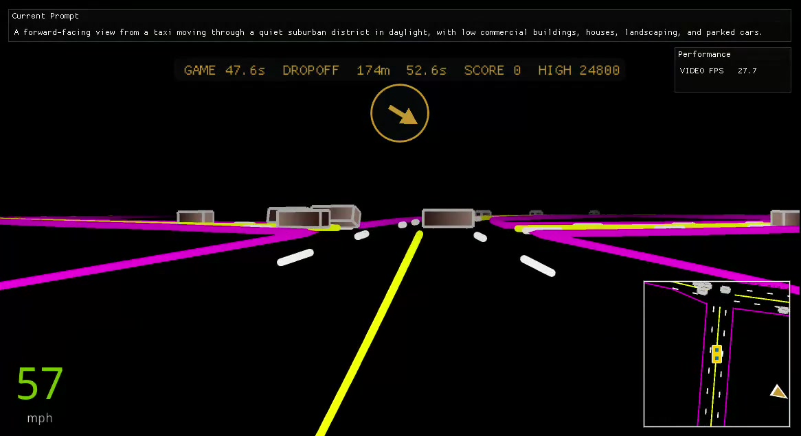
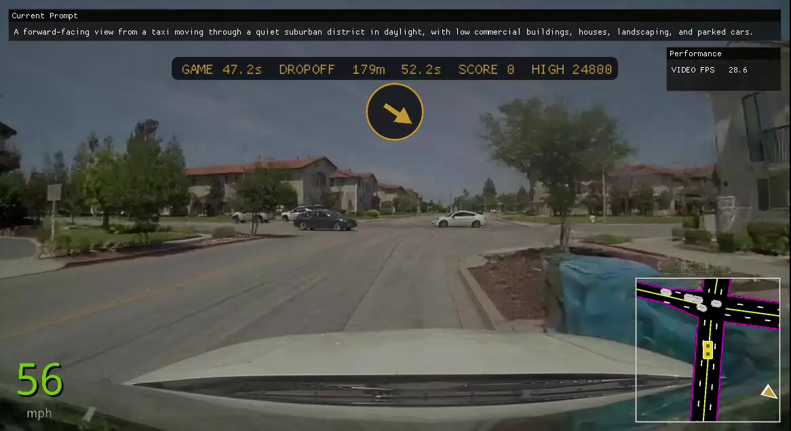
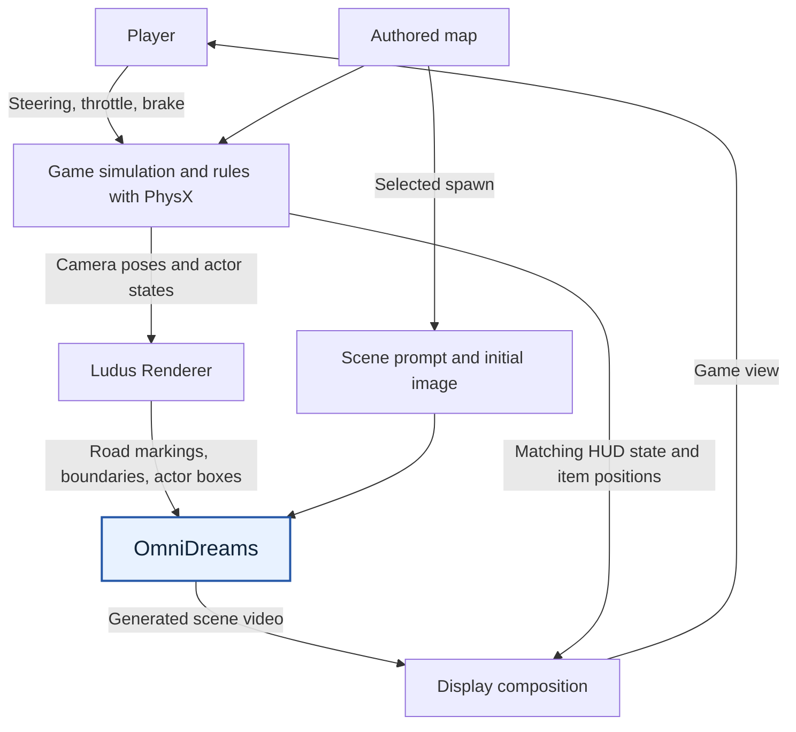
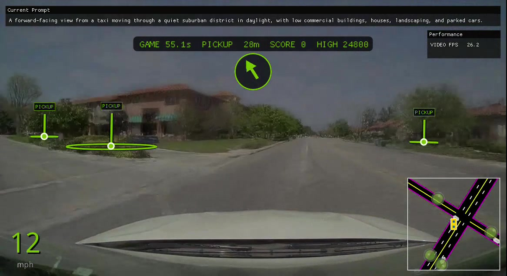
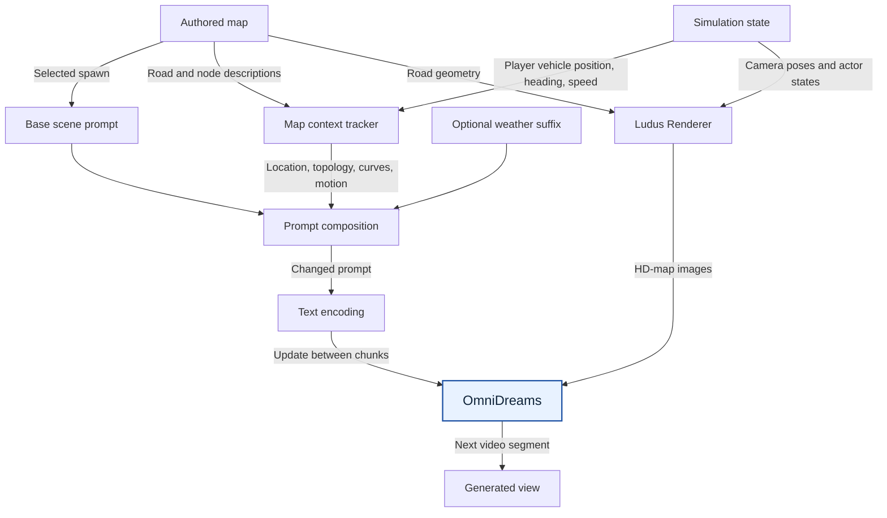
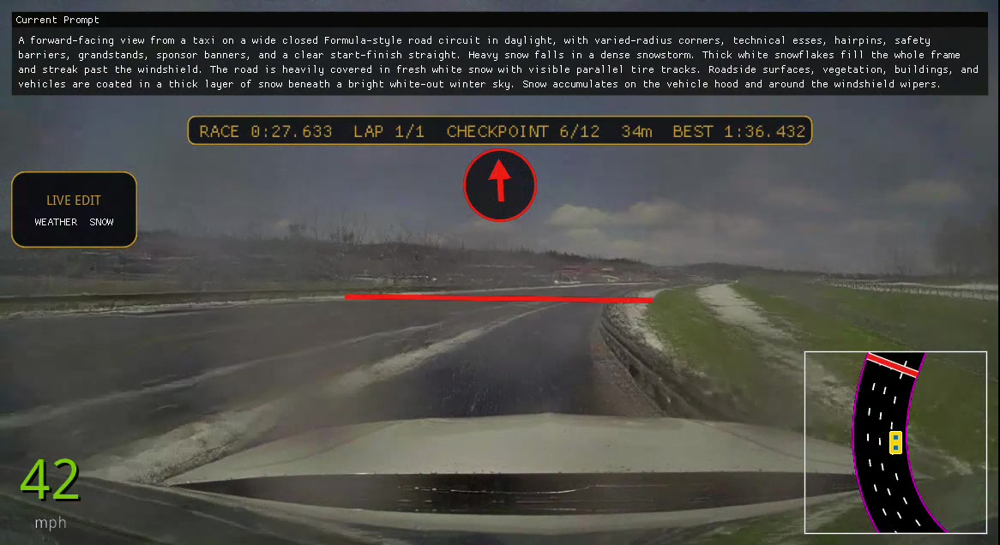
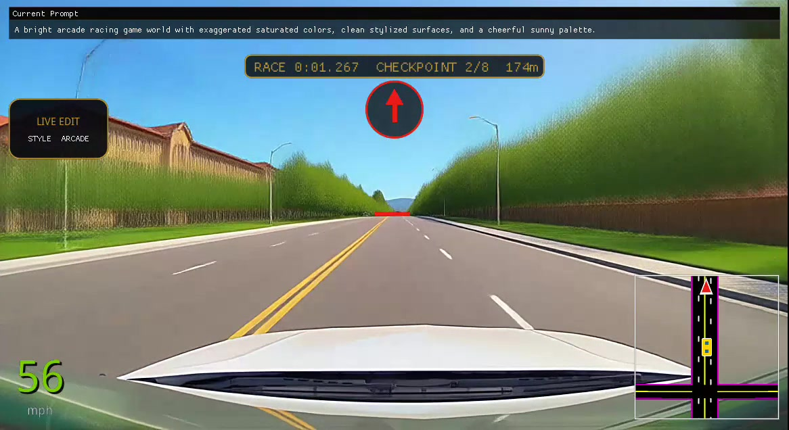
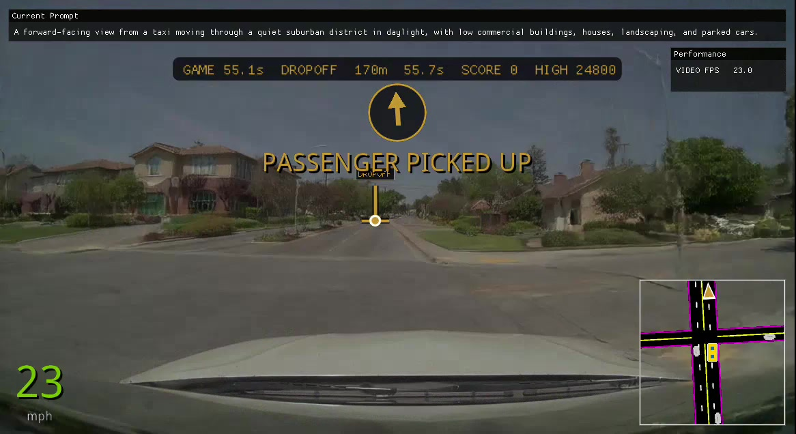
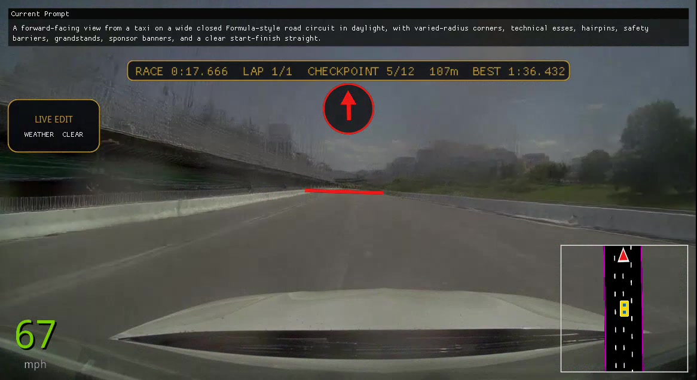

# Crazy Robotaxi: Architecture of a Game Based on World Models

Crazy Robotaxi is an interactive driving game built around the OmniDreams world model.
Players steer the player vehicle through an authored road network, pick up passengers,
deliver fares, or race through checkpoints. Optional abilities let them change the
weather and visual style, collect items, and introduce obstacles while driving.

The architecture combines an explicit simulation with a model that generates the view
from the player vehicle. The simulation maintains the road network, player vehicle
motion, traffic, and game rules, with **PhysX** resolving physical contacts. **Ludus
Renderer** renders that state as a sequence of **HD-map conditioning images**: road
lines and 3D actor boxes viewed from the player vehicle's camera. OmniDreams uses those
images, a scene prompt, and visual history to generate the evolving scene. This gives
the game concrete mechanics while allowing much of its visible environment to come from
a learned model.

The demo pushes a driving world model into arcade game behavior: reversing, harsh
turns, and collisions that abruptly change heading or speed. The engine can simulate
these actions, but getting OmniDreams to depict them faithfully is a central challenge.
The generated view often disagrees with the intended motion in these situations.

## From HD map conditioning to generated video

The central operation is visible below: **feed a scene of semantic lines and boxes to
OmniDreams, and get a realistic driving view in return.** The HD-map image supplies
spatial structure, rasterized by Ludus Renderer. Colored lines describe road boundaries
and lane markings; 3D boxes describe actors' positions, sizes, and orientations. The
model generates road surfaces, vehicle appearances, buildings, vegetation, lighting, and
other visual details using that structure together with its text and visual context.

| HD-map conditioning view | OmniDreams generated view |
| --- | --- |
|  |  |

*The two views show nearby moments approaching the same intersection. The conditioning
view shows Ludus Renderer's road layout and actor boxes; the generated view supplies a
realistic scene around that structure.*

The demo can switch its main view between generated video and HD-map conditioning. The
forward-facing semantic scene is what the model receives as its changing control input.
The navigation arrow, timers, and lower-right minimap in these screenshots are display
overlays. The minimap is an overhead view of the same simulated scene, while the
conditioning images use the player vehicle's camera perspective.

[Ludus Renderer
conditioning](../omnidreams_game_engine/omnidreams_game_engine/conditioning.py), [model
input](../omnidreams_game_engine/omnidreams_game_engine/model.py), [display view
selection](crazy_robotaxi/ui.py).

## Starting from a driving world model

OmniDreams was developed for closed-loop autonomous driving simulation. In that setting,
a driving policy observes generated camera frames, takes an action, and changes the
simulator state; the model then generates the next observations. It generates video
autoregressively, meaning each new segment depends on retained information from previous
frames as well as current conditioning. [NVIDIA’s OmniDreams research
overview](https://research.nvidia.com/publication/2026-06_nvidia-omnidreams-real-time-generative-world-model-closed-loop-autonomous)
describes this interaction between simulator state, driving actions, and visual history.

Crazy Robotaxi puts a human player into that loop. Steering, throttle, and braking
update the player vehicle in the simulation. The resulting camera movement and scene
structure become inputs to OmniDreams. The player sees the generated view and chooses
what to do next.

The core game uses a pretrained driving model. Taxi objectives, scoring, and race
progression are implemented as game logic around it. The experiment is to stretch the
model's existing ability to generate driving scenes into the behavior a game demands.

For a more conventional implementation, see FlashDreams' [OmniDreams Interactive Drive
demo](../../integrations_v2/omnidreams/apps/interactive_drive/README.md). It loads a
driving scene, turns vehicle controls into HD-map conditioning, and generates an ongoing
view from a scene prompt and initial image. Crazy Robotaxi builds on that kind of loop
with authored game maps, arcade handling, objectives, and live conditioning changes.

## Pushing OmniDreams beyond ordinary driving

Reversing moves the camera backward; harsh turns rotate it rapidly; collisions can
abruptly change the player vehicle's speed or heading. These maneuvers push into
**out-of-distribution behavior** for OmniDreams: they depart from the driving behavior
it has learned to continue reliably. Even when the simulation produces the expected
motion and Ludus Renderer projects it correctly into the HD-map sequence, generated
frames often fail to follow that motion.

The architecture gives the game control over simulated state and the conditioning sent
to the model. It relies on OmniDreams' learned response to turn that conditioning into
video. Crazy Robotaxi tests how far this response can be pushed toward arcade gameplay,
and where it breaks down.

## The core architecture at a glance

This diagram shows the core loop with the scene prompt selected at initialization.

There are two kinds of persistent state. **Game state** contains positions, velocities,
routes, objectives, timers, and collected items. **Model state** includes OmniDreams'
rollout cache, which retains visual context internally to continue generating the scene,
with or without live prompt editing. Each generation step advances both, and presentation
combines the resulting video with the corresponding game information.

| Component | Responsibility |
| --- | --- |
| Game simulation and rules | Player vehicle handling, traffic routes, pickups, checkpoints, scoring, and timers |
| PhysX | Simulate rigid bodies and resolve contacts involving the player vehicle, ground, curbs, and physical actors |
| Ludus Renderer | Render semantic road geometry and actor boxes into HD-map conditioning images, plus the overhead minimap view |
| OmniDreams | Generate the visible environment and its evolution from semantic images, text, and visual history |
| Display composition | Present generated video with aligned HUD information, navigation markers, and collectible sprites |

The [engine sequencing](../omnidreams_game_engine/omnidreams_game_engine/engine.py) and
[world model rollout](../omnidreams_game_engine/omnidreams_game_engine/model.py)
implement these boundaries.

PhysX and Ludus Renderer connect through explicit scene geometry and actor poses. The
game supplies collision geometry to PhysX and uses the resulting physical state when
preparing the scene for Ludus Renderer. That lets a collision change the player
vehicle's motion or an actor's pose, which then changes the boxes and road projection
fed to OmniDreams. Those images ask the model to depict the updated state. Abrupt changes
in motion can still produce a generated continuation that disagrees with the simulated
result.

## Turning player input into model input

Consider a player steering left at an intersection. The game first applies that input to
its player vehicle simulation, updating position, heading, speed, and camera pose.
Arcade driving logic defines acceleration, steering, braking, and handbrake behavior.
PhysX advances the rigid-body simulation and resolves contacts with authored collision
geometry and physical actors. The game combines those results with its handling policy
to produce the player vehicle state and actor trajectories used for the next images.

Ludus Renderer then projects the authored scene from the updated camera using its GPU
semantic renderer. It produces the kind of sparse HD-map image shown above, containing
road boundaries, lane markings, and boxes colored by actor type for cars and
pedestrians. As the player vehicle turns, the projected road and actors move through the
image in the way implied by the simulated trajectory. These images specify the camera
and actor motion that OmniDreams is expected to follow in the next video segment.

**In this integration, the world model receives those semantic camera images as its
changing control input.** The conversion from steering input to simulated motion to
projected scene structure is what lets the player control the generated view. The
model’s scene prompt and visual history provide the context for turning that structure
into a detailed continuation.

Traffic vehicles follow routes maintained by the game, with nearby actors entering
physical simulation and conditioning. Waiting passengers are also represented by
pedestrian boxes at game-defined pickup locations. Their generated appearance comes from
the model; their role in a fare comes from the rules.

[Vehicle and engine composition](crazy_robotaxi/factory.py), [PhysX
integration](crazy_robotaxi/physics.py), [Ludus Renderer
conditioning](../omnidreams_game_engine/omnidreams_game_engine/conditioning.py),
[passenger conditioning](crazy_robotaxi/passengers.py).

## Giving the model a world structure and starting appearance

An authored map supplies roads, lanes, intersections, and actor placement. That layout
becomes the structural scaffold in the HD-map images. Authoring a road network does not
require building all the detailed scenery around it: text and an initial image establish
the visual setting, such as a suburban district with houses, shops, landscaping, and
parked cars. OmniDreams supplies visual detail around the scaffold.

Each spawn has a scene prompt and can supply an initial image. The image gives
generation a starting appearance; the prompt describes the intended environment. If an
authored image is absent, the compiler produces a synthetic semantic view from the
spawn. An authored image that agrees with the spawn’s geometry gives the model a more
coherent starting point.

The scene prompt can also evolve with the player vehicle's location. The live prompt
context path described below uses authored road and landmark descriptions alongside
motion and topology cues. Geometry supplies spatial structure, while text describes the
character of the surroundings. [Map and spawn
format](../omnidreams_game_engine/NODE_GRAPH_MAP_FORMAT.md).

## Chunked rendering at 30 fps

The game caps generated scene video at **30 fps** to match the driving footage used to
train OmniDreams. Keeping that cadence preserves the time interval the model learned
between successive frames. [OmniDreams training
data](https://arxiv.org/html/2606.03159v3#S2.SS1).

OmniDreams generates **eight frames per chunk** in steady state; the initial chunk has
five frames. The application samples timestamped driving inputs for the chunk,
simulates the corresponding sequence of player vehicle and actor states, advances the
game rules, and renders one semantic camera image per output frame. The model generates
the matching video segment and updates its autoregressive cache before the application
prepares the result for display. [Chunk
sizing](../../integrations_v2/omnidreams/impl/pipeline.py), [30 fps output
contract](crazy_robotaxi/application.py).

The initial scene image and prompt initialize the model’s context. Subsequent generation
uses retained visual history to continue what has already appeared. This supports
continuity in appearance and motion across chunks, although a bounded visual-history
cache is not a complete, permanent reconstruction of every place visited.

At 30 fps, eight frames span **8 / 30 ≈ 0.267 seconds (267 ms)** of game time. The model
commits the generated response a chunk at a time: inputs arriving after a chunk has been
prepared affect a later generation step. That 267 ms is the chunk's video duration;
input-to-display latency also depends on when the input arrives, how long the next chunk
takes to generate, and how long the affected frame waits for presentation. Chunk duration
alone does not establish a minimum input latency.

On an **NVIDIA RTX PRO 6000 Blackwell**, the `fast-perf` preset reaches the demo's
**30 fps cap**. Reaching the cap means generation can keep up with real-time playback;
responsiveness still depends on chunk boundaries, generation time, and buffering. The
implementation uses FlashDreams for model execution, input delivery, and native-window
or browser presentation. [Fast-perf configuration](../../integrations_v2/omnidreams/config.py),
[application loop and frame alignment](crazy_robotaxi/session.py).

## Aligning overlays with generated frames

The game uses conventional rendering for elements that need exact placement or legible
text: HUD labels and timers, navigation markers, checkpoint gates, and collectible
sprites. OmniDreams generates the surrounding street view, and these elements are drawn
on top. This gives the game direct control over their appearance and presence, even when
the generated scenery is unstable.

Presentation preserves the relationship between each generated frame and its simulated
state. A fare timer, checkpoint marker, or coin should correspond to the player
vehicle's pose in the frame being displayed. Crazy Robotaxi carries game snapshots and
camera poses alongside the video so overlays can use the matching information. This
matters because the simulation has already computed the whole chunk before the player
has seen all of its frames.

*Pickup selection. The green markers identify game-defined pickup locations in both the
camera view and the minimap. Their placement uses the camera pose associated with this
displayed frame.*

Coins and effect items also have positions and pickup rules maintained by the game.
Their sprites are projected into the camera and composited onto the generated frames.
[Frame alignment](crazy_robotaxi/session.py), [item
rendering](crazy_robotaxi/live_edit/item_ability.py).

## Live prompt context: describing the surroundings as they change

With **live map context** enabled, the model's text conditioning follows the player
vehicle through the authored map. A road can describe storefronts and awnings; an
intersection can describe a market plaza. The game selects those descriptions as the
player vehicle moves and combines them with cues about approaching an intersection,
entering a parking area, curves ahead, and forward, stationary, or reverse motion.

The base scene prompt comes from the selected spawn in the authored map. Live map
context uses that spawn's `prompt_context` when provided, falling back to its `prompt`.

This gives OmniDreams two complementary ways to follow the scene: **HD-map images
specify spatial structure, and live text context describes the surroundings and motion.**
The geometry still determines road and actor placement. The changing prompt directs the
appearance of details around that geometry.

Motion and topology clauses also give the model explicit text cues for situations such
as reversing or approaching a turn. They provide another way to communicate the
intended behavior, while faithful generated motion remains a model limitation.

The live-context path uses the same visual history cache inside OmniDreams as the core
loop. Prompt updates continue the existing rollout history.

For example, an illustrative prompt while approaching a market intersection could be:

> A suburban street in daylight. Small storefronts and awnings line both sides of the
> road. The vehicle is approaching an intersection. A busy market plaza fills the
> intersection.

The first sentence is the base scene description. The remaining sentences combine an
authored road description, a topology cue, and an authored intersection description.
Curve and motion clauses can be appended as well. On another road, the selected local
descriptions change while the base setting continues to anchor the scene.

The implementation evaluates context from the player vehicle state at the end of each
simulated chunk. It uses hysteresis, retaining a context until a change is stable, to
avoid toggling prompts near road boundaries or while nearly stationary. Changed suffixes
are queued and composed into the active prompt before a subsequent model generation
step. If a guided appearance transition is already running, the context update waits for
that transition to finish.

Complete combined prompts are encoded when first needed, and their embeddings are
cached for reuse. The update replaces text conditioning on the existing rollout cache;
generation continues with retained visual history and the next HD-map sequence. Map
context uses plain prompt replacement with no editing adapter or guided transition.
Text can influence what appears, but a described storefront or landmark does not gain
an authored 3D shape or collider from its description alone.

Enable this path with `--live-edit-map-context` or
`live_edit.map_context.enabled`. Roads and nodes can supply `prompt_context`; a spawn
can provide a shorter base description through its own `prompt_context`. A new combined
context may briefly pause generation for text encoding, and many unique contexts retain
more embedding memory. [Context
selection](crazy_robotaxi/live_edit/map_context.py), [prompt composition and
replacement](crazy_robotaxi/live_edit/style_ability.py), [chunk-boundary
integration](crazy_robotaxi/live_edit/runtime_v2.py), [map context
settings](crazy_robotaxi/live_edit/config.py).

## Changing weather through text conditioning

Weather editing uses the same ability to replace active text conditioning during a
rollout. A selected weather preset appends a request for rain or snow to the base scene
and current map context.

During a short transition, each denoising step asks the model how to update the same
partially generated video twice: once with the previous prompt and once with the
updated weather prompt. Both predictions use the same HD-map input and visual history.
The generation step amplifies the difference between those predicted updates, pushing
the scene toward the requested weather more strongly than a plain prompt replacement.
This helps the new appearance take hold despite the history of the previous weather.

The transition adds one model evaluation per denoising step. Once the weather has
landed, generation continues with the updated prompt and retained history at the
ordinary single-branch cost. The game continues to maintain the player vehicle, map,
and objectives. [Prompt editing and guidance](https://github.com/NVIDIA/flashdreams/pull/431).

An optional LoRA drift corrector can be applied during continued weather generation.
Its gain defaults to zero for performance, avoiding correction weight copies and extra
weight storage during weather holds. [Live-edit integration and performance
tradeoffs](https://github.com/NVIDIA/flashdreams/pull/494).

*Weather editing. The prompt requests heavy snow and the live-edit status shows SNOW,
while the race continues to checkpoint 6 of 12. The generated image is the model's
response to that request; visible snow coverage can vary as generation evolves.*

Appearance and mechanics remain independently controlled: rain generation does not
automatically change tire grip. Weather control operates in the base visual style.
[Weather prompt composition](crazy_robotaxi/live_edit/weather_ability.py), [live prompt
editing](crazy_robotaxi/live_edit/style_ability.py).

## Introducing actors through semantic conditioning

Obstacle events change the scene through the HD-map input. The game adds actor
trajectories, and Ludus Renderer projects the new boxes into the camera images used for
generation. Optional guidance compares conditioning with and without those actors to
strengthen their appearance in the generated view.

An actor box alone does not guarantee that an object will appear. Live-edit experiments
found that clones of perception tracks and placements consistent with ordinary driving
scenes worked better than arbitrary synthetic boxes. This is another limit on how far
conditioning can push the model's learned behavior. [Actor insertion
experiments](https://github.com/NVIDIA/flashdreams/pull/431).

Rendering an actor and registering it with PhysX are separate steps. A generated
obstacle gets physical collision behavior when the game also supplies it to the physics
simulation. A vehicle invented by the model has no automatic collider. [Obstacle
conditioning and guidance](crazy_robotaxi/live_edit/runtime_v2.py).

## What this design makes possible

This combination provides control over the parts needed for a game: a connected map,
adjustable player vehicle handling, explicit objectives, and well-defined scoring. The
world model supplies a rich visual environment whose appearance can change during play.
New routes and gameplay events become inputs to ongoing generation.

The main limitation is whether the generated view follows the intended game behavior,
especially during the out-of-distribution maneuvers described above. A correct player
vehicle trajectory, collision response, and HD-map sequence can still produce frames
that imply different motion. Synchronizing a frame with its game state keeps overlays
aligned in time; it cannot make the model's depiction physically correct.

Generated details can also drift, flicker, or disagree with the semantic scaffold. A
building or parked vehicle invented in the image has no automatic counterpart in the
collision world. Returning to a location preserves the authored road layout, while the
exact scenery depends on what the model retains and generates.

The core integration maintains explicit state for gameplay, translates that state into
conditioning the model understands, and keeps the generated view synchronized with the
game. Live prompt context adds location-dependent descriptions to this loop without
restarting the world model.

## Additional experiments: LoRA style editing

Alongside the core integration, the demo includes experiments in changing visual style
during an ongoing rollout. Selecting a skin replaces the scene description with a style
prompt, such as a bright arcade world, while preserving the current map context and
HD-map input. The player vehicle, route, and objectives continue through the change.

*Arcade style. The prompt requests saturated colors and stylized surfaces, and the
generated view takes on that appearance. The navigation arrow, checkpoint gate, timer,
and minimap retain their roles in the game.*

The style experiments use a **LoRA (low-rank adaptation)** adapter: learned updates to
selected model weights. Training pairs an OmniDreams rollout with an offline-restyled
version, filters those pairs for road-layout fidelity, and teaches the model to apply a
prompt-selected style partway through a rollout. One adapter supports several skins.
This supervised style adapter shares its deployment hook with a separate experiment
that distilled stronger prompt guidance into a LoRA. [Style training](https://github.com/NVIDIA/flashdreams/pull/458),
[guidance distillation](https://github.com/NVIDIA/flashdreams/pull/431).

Holding a style can amplify errors in self-generated history over successive chunks.
A separate LoRA drift corrector learns to reduce that accumulated drift, helping retain
road structure and scene detail during continued styled generation. The game applies
correction during skin states, where comparisons showed a clear benefit. Enabling style
editing with the default `corrector_mode="fused"` also downloads and enables a base-state
corrector with gain `0.25`. Weather correction defaults off to avoid its ongoing
performance cost. [Drift-correction research](https://github.com/NVIDIA/flashdreams/pull/398),
[earlier in-game experiments](https://github.com/NVIDIA/flashdreams/pull/494), [current
correction defaults](crazy_robotaxi/live_edit/config.py).

Deployment matters for performance. The early corrector path forced compilation and
CUDA graphs off, severely reducing frame rate. The later fused path pre-merges weight
updates and copies prepared weights into stable model buffers, preserving acceleration
on the Python transformer path while retaining extra weight sets in GPU memory. The
integration PR reports about **34 fps end to end on a GB300 with features enabled**
using this fused path. Live prompt edits and adapter switching still require the Python
transformer: the native FP8 transformer lacks the necessary prompt-replacement and
weight-switching support. Consequently, these features change the execution path used
by the vanilla `fast-perf` preset. [Fused deployment and measured costs](https://github.com/NVIDIA/flashdreams/pull/494),
[map-context execution path](https://github.com/NVIDIA/flashdreams/pull/546).

These additions act on the generation model; they do not implement road geometry, input
handling, or game rules. The core driving loop and live map-context replacement work
without them. [Style editing integration](crazy_robotaxi/live_edit/style_ability.py),
[editing adapter](../../integrations_v2/omnidreams/impl/_edit_lora.py), [drift
corrector](../../integrations_v2/omnidreams/impl/_drift_corrector.py), [style
settings](crazy_robotaxi/live_edit/config.py).

## Game engine and presentation

### Maps, routing, and physical geometry

Maps describe roads, lanes, intersections, parking areas, spawn points, and traffic
routes in a semantic YAML format. A map compiler derives road boundaries, lane markings,
ground geometry, collision barriers, and the directed lane graph used for routing. The
same authored layout supplies both gameplay geometry and model conditioning.

The game uses arcade driving logic for handling and PhysX for rigid-body contacts.
Traffic follows authored routes, while passengers occupy game-defined pickup locations.
These explicit positions and rules provide the state used for objectives and scoring.
[Map format](../omnidreams_game_engine/NODE_GRAPH_MAP_FORMAT.md), [engine
composition](crazy_robotaxi/factory.py), [PhysX integration](crazy_robotaxi/physics.py).

### Taxi objectives and races

The taxi game tracks whether the player is seeking a passenger or driving to a dropoff.
Pickup and delivery use distances between simulated positions; the rules update the
fare, score, and remaining time. A visible person gives the pickup a place in the
generated scene, while navigation markers make the destination explicit to the player.

*Taxi gameplay. OmniDreams generates the street view; the game draws the pickup message,
destination marker, navigation arrow, speed, and timers. The lower-right minimap shows
the semantic road and actor representation maintained by the engine.*

Race mode uses the same driving and generation loop with a different set of objectives.
Maps define an ordered course, and the game checks whether the player vehicle crosses
each checkpoint gate in sequence. It tracks laps and elapsed time and projects the
active gate into the camera view. This lets one world model support different games
through changes to authored maps and rules.

*Race mode. The red line is a projected checkpoint gate. Crossing its authored position
advances the race; OmniDreams supplies the track's visible surroundings. The timer and
checkpoint count come from the race state.*

[Taxi rules](crazy_robotaxi/rules.py), [race rules](crazy_robotaxi/race.py).

### Collectible effects

An item pickup can request rain, snow, a style change, or a speed boost. For example,
collecting a rain item queues the weather prompt change described above; a nitro pickup
changes player vehicle motion, which reaches the model through the resulting semantic
camera sequence. [Frame alignment](crazy_robotaxi/session.py), [item
effects](crazy_robotaxi/live_edit/item_ability.py).

See the [demo README](README.md) to run it and [Options and user
configuration](README.md#options-and-user-configuration) to explore its settings.
