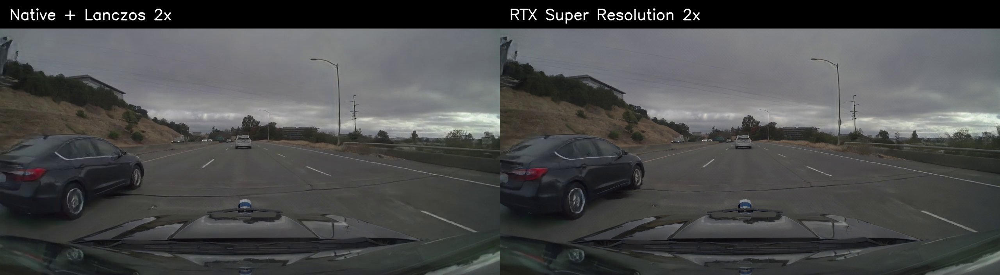
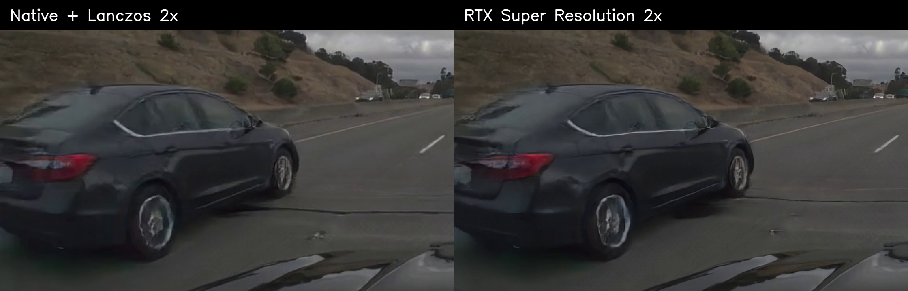

# OmniDreams RTX Super Resolution offline benchmark

Date: 2026-07-22  
FlashDreams commit: `34bbd2ae` (`dev/gtong/dlss`)  
Result: the `rtx-super-resolution` preset produced the expected 2x linear-resolution output with a small steady-state latency cost. It made edges measurably stronger than a Lanczos 2x reference, but the full-frame perceptual difference remained subtle on this source.

## Executive summary

- Native generated resolution: **1280×704**; RTX output: **2560×1408** (4x as many pixels).
- Steady-state RTX processing: **8.94 ms median per eight-frame chunk**, or **1.12 ms/frame**.
- End-to-end steady-state chunk latency: **600.61 ms native** versus **610.69 ms with RTX**, a measured **1.68% median increase** after adding the separately timed postprocess stage.
- Effective generation throughput: **13.32 FPS native** versus **13.10 FPS with RTX** at the median.
- RTX increased mean Laplacian variance by **218.4%** and mean Sobel edge energy by **13.9%** relative to Lanczos 2x. These are sharpness indicators, not proof of recovered ground-truth detail.
- The RTX and Lanczos outputs remained structurally close: mean luma SSIM **0.9681** and mean PSNR **37.75 dB**. Downsampling RTX back to native resolution yielded mean luma SSIM **0.9688** and PSNR **38.48 dB** against native.
- The first RTX call cost **1.60 s** because it included session initialization. Subsequent calls were 8.59–9.72 ms. A demo should create/warm the postprocessor before latency-sensitive interaction when possible.
- The full-frame difference is expected to be hard to see when both versions are scaled to the same display area. The 1:1 crop shows stronger contours on the neighboring car, wheel, lane marking, and hillside, along with a mild risk of emphasizing existing edge/compression artifacts.

## Visual comparison

The reference side uses the exact native generated frame upscaled to 2560×1408 with Lanczos. RTX VSR receives the same generated content and produces 2560×1408 directly. Frame 36 (1.20 seconds) was selected from a steady-state chunk.

### Full frame



The panels are reduced equally for display. At this scale, the difference is intentionally subtle; RTX does not alter scene composition, and display downscaling hides much of the extra edge energy.

### Close-up crop at 1:1 output pixels



Crop coordinates at RTX resolution are `(x=0, y=480, width=1120, height=720)`. RTX produces clearer/high-contrast contours around the car body, wheel, lane stripe, and vegetation. Some fine contours also look slightly more processed, so “sharper” should not be interpreted as ground-truth recovery.

## Workload and reproducibility

Both variants ran in separate processes with identical model, input, prompt, seed, spatial size, frame count, and chunk count.

| Setting | Value |
|---|---|
| Offline slug | `omnidreams-sv-2steps-chunk2-loc6-lightvae-lighttae` |
| Input | bundled example scene UUID `239560dc-33d1-11ef-9720-00044bcbccac` |
| Prompt | slug default driving-scene prompt |
| Diffusion seed | `42` |
| AR chunks | 6 |
| Frames | 45 total; chunk 0 has 5, chunks 1–5 have 8 each |
| Native generated size | 1280×704 |
| Output rate | 30 FPS |
| Postprocess preset | disabled / `rtx-super-resolution` |
| RTX preset settings | `HIGH`, scale `2.0` |
| Measured steady state | chunks 3–5 (24 frames); chunks 0–2 excluded as compile/capture warmup |

Baseline command:

```powershell
uv run --with "nvidia-vfx==0.1.0.1" `
  --package flashdreams-omnidreams `
  flashdreams-run omnidreams-sv-2steps-chunk2-loc6-lightvae-lighttae `
  --example-data True `
  --total-blocks 6 `
  --output-dir artifacts/omnidreams_rtx_sr_benchmark_20260722/baseline `
  --pipeline.diffusion-model.seed 42
```

RTX command:

```powershell
uv run --with "nvidia-vfx==0.1.0.1" `
  --package flashdreams-omnidreams `
  flashdreams-run omnidreams-sv-2steps-chunk2-loc6-lightvae-lighttae `
  --example-data True `
  --total-blocks 6 `
  --output-dir artifacts/omnidreams_rtx_sr_benchmark_20260722/rtx_super_resolution `
  --pipeline.diffusion-model.seed 42 `
  --postprocess.preset rtx-super-resolution
```

The baseline command deliberately uses the same temporary `nvidia-vfx` environment even though the preset is disabled, avoiding a dependency-environment difference. FFmpeg comes from the host `PATH`; no bundled FFmpeg package was used.

## Environment

| Component | Value |
|---|---|
| GPU | NVIDIA RTX PRO 6000 Blackwell Workstation Edition, 97,887 MiB |
| NVIDIA driver | 591.86 |
| Driver CUDA capability | 13.1 |
| PyTorch | 2.12.1+cu130 |
| PyTorch CUDA build | 13.0 |
| Python | 3.10.15 |
| `nvidia-vfx` | 0.1.0.1 |
| OpenCV / NumPy | 4.13.0 / 2.2.6 |
| FFmpeg | 8.1.2 full build |
| OS | Windows 11 build 22631 (reported by Python as Windows 10.0.22631) |

## Performance results

CUDA event timings come from the pipeline and postprocess stream. Each steady-state sample is one eight-frame chunk. Effective RTX time is `pipeline total_ms + postprocess elapsed_ms`; the pipeline's own `total_ms` does not include postprocessing.

| Metric, chunks 3–5 | Native | RTX VSR | Difference |
|---|---:|---:|---:|
| Chunk latency, median | 600.61 ms | 610.69 ms effective | +10.08 ms / +1.68% |
| Chunk latency, mean | 616.88 ms | 629.63 ms effective | +12.75 ms / +2.07% |
| Chunk latency, p90 | 640.62 ms | 656.86 ms effective | +16.24 ms / +2.54% |
| Effective FPS, median | 13.32 | 13.10 | -0.22 / -1.65% |
| RTX stage, median | — | 8.94 ms/chunk | 1.12 ms/frame |
| RTX stage, p90 | — | 9.33 ms/chunk | 1.17 ms/frame |
| CUDA memory reserved, median | 40.00 GiB | 40.67 GiB | +0.67 GiB |

Measured per-chunk values:

| AR chunk | Native pipeline | RTX pipeline | RTX stage | RTX effective |
|---:|---:|---:|---:|---:|
| 3 | 650.62 ms | 658.98 ms | 9.42 ms | 668.40 ms |
| 4 | 599.41 ms | 601.81 ms | 8.89 ms | 610.69 ms |
| 5 | 600.61 ms | 600.86 ms | 8.94 ms | 609.80 ms |

The model-only variation between processes is larger than the RTX stage on chunk 3. Consequently, the direct RTX event measurement (8.94 ms median) is the cleanest estimate of incremental processor cost; the 1.68% end-to-end delta also contains ordinary cross-run model jitter.

### Warmup and wall time

Chunks 0–2 were excluded because `torch.compile`/CUDA graph work was still occurring. Native chunk totals were 38.86 s, 26.48 s, and 17.23 s; RTX-run model totals were 12.16 s, 18.46 s, and 19.46 s. The mismatch is consistent with cache/order effects and is not attributable to RTX.

Fresh-process wall times were 133.71 s native and 103.04 s RTX. These numbers are recorded for reproducibility but are **not a fair speed comparison**: baseline ran first and populated shared compilation/checkpoint caches. They also include model loading, input decoding, compilation, and MP4 encoding. The candidate additionally writes four times as many output pixels.

The first postprocess event was 1,599.98 ms for five frames. This is a one-time VFX session initialization cost; later events stabilized below 10 ms per eight frames. The 35.04 ms flush returned no buffered frames.

Memory figures are sampled by the pipeline before the postprocessor executes. The observed +0.67 GiB reserved-memory difference is useful operational evidence, but it is not a direct peak-allocation measurement for VSR. The pipeline-reported peak remained 37.45 GiB in both runs.

## Quality results

There is no native high-resolution ground truth for this generated sequence. The evaluation therefore answers three narrower questions:

1. How different is RTX from a deterministic Lanczos 2x resize of the exact native output?
2. Does RTX increase objective edge/sharpness indicators?
3. Does RTX preserve the native scene after downsampling?

Metrics were computed across all 45 decoded output frames. The baseline's generated pane was cropped from the lower half of its 1280×1408 diagnostic HDMap/RGB canvas before comparison.

| Metric, all frames | Result | Interpretation |
|---|---:|---|
| RTX vs Lanczos 2x PSNR, mean / median | 37.75 / 37.95 dB | Outputs are close but not identical |
| RTX vs Lanczos 2x luma SSIM, mean / median | 0.9681 / 0.9708 | Strong structural agreement |
| RTX downsampled vs native PSNR, mean / median | 38.48 / 38.58 dB | Native content mostly preserved |
| RTX downsampled vs native luma SSIM, mean / median | 0.9688 / 0.9734 | Native structure mostly preserved |
| Laplacian variance, Lanczos / RTX mean | 6.07 / 19.32 | RTX +218.4% high-frequency response |
| Sobel edge energy, Lanczos / RTX mean | 9.39 / 10.69 | RTX +13.9% edge strength |
| Frame-to-frame MAE, Lanczos / RTX mean | 2.190 / 2.307 | RTX +5.4% temporal pixel change |

The increase in frame-to-frame MAE is small but worth noting: it may reflect genuinely stronger moving detail, temporally varying enhancement, or both. This 1.5-second sample is too short to classify it as flicker. A longer camera-motion sweep and subjective playback would be needed for that conclusion.

Both outputs are encoded independently as H.264 CRF 18, YUV420p. The metrics therefore include minor codec effects in addition to the postprocessor's effect. Because VSR runs before encoding, this matches what an offline client receives, but it is not a lossless tensor-level comparison.

## Assessment

For this OmniDreams clip, RTX VSR is functioning correctly and cheaply after initialization. It supplies true 2560×1408 output and significantly raises edge/high-frequency measures for roughly 1.1 ms per frame on this GPU. The qualitative gain is most visible at native output pixels or under zoom, not when both videos are shrunk into the same window.

The preset should therefore be presented as an optional 2x output/sharpening path, not as a guaranteed large perceptual upgrade. It is a good fit when the client can display or consume the larger raster. If the HUD or browser immediately scales the 2x result back to 1280×704, most of the benefit will be hidden and the UI may appear nearly unchanged.

Recommended follow-ups for a release-grade conclusion:

- Repeat measured chunks across at least five fresh, counterbalanced runs after explicitly priming compilation caches.
- Capture processor-specific peak allocated memory around VSR events.
- Evaluate a longer clip with fine signs/text, foliage, and lateral motion for temporal stability.
- Compare `rtx-super-resolution-ultra` against the current `HIGH` preset using the same protocol.
- If a high-resolution source can be obtained, downsample it to 1280×704, process it, and report reference-based reconstruction metrics against the original high-resolution sequence.

## Artifacts

- [Native diagnostic video](baseline/omnidreams-sv-2steps-chunk2-loc6-lightvae-lighttae.mp4)
- [Native generated-only video](baseline/generated_native.mp4)
- [RTX Super Resolution video](rtx_super_resolution/omnidreams-sv-2steps-chunk2-loc6-lightvae-lighttae.mp4)
- [Machine-readable metrics](metrics.json)
- [Reproducible analysis script](analyze_results.py)
- [Native run log](baseline/run.log) and [RTX run log](rtx_super_resolution/run.log)
- [Native runner stats](baseline/stats_omnidreams-sv-2steps-chunk2-loc6-lightvae-lighttae.json) and [RTX runner stats](rtx_super_resolution/stats_omnidreams-sv-2steps-chunk2-loc6-lightvae-lighttae.json)

