<!--
SPDX-FileCopyrightText: Copyright (c) 2026 NVIDIA CORPORATION & AFFILIATES. All rights reserved.
SPDX-License-Identifier: Apache-2.0
-->

# Architecture — FlashDreams

Compact, FlashDreams-scoped four-view architecture (static / dynamic / data / deployment) for the `flashdreams` repo. The broader omni-dreams + flashdreams architecture lives in [`../../../omni-dreams/docs/arch/architecture.md`](../../../omni-dreams/docs/arch/architecture.md); this document is the **TOE = flashdreams** subset that the [`sadd.md`](sadd.md), [`tava.md`](tava.md), and [`fsr_table.md`](fsr_table.md) reference.

Diagram-marker convention used throughout:

| Marker | Meaning |
|---|---|
| Unannotated node / edge | As-built on HEAD |
| Node / edge marked **(FSR_FD_NN)** | TAVA-recommended; contract+stub upstream at `../../../omni-dreams/internal/tests/security/<topic>.py` |
| OE-1..OE-7 callouts | Operational-environment assumption; not enforced by the TOE |

---

## Static view

### 1. System

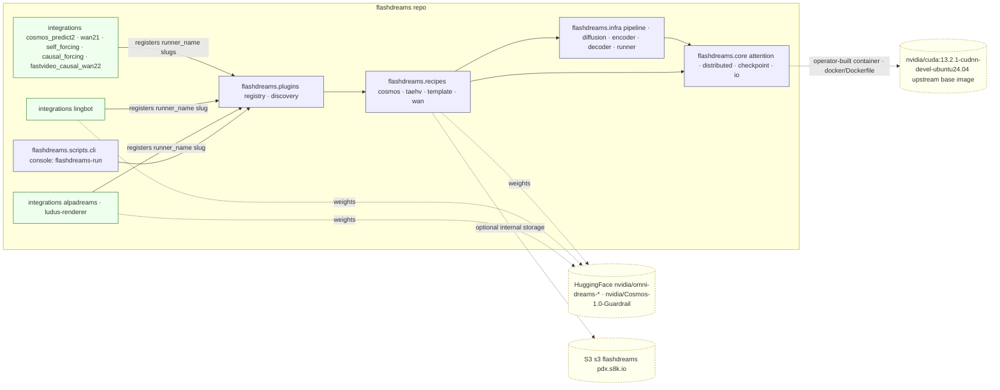

**Key facts:**
- Single console script `flashdreams-run` declared at `flashdreams/pyproject.toml`; entrypoint at `flashdreams/flashdreams/scripts/cli.py`.
- Recipes registered via Python entry-points; integrations register additional slugs via the same registry (`flashdreams/flashdreams/plugins/registry.py`).
- Integration adapters live under `integrations/` as separately-installable workspace packages.
- FlashDreams publishes **no canonical container image**: operators build locally from `docker/Dockerfile` against `nvidia/cuda:13.2.1-cudnn-devel-ubuntu24.04` (commit `ab74b58`); CI runs against the upstream CUDA image directly with inline `apt-get` bootstrap.

### 2. flashdreams package / class structure

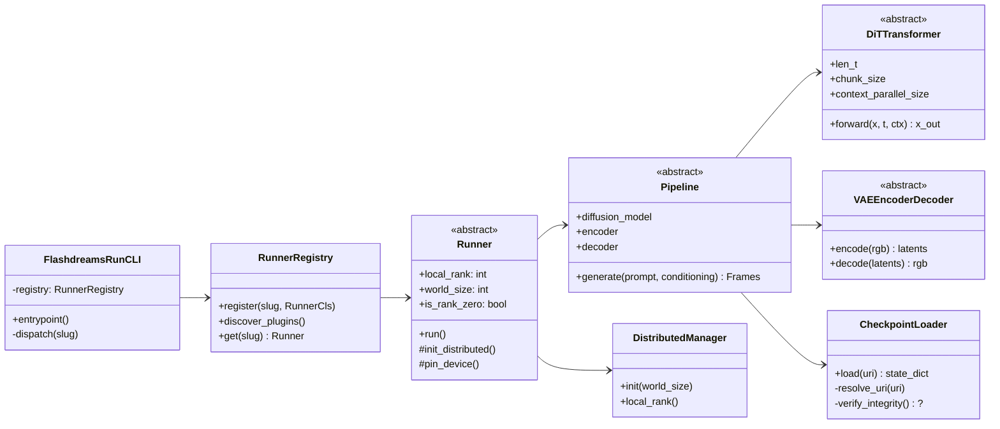

> **Path cites** — `flashdreams/flashdreams/{recipes,core,infra,plugins,scripts}/`. The `Runner` abstract class lives in `flashdreams/flashdreams/infra/runner.py`; `Pipeline` in `flashdreams/flashdreams/infra/pipeline/`; `CheckpointLoader` in `flashdreams/flashdreams/core/checkpoint/`.

### 3. Integration adapters

Each integration is a workspace package that *wraps* a flashdreams recipe with an over-the-network or pluggable serving surface.

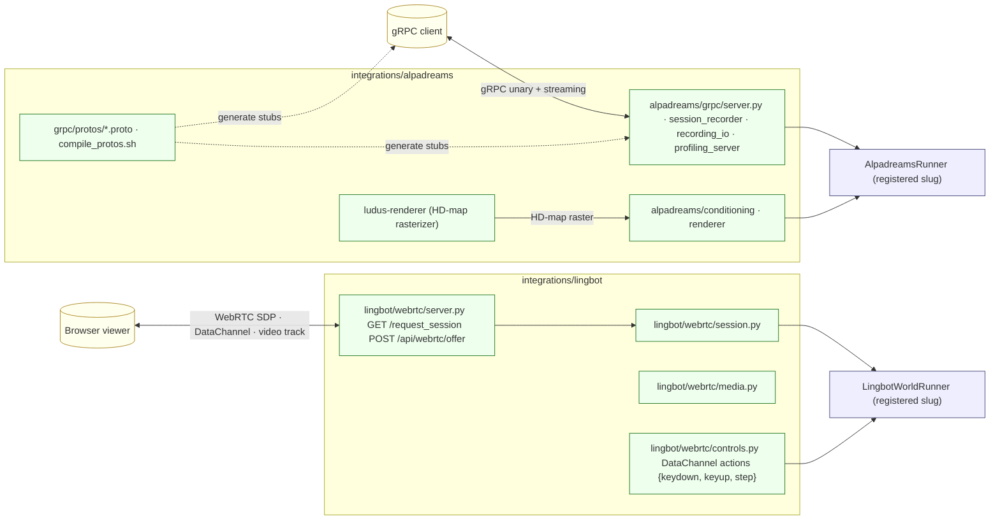

> **Trust boundary preview:** Both adapters expose a **local-server** surface (loopback by default once FSR_FD_10 lands; documented `--host 0.0.0.0` in lingbot README today). See [Data view](#data-view).

### 4. Naming index

| Short name | Long name | Where it lives |
|---|---|---|
| **FD-RUN** | `flashdreams-run` console entry | `flashdreams/pyproject.toml` → `flashdreams/flashdreams/scripts/cli.py` |
| **FD-REG** | Runner / plugin registry | `flashdreams/flashdreams/plugins/registry.py` |
| **FD-CKPT** | CheckpointLoader | `flashdreams/flashdreams/core/checkpoint/` |
| **FD-CORE** | `flashdreams.core.distributed` (torch.dist init) | `flashdreams/flashdreams/core/distributed/` |
| **FD-INFRA** | Pipeline / Runner base + diffusion / encoder / decoder | `flashdreams/flashdreams/infra/` |
| **FD-COSMOS** | Cosmos DiT recipe | `flashdreams/flashdreams/recipes/cosmos/` |
| **FD-WAN** | Wan recipe (t2v / i2v) | `flashdreams/flashdreams/recipes/wan/` |
| **FD-TAEHV** | TAEHV recipe | `flashdreams/flashdreams/recipes/taehv/` |
| **ALPA-GRPC** | Alpadreams gRPC server | `integrations/alpadreams/alpadreams/grpc/server.py` |
| **ALPA-PROF** | Alpadreams profiling server | `integrations/alpadreams/alpadreams/grpc/profiling_server.py` |
| **LING-RTC** | Lingbot WebRTC server | `integrations/lingbot/lingbot/webrtc/server.py` |
| **LUDUS** | Ludus HD-map rasterizer | `integrations/alpadreams/ludus-renderer/` |

This naming is used consistently in the dynamic, data, and deployment views.

---

## Dynamic view

### 1. Offline generation — `flashdreams-run <slug>` (CLI cold-path)

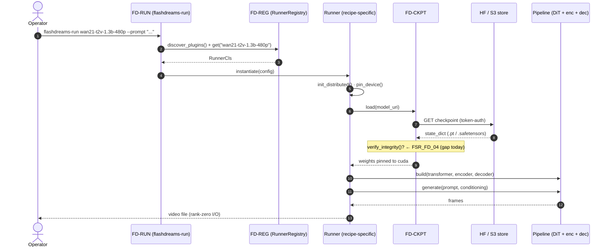

### 2. lingbot WebRTC interactive session

```mermaid
sequenceDiagram
    autonumber
    actor Operator as Operator (browser)
    participant LING_RTC as LING-RTC (aiohttp + aiortc)
    participant LING_SESS as LingbotSession
    participant LR as LingbotWorldRunner
    participant Gate as Input content gate  (FSR_FD_06)

    Operator->>LING_RTC: GET /request_session
    LING_RTC-->>Operator: viewer page (HTML/CSS/JS)
    Operator->>LING_RTC: POST /api/webrtc/offer (SDP offer)
    LING_RTC->>LING_SESS: new session (only 1 active)
    opt initial RGB conditioning
        LING_SESS->>Gate: classify(initial_rgb)
        Gate-->>LING_SESS: ok | REJECT (FSR_FD_06)
        Note right of Gate: on REJECT: tear down session, no inference
    end
    LING_SESS-->>LING_RTC: SDP answer
    LING_RTC-->>Operator: SDP answer
    Note over Operator,LING_SESS: ICE handshake (STUN/TURN if configured)

    loop interactive
        Operator->>LING_SESS: DataChannel action ({keydown|keyup|step}, key ≤256 B)
        Note right of LING_SESS: schema validate (FSR_FD_13); drop on miss
        LING_SESS->>LR: enqueue(action)
        LR->>LR: AR inference chunk
        LR-->>LING_SESS: chunk frames
        LING_SESS-->>Operator: video track (RTP)
        LING_SESS-->>Operator: DataChannel "chunk_done"
    end
```

> Runtime + model preload happens before request handling (`integrations/lingbot/lingbot/webrtc/server.py`). Single active WebRTC session per server process.

### 3. alpadreams gRPC inference + optional session recording

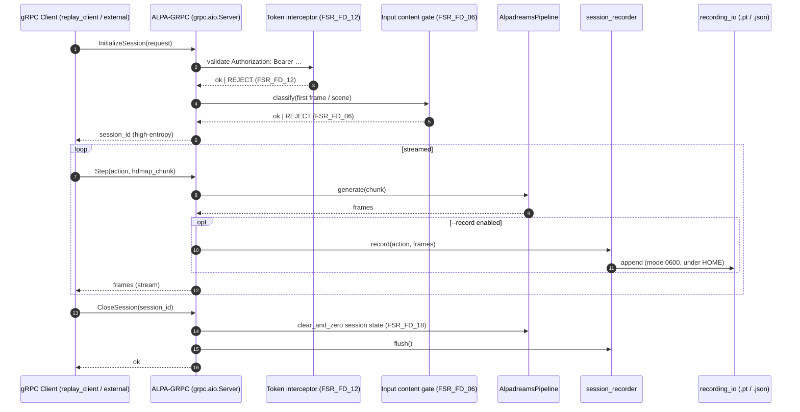

### 4. Checkpoint resolution / fallback

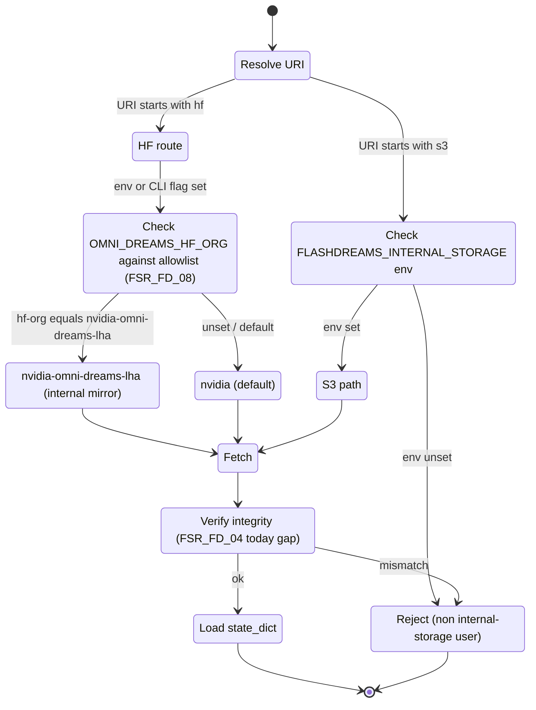

> **Threat hook for TAVA**: today the `Fetch → VerifyIntegrity` arrow is **dashed in code** — there is no in-process signature/SHA check beyond HTTPS-level transport auth and HF/S3 ACLs. Promoting this to a code-level check is **FSR_FD_04** (see [`fsr_table.md`](fsr_table.md)).

### 5. Distributed init (cross-cutting)

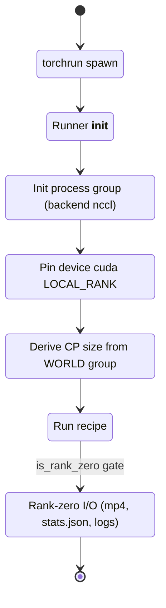

---

## Data view

DFD legend: **Process** = rounded box; **Data store** = cylinder; **External entity** = square; **Dataflow** = labelled arrow; **Trust boundary** = dotted region; crossings are where STRIDE threats land.

### 1. Level-0 — FlashDreams as one TOE

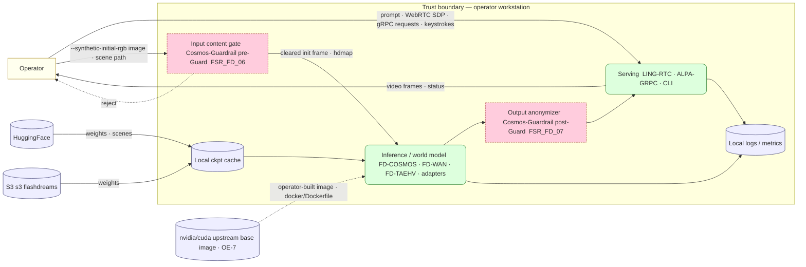

> **Architecturally** the TOE is a self-contained workstation process tree; there is **no NVIDIA-side ingress / egress / storage** of operator-generated data (architectural invariant restated from MVSB-32946 ticket comment).

#### Filter staging — input vs. output asymmetry

| Stage | When it runs | Cost | Default |
|---|---|---|---|
| Input content gate (FSR_FD_06) — **Cosmos-Guardrail pre-Guard, image side** | One-shot at session init / scene load | One model invocation, ≤200 ms on a single GPU; reject → session never starts | **on** when Cosmos-Guardrail weights are present |
| Output anonymizer (FSR_FD_07) — **Cosmos-Guardrail post-Guard (RetinaFace + plate + blur)** | Per chunk post-VAE — every ~900 ms steady-state | Few-step network designed for this; ≤50 ms / chunk budget on a co-resident GPU slot | **off** by default; opt-in via `--anonymize` |

### 2. Level-1 — lingbot WebRTC server

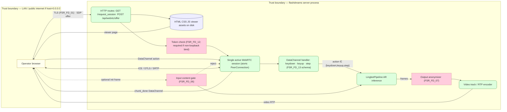

> **Risk hot-spots:**
> - **Single active session**: simplifies STRIDE-D analysis but is a DoS pinhole (T-DOS-1).
> - **`--host 0.0.0.0`**: documented default in the README; binds publicly on any non-loopback interface (T-NET-1).
> - **DataChannel actions are JSON**: validate types and keys server-side (FSR_FD_13).

### 3. Level-1 — alpadreams gRPC server

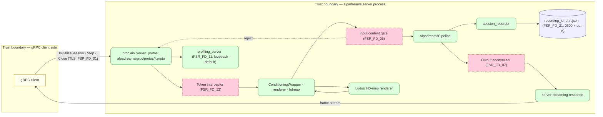

### 4. Data classification (per dataflow)

| Dataflow | Direction | Classification | Notes |
|---|---|---|---|
| Operator prompt / keystroke | Op → Pipeline | **Operator-confidential** (synthetic / non-PII by default) | Don't log raw inputs above DEBUG (FSR_FD_02, FSR_FD_03) |
| Initial RGB frame | Op → Pipeline | **Possibly PII** (faces / plates if real photo) | FSR_FD_06 input gate |
| HD-map raster | Op → Pipeline | Public (synthetic) | |
| Generated video frames | Pipeline → Op | **Possibly PII** (model may emit identifiable faces / plates) | FSR_FD_07 output anonymizer; FSR_FD_19 per-session routing |
| Checkpoint weights | HF / S3 → Process | **NVIDIA proprietary** until license-class flips at GA | Integrity check FSR_FD_04 |
| Container image | upstream `nvidia/cuda` → operator build → Host | **Operator-owned** (FlashDreams ships no canonical image; OE-7) | Trust delegates upward to the `nvidia/cuda` base image; operator-side build is the new tamper surface |
| Logs / metrics | Process → Disk | Operator-confidential | Scrubbing on export only |
| Session recording (.pt) | Process → Disk | **Operator-confidential** | Off by default (FSR_FD_21) |
| S3 credentials file | Disk → Process | **Secret** | `credentials/s3_checkpoint.secret` — chmod 600, never committed |

---

## Deployment view

### 1. Single-node multi-GPU (lingbot WebRTC / alpadreams gRPC)

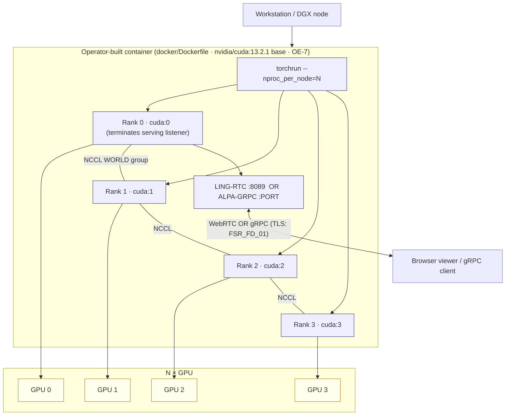

> Only **rank 0** terminates the WebRTC / gRPC connection (rank-zero I/O invariant). Other ranks do compute; they have no exposed listener.

### 2. Container layering

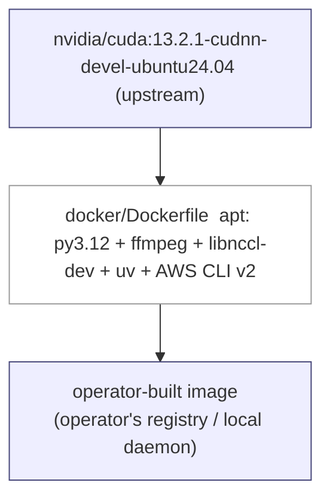

> FlashDreams publishes **no canonical container image** (commit `ab74b58`). The Dockerfile lives at `docker/Dockerfile`; operators run `docker build` (or `docker/build_with_docker.sh <registry>/<tag>`) to produce an image under their own registry / access controls. Sigstore signing (formerly FSR_FD_05) is therefore an **operator guidance** item rather than a FlashDreams-side enforcement (see [`fsr_table.md`](fsr_table.md) FSR_FD_05).

### 3. Network exposure summary (for the TAVA)

| Component | Default bind (today) | Default port | Auth | Encryption | Recommended target |
|---|---|---|---|---|---|
| LING-RTC (HTTP signaling) | `0.0.0.0` per README | `8089` | none | none | **127.0.0.1** (FSR_FD_10); TLS (FSR_FD_01) + token (FSR_FD_12) when public |
| LING-RTC (WebRTC media) | dynamic UDP | ephemeral | DTLS-SRTP (aiortc) | yes | OK as-is |
| ALPA-GRPC | configurable | configurable | none in dev | none in dev | **127.0.0.1** (FSR_FD_10); mTLS + token interceptor (FSR_FD_12) |
| ALPA-PROF (profiling) | configurable | configurable | none in dev | none in dev | **127.0.0.1** (FSR_FD_11); separate opt-in from main server |
| torch.distributed | depends on launcher | depends | none | none | trust cluster network only; no public exposure |
| HF / S3 / upstream `nvidia/cuda` registry | outbound | 443 | token / sigv4 | TLS | OK |

> The `0.0.0.0` default binds are an audit hot-spot — see threat T-NET-1 in [`tava.md`](tava.md) § 2.3.
