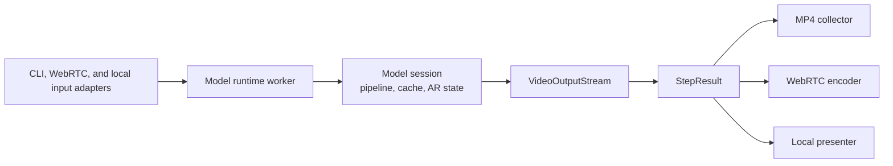

# Inference runtime and serving architecture improvements

## Status

Proposed. This document records the follow-up work needed to make the runtime,
output, WebRTC, and local-window architecture match the intended component
boundaries. It is an implementation checklist, not a compatibility promise.

## Goal

Use one model-session implementation and one generated-video result boundary
for runner CLI, WebRTC, and local-window execution:



The model integration owns conditioning, pipeline/cache state, and generation.
Shared runtime code owns orchestration contracts. Output consumers own only
their transport or presentation behavior.

## Non-goals

- Do not change `StreamInferencePipeline.initialize_cache`, `generate`, or
  `finalize`.
- Do not move Lingbot- or OmniDreams-specific conditioning into shared
  `flashdreams` code.
- Do not force model output tensors to CPU before a consumer requires host
  memory.
- Do not combine WebRTC encoding, MP4 writing, and local presentation into one
  output class.
- Do not add a video-specific wrapper around `StepResult`.

## Current problems

### Parallel model runtimes

The generic runtime API uses `InferenceRuntime` and `InferenceSession`, while
WebRTC uses a separate `WebRTCGenerationRuntime`. Lingbot and OmniDreams each
implement replay and WebRTC generation separately, and OmniDreams local-window
execution adds a third session implementation.

This duplicates pipeline construction, cache lifecycle, AR indexing,
`generate`/`finalize`, reset behavior, and output packaging.

### Duplicate result metadata

The earlier design wrapped a video-specific result in `StepResult`, while both
carried equivalent step index, frame count, and metrics fields. Consumers need
one layout-aware `StepResult` boundary instead.

### Mixed `VideoOutputStream` responsibilities

`VideoOutputStream` currently performs post-processing, collection, statistics
collection, result construction, CUDA synchronization, MP4 conversion, and
writing. It also exposes both `process` and `make_step_result`, leaving callers
to choose between a tensor and a result object.

### WebRTC discards the result abstraction

The WebRTC manager receives `StepResult` but passes only
`result.video_chunk` to encoders. Encoder implementations then infer tensor
layout from rank and shape instead of consuming the declared layout.

### Hidden WebRTC extension points

The shared demo builder discovers undeclared adapter methods with `getattr`,
including runtime-config, session-manager, and app factories. Model-specific
manager subclasses also provide result metadata and session-reset behavior.
The effective server interface is therefore wider than the declared protocol.

### Model behavior in the shared browser client

The shared browser module owns peer connection, video, metrics, and data-channel
logic, but it also hardcodes driving controls and post-process REST behavior.
The model `adapter.js` contract is implicit and differs greatly between
integrations.

### Hard-coded output launch routing

`serving/output_targets.py` identifies integrations from runner-name prefixes
and launches different server families for Lingbot and OmniDreams. Adding an
integration or output mode requires editing shared routing code.

## Target ownership

### Shared runtime and infrastructure

- Runtime/session protocols and orchestration.
- A thread-affine runtime worker for asynchronous serving.
- `StepResult` and layout-aware video conversion.
- Stateful output post-processing through `VideoOutputStream`.
- Generic output targets, WebRTC manager, encoders, and app construction.

### Model integrations

- Pipeline/config selection and checkpoint behavior.
- Model-specific global conditioning and per-step input mapping.
- One session core containing pipeline/cache/AR state.
- Model-specific session-input validation and optional browser routes/assets.
- Model-specific metadata placed on the generated result.

### Output consumers

- MP4: collect results and persist artifacts/statistics.
- WebRTC: encode and enqueue results, then report delivery metrics.
- Local window: convert results to lazy frames and present them.

## Improvement workstreams

### 1. Canonical step result

Use one layout-aware `StepResult` as the direct boundary for generated video.
Do not introduce a separate video result type or nested result envelope.

Target properties:

- One step/chunk index.
- One frame count, derived from or validated against the declared layout.
- A required tensor layout.
- One metrics mapping.
- Optional output time window and model-specific metadata.
- No implicit CPU transfer.

#### TODO

- [x] Decide the final field names and update the runtime protocol.
- [x] Require `layout` on every video `StepResult`.
- [x] Derive or validate `num_frames` exactly once during construction.
- [x] Keep all step metrics in `StepResult.metrics`.
- [x] Move video output-window information onto the canonical result.
- [x] Change video sessions and output targets to pass `StepResult` directly.
- [x] Remove duplicate unwrap/type-check code from MP4 and runner output
      targets.
- [x] Add CPU tests for layout validation, frame counts, metadata, and metrics.

Acceptance criteria:

- A generated video step crosses every model/output boundary as exactly one
  layout-aware `StepResult`.
- No step index, frame count, or metrics mapping is duplicated in a second
  envelope.

### 2. Single `VideoOutputStream` operation

Make the stream the only raw-tensor-to-generated-result stage:

```python
result = output_stream.process(
    video_chunk,
    autoregressive_index=step_index,
    metrics=metrics,
)
```

`process` should return `StepResult`. There should be no separate
`make_step_result` call.

#### TODO

- [x] Change `VideoOutputStream.process` to return `StepResult`.
- [x] Remove `VideoOutputStream.make_step_result`.
- [x] Keep streaming post-processing and result construction in the stream.
- [x] Move MP4 collection and writing into `Mp4VideoOutputTarget`.
- [x] Move runner statistics persistence into the runner/MP4 target.
- [x] Remove transport-specific CUDA synchronization from the stream.
- [x] Define how `finish` reports a buffered post-processor tail without
      introducing a second result type.
- [x] Verify that a disabled postprocessor preserves tensor identity and device.
- [x] Verify that stateful postprocessors are reset between sessions.

Acceptance criteria:

- Every generated chunk makes one output-stream call.
- Post-processing occurs at most once per chunk.
- The stream does not know about WebRTC, local-window presentation, or MP4
  files.

### 3. Result-aware WebRTC delivery

The WebRTC manager and encoders should consume the complete generated result.

#### TODO

- [x] Change `VideoEncoder.deliver_chunk` to accept `StepResult`.
- [x] Pass the result directly from the session manager to the encoder.
- [x] Make software frame conversion use `result.layout`.
- [x] Make NVENC conversion use `result.layout` instead of tensor-rank
      heuristics.
- [x] Move model-specific `chunk_done` fields into `result.metadata`.
- [x] Keep transport measurements such as enqueue time, queue depth, and
      control latency in the WebRTC manager.
- [x] Test `tchw` and `bvtchw` delivery through both software and NVENC fakes.
- [x] Test that no host copy occurs before the software path requests one.

Acceptance criteria:

- The manager never unwraps `result.video_chunk` merely to cross the encoder
  boundary.
- Encoder behavior is driven by the declared layout, not guessed shape.

### 4. One model session core per integration

Extract one synchronous model-session core for each integration. The core owns
pipeline/cache/AR state and returns `StepResult`. Input adapters prepare
the model-specific inputs for replay, WebRTC, or local use.

#### Lingbot TODO

- [x] Extract shared cache initialization, AR indexing, generation, finalize,
      reset, and close logic from the replay and WebRTC sessions.
- [x] Reuse the core from the runner/replay path.
- [x] Map WebRTC keyboard actions and text events into the same per-step input
      boundary.
- [x] Reuse the core from the WebRTC path.
- [x] Delete the duplicate Lingbot generation implementation.
- [x] Add parity tests comparing replay and live mappings for equivalent camera
      inputs.

#### OmniDreams TODO

- [x] Extract shared pipeline/wrapper state, cache/finalization state, AR index,
      post-processing, reset, and close logic.
- [x] Reuse the model-session boundary from replay and WebRTC.
- [x] Adapt interactive-drive trajectories to the same session-step input.
- [x] Carry `StepResult` to the local presentation boundary and use
      `lazy_rgb_frames()` for presentation.
- [x] Preserve delayed-finalization behavior required by interactive drive.
- [x] Delete duplicate OmniDreams generation implementations after parity is
      established.
- [x] Test RGB, debug-HDMap, post-process on/off, and scene-reset behavior.

Acceptance criteria:

- Each integration contains one implementation of cache initialization,
  `generate`, `finalize`, reset, and AR-index advancement.
- Output mode changes input and presentation adapters, not model execution.

### 5. Thread-affine runtime worker

All asynchronous serving lifecycle calls must execute on one owned worker
thread so CUDA, Triton, and CUDA-graph state remain thread-affine.

#### TODO

- [x] Add a shared single-thread runtime worker under `flashdreams.runtime`.
- [x] Route runtime initialization, session creation/reset, step, and close
      through that worker.
- [x] Set the CUDA device when the worker thread starts.
- [x] Keep distributed rank coordination inside model-owned operations.
- [x] Remove per-call `asyncio.to_thread` use from integration runtimes.
- [x] Make cancellation stop awaiting a call without abandoning runtime
      cleanup.
- [x] Add CPU tests for call ordering, exception propagation, and shutdown.
- [x] Add a GPU regression test that runs enough chunks to exercise Triton and
      CUDA-graph reuse on one thread.

Acceptance criteria:

- `initialize -> reset -> step* -> close` executes on the same OS thread for a
  serving runtime.
- No integration independently invents its own thread-dispatch mechanism.

### 6. Generic WebRTC session manager

The shared manager should own only peer lifecycle, control-event timing, input
sampling, generation scheduling, encoding, and delivery.

#### TODO

- [x] Drive the canonical `StepRequest -> StepResult` runtime boundary instead
      of a WebRTC-only `generate_chunk` method.
- [x] Use `StepRequest` metadata to determine the next input window and
      frame count.
- [x] Replace model-specific reset hooks with mapped session inputs.
- [x] Replace `_model_name` with runtime/adapter identity.
- [x] Replace `_chunk_done_extra` with `StepResult.metadata`.
- [x] Replace integration-specific runtime-error tuples with shared runtime
      errors.
- [x] Delete no-op manager wrappers.
- [x] Remove integration-specific manager subclasses; integration factories
      configure the shared manager's control keys and generation-error policy.
- [x] Move model-specific HTTP input and preview behavior to app controllers.
- [x] Cover session negotiation, reset, reconnect, error, and warmup behavior in
      shared CPU tests.

Acceptance criteria:

- Lingbot and OmniDreams use the same concrete manager unless a real transport
  capability differs.
- The manager has no imports from integration packages.

### 7. Explicit WebRTC app and browser adapter contracts

Replace dynamic optional methods with explicit extension surfaces.

#### Server TODO

- [x] Declare a typed WebRTC demo-adapter protocol.
- [x] Replace `getattr` discovery of runtime-config, manager, and app factories.
- [x] Always construct the shared aiohttp/WebRTC app in shared code.
- [x] Let integrations provide model web resources and optional route
      registration, not a complete replacement app factory.
- [x] Provide one generic session-input route that delegates parsing/validation
      to the model adapter where practical.
- [x] Keep offer, health, static assets, preload, and shutdown routes shared.

#### Browser TODO

- [x] Document the `adapter.js` interface with a JSDoc typedef or equivalent.
- [x] Keep peer connection, video, heartbeat, metrics, and common control
      rendering in the shared client.
- [x] Make control groups declarative instead of hardcoded as universal WSAD
      controls.
- [x] Move model-specific session forms and control-message handling into the
      model adapter.
- [x] Represent optional post-processing as an explicit capability.
- [x] Add shared adapter-contract tests for Lingbot and OmniDreams.

Acceptance criteria:

- The browser loads one shared client and one small model adapter.
- A model can add UI/session behavior without copying connection or playback
  logic.
- The shared demo builder has no undeclared adapter calls.

### 8. Capability-driven output launch

Output discovery should come from registered model/demo adapters instead of
runner-name prefix checks.

#### TODO

- [x] Let adapters declare supported input and output modes.
- [x] Resolve `cli`, `webrtc`, and `local-window` through adapter capabilities.
- [x] Remove `_is_lingbot_runner` and `_is_omnidreams_runner` branches from
      shared output routing.
- [x] Launch Lingbot and OmniDreams WebRTC through the same shared demo entry
      point.
- [x] Keep local-window manifest selection inside the OmniDreams integration.
- [x] Add registry tests proving a new adapter can add an output without editing
      shared routing code.

Acceptance criteria:

- Adding a model integration does not require a model-name branch under
  `flashdreams/flashdreams`.
- All WebRTC-capable integrations use the same shared server construction.

## Suggested pull-request sequence

Keep each change behavior-preserving and independently testable:

1. **Result contract:** canonicalize `StepResult` and remove duplicated
   video fields from the outer result path.
2. **Output consumption:** simplify `VideoOutputStream`; make WebRTC encoders,
   MP4, and local presentation consume the result directly.
3. **Runtime worker:** add thread-affine execution and migrate existing WebRTC
   lifecycle calls without changing model behavior.
4. **Lingbot session:** unify replay/runner and WebRTC generation.
5. **OmniDreams session:** unify replay, WebRTC, and local-window generation.
6. **WebRTC manager:** remove model-specific manager hooks and wrappers.
7. **App/UI boundary:** formalize server and browser adapter contracts.
8. **Launch routing:** replace model-name branches with adapter capabilities.

Do not combine the model-session migrations with the browser redesign. Keeping
those changes separate makes output parity and UI regressions easier to locate.

## Verification checklist

### Static and CPU checks

- [x] `uv run --locked --group lint ty check`
- [x] `uv run --locked --group lint pre-commit run --all-files`
- [x] Runtime/result/output unit tests.
- [x] WebRTC manager, message, encoder, and server unit tests.
- [x] Lingbot and OmniDreams demo API CPU tests.
- [x] Local-window adapter and frame-conversion CPU tests.
- [x] Every new pytest test has exactly one CI marker.

### GPU checks

- [ ] Lingbot runner replay produces the expected chunk count and MP4.
- [ ] Lingbot WebRTC runs multiple chunks, resets, and reconnects.
- [ ] OmniDreams replay produces the expected chunk count and MP4.
- [ ] OmniDreams WebRTC runs multiple chunks with post-processing off and on.
- [ ] OmniDreams local window renders multiple chunks and resets scenes.
- [ ] Software and NVENC WebRTC delivery both work.
- [x] Compiled and CUDA-graph configurations run beyond capture/replay startup.
- [ ] Multi-GPU rank coordination still advances every AR step in order.

### Parity checks

- [x] Equivalent replay and live per-step inputs reach the same model session
      shape and layout.
- [ ] Post-processing is applied once, with matching output across consumers.
- [ ] Frame count, step index, metrics, and metadata agree across CLI, WebRTC,
      and local-window paths.
- [ ] No output consumer introduces an unexpected device transfer.

## Definition of done

- One model session implementation exists per integration.
- One `VideoOutputStream` call creates each generated `StepResult`.
- CLI, WebRTC, and local-window consumers accept that result directly.
- All WebRTC runtime lifecycle operations are thread-affine.
- Shared runtime and serving code contain no Lingbot/OmniDreams branches.
- The shared browser client owns connection/playback behavior; model adapters
  own only model-specific UI and session behavior.
- CPU CI, lint/type checks, and targeted GPU serving tests pass.
