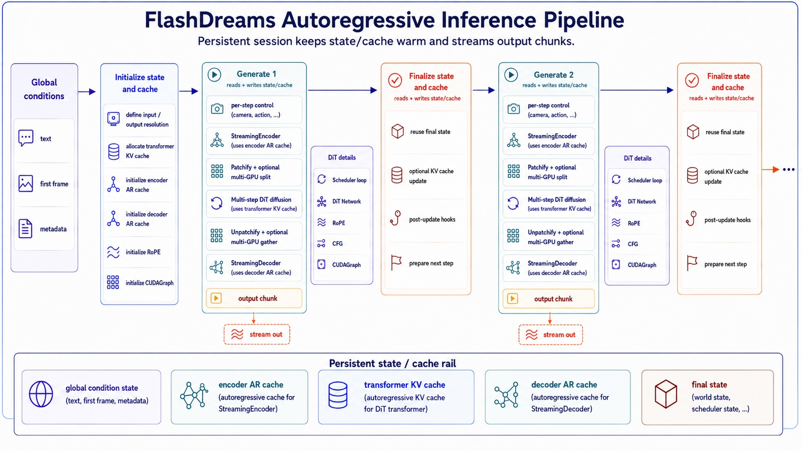

<!-- SPDX-FileCopyrightText: Copyright (c) 2026 NVIDIA CORPORATION & AFFILIATES. All rights reserved. -->
<!-- SPDX-License-Identifier: Apache-2.0 -->

`flashdreams.infra.pipeline.StreamInferencePipeline` is the low-level model
pipeline used by v2 application model loops. It owns encode, diffuse, and
decode stages plus a per-rollout cache. Application, session, UI, and transport
behavior live above this layer.



## Component boundaries

A pipeline contains:

```text
StreamInferencePipeline
├── encoder (optional per-step StreamingEncoder)
├── diffusion_model
│   ├── transformer
│   │   └── context_encoder (one-shot Encoder)
│   └── scheduler
└── decoder (optional StreamingDecoder)
```

The two encoder positions are not interchangeable:

| Slot | Runs | Contract | Typical input |
| --- | --- | --- | --- |
| `transformer.context_encoder` | once while building a rollout cache | stateless `Encoder` | text or reference image |
| `pipeline.encoder` | once per autoregressive step | stateful `StreamingEncoder` | camera, HD map, action, video chunk |

Set `pipeline.encoder=None` when no per-step control exists. Set
`pipeline.decoder=None` to return the clean latent. Use `StreamingVideoEncoder`
or `StreamingVideoDecoder` when pixel-video compression ratios and temporal
size mapping are part of the contract.

## Rollout lifecycle

Create one cache, then call `generate` and `finalize` with consecutive indices:

```python
from flashdreams.infra.pipeline import StreamInferencePipeline

pipeline: StreamInferencePipeline = ...
cache = pipeline.initialize_cache(
    transformer_context={"text_embeddings": text_embeddings},
    encoder_context={},
    decoder_context={},
)

for autoregressive_index, control in enumerate(controls):
    output = pipeline.generate(
        autoregressive_index,
        cache,
        input=control,
    )
    yield output
    metrics = pipeline.finalize(autoregressive_index, cache)
```

`initialize_cache` forwards each context dictionary to the matching component's
`initialize_autoregressive_cache`. Recipe-specific pipeline subclasses may
expose higher-level inputs; for example, a Wan pipeline accepts text and an
optional image and prepares transformer context internally.

`generate` performs these stages:

1. encode a supplied per-step input;
2. run the scheduler and transformer denoising loop;
3. decode the clean latent when a decoder exists;
4. retain the diffusion final state on the cache.

`finalize` consumes that final state and advances the autoregressive model/cache
for the next step. Use the same cache and index for both calls. The base class
rejects skipped, repeated, or mismatched indices. When synchronized profiling
is enabled, `finalize` returns stage timings and GPU-memory metrics; otherwise
it returns `None`.

## Shape and state rules

Outside the transformer network, video tensors are normally pre-patchify
`[B, C, T, H, W]`. Inside the network they are token sequences such as
`[B, L/cp, C]`. The transformer owns patchify/context-parallel split and the
inverse gather/unpatchify boundary; callers should not duplicate it.

Caches mirror component ownership:

- pipeline cache: encoder, transformer, decoder caches plus the latest final
  diffusion state;
- transformer cache: encoded context, RoPE state, and network cache;
- network cache: model-specific K/V or recurrent state.

Allocate caches per rollout or session. Do not share mutable caches across
sessions, and rebuild them when shape or context changes.

## Configure, then instantiate

```python
from flashdreams.infra.diffusion.model import DiffusionModelConfig
from flashdreams.infra.diffusion.scheduler.fm import FlowMatchSchedulerConfig
from flashdreams.infra.pipeline import StreamInferencePipelineConfig

pipeline_config = StreamInferencePipelineConfig(
    name="my-model",
    encoder=MyStreamingEncoderConfig(),
    diffusion_model=DiffusionModelConfig(
        transformer=MyTransformerConfig(),
        scheduler=FlowMatchSchedulerConfig(),
    ),
    decoder=MyStreamingDecoderConfig(),
)

pipeline = pipeline_config.setup().to("cuda").eval()
```

Subclass the pipeline only when the public cache-initialization behavior must
change. Most integrations should compose existing component contracts and keep
model-specific logic in the integration.

Reference configs include
[Self-Forcing](https://github.com/NVIDIA/flashdreams/blob/main/integrations_v2/self_forcing/config.py)
for uncontrolled streaming T2V,
[LingBot-World](https://github.com/NVIDIA/flashdreams/blob/main/integrations_v2/lingbot/config.py)
for per-step camera control, and
[Wan 2.1](https://github.com/NVIDIA/flashdreams/blob/main/integrations_v2/wan21/config.py)
for single-step bidirectional generation.
