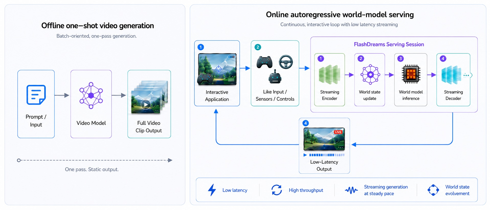

<!-- SPDX-FileCopyrightText: Copyright (c) 2026 NVIDIA CORPORATION & AFFILIATES. All rights reserved. -->

<!-- SPDX-License-Identifier: Apache-2.0 -->

  

    <h1 class="fd-hero-title">FlashDreams</h1>
    
FlashDreams is an inference and serving runtime for turning
    autoregressive video and world models into live, controllable simulations. It runs
    the model in a continuous loop, carrying state forward and streaming frames while
    new actions or sensor inputs change what happens next, whether the application is a
    game world, an autonomous-vehicle simulator, robotic policy testing, or a virtual
    training environment.

    

      <a class="fd-button fd-button-primary" href="quickstart/">Get Started!</a>
      <a class="fd-button" href="https://github.com/NVIDIA/flashdreams">GitHub</a>
      <a class="fd-button" href="community/">Contribute</a>
    

  

  

    
  

  <h2>Why FlashDreams?</h2>

  

    

      
    

    

      
A world model learns to generate and evolve an environment over time. In practice
      that usually means video, but the same idea extends to actions, state, audio, sensor
      input, and control signals. Serving one means keeping a session alive while input,
      model state, GPU inference, and output advance together, rather than producing a
      single static clip, which is what makes interactive simulation, robotics, autonomy,
      and game-like experiences possible.

    

  

  FlashDreams is built for that real-time case: a closed-loop world-model
  demo, a driving simulator, an interactive scene rollout. Generating
  high-quality video is not enough on its own. The runtime has to keep an
  interactive session responsive while the model continues to advance the
  world. That comes down to four things:

  

    

      
Low latency

      
Keep the interaction responsive when controls, sensors, or user input change.

    

    

      
High throughput

      
Keep the GPU busy across autoregressive steps and multi-GPU execution.

    

    

      
Steady streaming generation

      
Stream frames or chunks at a steady pace while the session continues.

    

    

      
World-state evolution

      
Carry rolling state forward so the generated world evolves across steps.

    

  

  <h2>Performance</h2>

  Each tile shows the speedup over a separate existing implementation of
  the same model. Both runs use the same weights on the same GPU, so the
  gain comes from FlashDreams' runtime alone. Each tile links to the
  profiling chart on its model page.

  

    <a class="fd-card fd-stat-card" href="models/self_forcing/#performance-outdated">
      2.12×
      Self-Forcing speedup
    </a>
    <a class="fd-card fd-stat-card" href="models/lingbot_world/#performance-outdated">
      3.10×
      LingBot-World speedup
    </a>
    <a class="fd-card fd-stat-card" href="models/wan21/#performance-outdated">
      1.40×
      Wan2.1 speedup
    </a>
    <a class="fd-card fd-stat-card" href="models/flashvsr/#performance-outdated">
      1.42×
      FlashVSR speedup
    </a>
  

  <h2>Try FlashDreams!</h2>

  FlashDreams brings best-in-class per-step latency to interactive
  autoregressive video and world models: multiple integrated models across
  streaming and bidirectional methods, multi-GPU execution, and CLI entry
  points for runner presets, demos, and v2 applications.

  The [Get Started guide](quickstart/index.md) walks from a fresh
  checkout to running OmniDreams, an interactive driving world-model demo
  built on FlashDreams.

  <h2>Supported Models</h2>

  Streaming and autoregressive model implementations emit per-step output with
  sub-second latency once warm; bidirectional model implementations are kept as
  full-block parity references. Each model page carries the canonical
  invocation, the checkpoint source, and the per-implementation knobs.

  

    <a class="fd-card fd-model-card" href="models/omnidreams/">
      OmniDreams
      Interactive world simulator for autonomous vehicles.
    </a>
    <a class="fd-card fd-model-card" href="models/self_forcing/">
      Self-Forcing
      Autoregressive text-to-video based on Wan 2.1.
    </a>
    <a class="fd-card fd-model-card" href="models/causal_forcing/">
      Causal-Forcing
      Autoregressive text/image-to-video based on Wan 2.1.
    </a>
    <a class="fd-card fd-model-card" href="models/causal_wan22/">
      Causal Wan 2.2
      Autoregressive text-to-video based on Wan 2.2 from FastVideo.
    </a>
    <a class="fd-card fd-model-card" href="models/lingbot_world/">
      LingBot-World
      Camera-controllable image-to-video world model.
    </a>
    <a class="fd-card fd-model-card" href="models/waypoint/">
      Waypoint 1.5
      Interactive image-established world model controlled by keyboard and mouse.
    </a>
    <a class="fd-card fd-model-card" href="models/sana_wm_streaming/">
      SANA-WM
      Camera-controlled world model with streaming and bidirectional variants.
    </a>
    <a class="fd-card fd-model-card" href="models/flashvsr/">
      FlashVSR
      Streaming video super-resolution.
    </a>
    <a class="fd-card fd-model-card" href="models/swiftvr/">
      SwiftVR
      Real-time one-step streaming video restoration with 2x and 4x presets.
    </a>
    <a class="fd-card fd-model-card" href="models/wan21/">
      Wan 2.1 (bidirectional)
      Bidirectional video generation model that supports both text-to-video and image-to-video.
    </a>
    <a class="fd-card fd-model-card" href="models/wan22/">
      Wan 2.2 TI2V-5B (bidirectional)
      Bidirectional text-and-image-to-video generation in one full-clip rollout.
    </a>
    <a class="fd-card fd-model-card" href="models/cosmos_predict2/">
      Cosmos-Predict2.5 (bidirectional)
      Bidirectional Cosmos-Predict2 reference implementations (T2V / I2V, 2B).
    </a>
  

