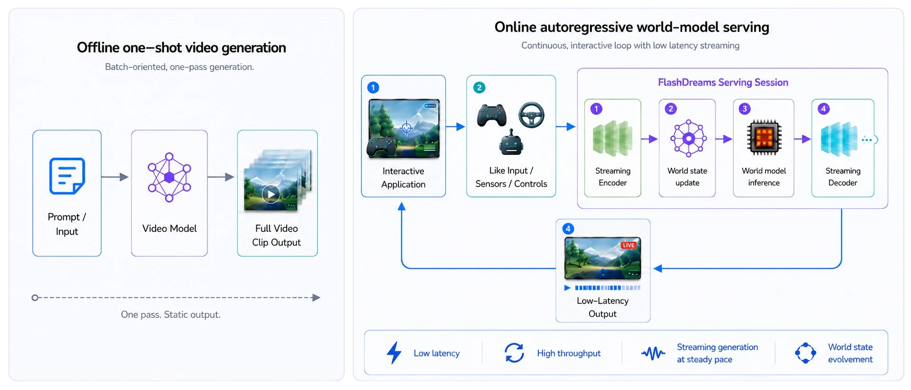
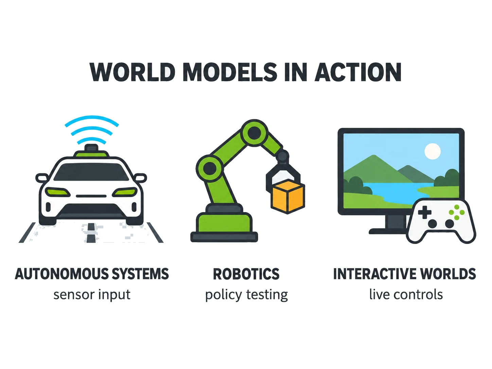
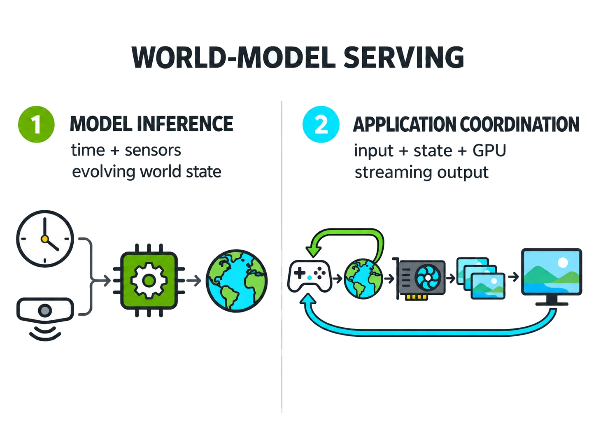
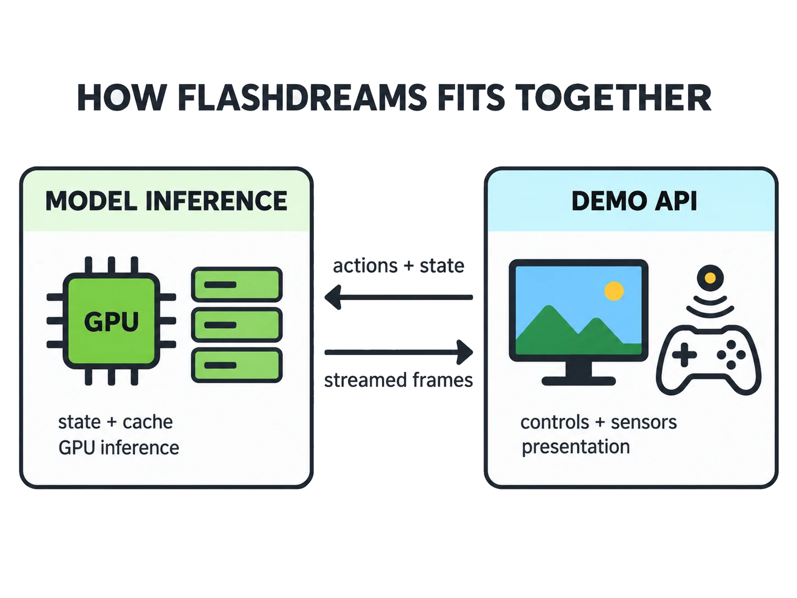

<!-- SPDX-FileCopyrightText: Copyright (c) 2026 NVIDIA CORPORATION & AFFILIATES. All rights reserved. -->

<!-- SPDX-License-Identifier: Apache-2.0 -->

  

    <h1 class="fd-hero-title">FlashDreams</h1>
    

    FlashDreams is an inference and serving runtime for turning
    world models into live, controllable simulations. FlashDreams runs models in a continuous
    loop, carrying state forward and streaming frames while new actions or sensor inputs change
    what happens next step.
     
     
    Whether the application is a game world, an autonomous-vehicle simulator, robotic policy testing, or a virtual training environment, FlashDreams is the runtime to make it possible.
  

    

      <a class="fd-button fd-button-primary" href="quickstart/">Get Started!</a>
      <a class="fd-button" href="https://github.com/NVIDIA/flashdreams">GitHub</a>
      <a class="fd-button" href="community/">Contribute</a>
    

  

  

    
  

  <h2>Explore FlashDreams</h2>
  
Choose a section to get started or browse the project.

  

    <a class="fd-card fd-model-card" href="quickstart/">Get StartedInstall FlashDreams and run your first model.</a>
    <a class="fd-card fd-model-card" href="models/">ModelsBrowse default supported models.</a>
    <a class="fd-card fd-model-card" href="demos/">DemosExplore our game-like experiences and model interfaces.</a>
    <a class="fd-card fd-model-card" href="documentation/">DocumentationCheckout our CLI, Demo API, Inferencing API, tooling, or related guides.</a>
    <a class="fd-card fd-model-card" href="community/">CommunityFind contribution documentation and support channels.</a>
  

  <h2>Why FlashDreams?</h2>

  

    <h2>Serving World Models is Hard</h2>
    
Building a <strong>static clip generator is not enough</strong> for world-model serving.

    

    

      

        <h4>Worlds evolve over time</h4>
        
World models are taught to generate and evolve an environment over time. They support robotics-policy testing, autonomous-vehicle simulation, interactive worlds, and other applications.

      

      
    

    

      

        <h4>Serving has two parts</h4>
        <ol class="fd-why-list">
          <li>Inference of a video model that consumes inputs such as clock time and sensors while evolving world state.</li>
          <li>A separate application that coordinates inputs, model state, GPU inference, and output.</li>
        </ol>
      

      
    

    

      

        <h4>FlashDreams was built for both parts:</h4>
        <ol class="fd-why-list">
          <li>The <a href="documentation/inferencing_api/">Inferencing API</a> helps model designers implement stateful world-model inference.</li>
          <li>The <a href="documentation/demo_api/">Demo API</a> helps application developers build experiences around the constraints of world-model serving.</li>
        </ol>
      

      
    

  

  

    <h2>Performance</h2>

    Each tile shows speedup over an existing implementation of
    the same model. Both run the same weights on the same GPU, so the
    gain comes from the FlashDreams runtime alone.

    

      <a class="fd-card fd-stat-card" href="models/self_forcing/#performance-outdated">
        2.12×
        Self-Forcing speedup
      </a>
      <a class="fd-card fd-stat-card" href="models/lingbot_world/#performance-outdated">
        3.10×
        LingBot-World speedup
      </a>
      <a class="fd-card fd-stat-card" href="models/wan21/#performance-outdated">
        1.40×
        Wan2.1 speedup
      </a>
      <a class="fd-card fd-stat-card" href="models/flashvsr/#performance-outdated">
        1.42×
        FlashVSR speedup
      </a>
    

  

  

  <h2>Try FlashDreams!</h2>

  The [Get Started guide](quickstart/index.md) walks from a fresh
  checkout to running OmniDreams, an interactive driving world-model demo
  built on FlashDreams.

  <h2>Supported Models</h2>

  Streaming and autoregressive model implementations emit per-step output with
  sub-second latency once warm; bidirectional model implementations are kept as
  full-block parity references. Each model page carries the canonical
  invocation, the checkpoint source, and the per-implementation knobs.

  

    <a class="fd-card fd-model-card" href="models/omnidreams/">OmniDreamsInteractive world simulator for autonomous vehicles.</a>
    <a class="fd-card fd-model-card" href="models/self_forcing/">Self-ForcingAutoregressive text-to-video based on Wan 2.1.</a>
    <a class="fd-card fd-model-card" href="models/causal_forcing/">Causal-ForcingAutoregressive text/image-to-video based on Wan 2.1.</a>
    <a class="fd-card fd-model-card" href="models/causal_wan22/">Causal Wan 2.2Autoregressive text-to-video based on Wan 2.2 from FastVideo.</a>
    <a class="fd-card fd-model-card" href="models/lingbot_world/">LingBot-WorldCamera-controllable image-to-video world model.</a>
    <a class="fd-card fd-model-card" href="models/waypoint/">Waypoint 1.5Interactive world model controlled by keyboard and mouse.</a>
    <a class="fd-card fd-model-card" href="models/hy_worldplay/">HY-WorldPlayAction- and camera-controllable image-to-video world model.</a>
    <a class="fd-card fd-model-card" href="models/sana_wm_streaming/">SANA-WMCamera-controlled world model with streaming and bidirectional variants.</a>
    <a class="fd-card fd-model-card" href="models/flashvsr/">FlashVSRStreaming video super-resolution.</a>
    <a class="fd-card fd-model-card" href="models/swiftvr/">SwiftVRReal-time streaming video restoration with 2× and 4× presets.</a>
    <a class="fd-card fd-model-card" href="models/wan21/">Wan 2.1Bidirectional text-to-video and image-to-video generation.</a>
    <a class="fd-card fd-model-card" href="models/wan22/">Wan 2.2 TI2V-5BBidirectional text-and-image-to-video generation.</a>
    <a class="fd-card fd-model-card" href="models/cosmos_predict2/">Cosmos-Predict2.5Bidirectional Text2World, Image2World, and Video2World generation.</a>
  

