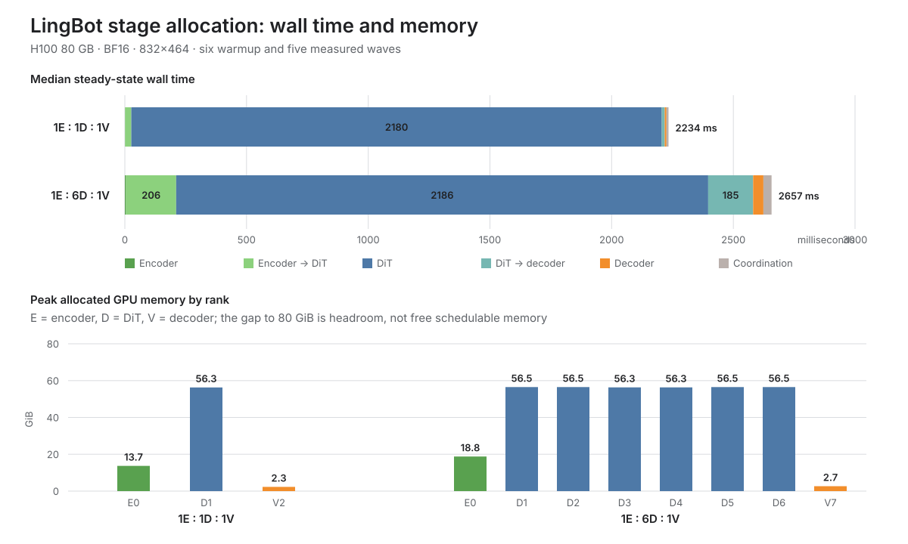
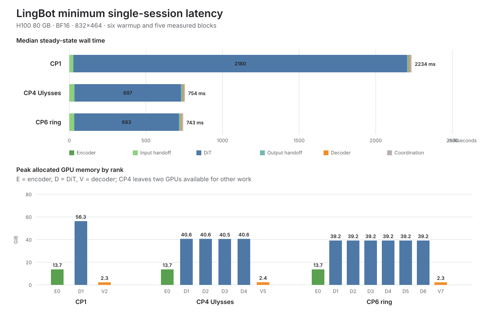
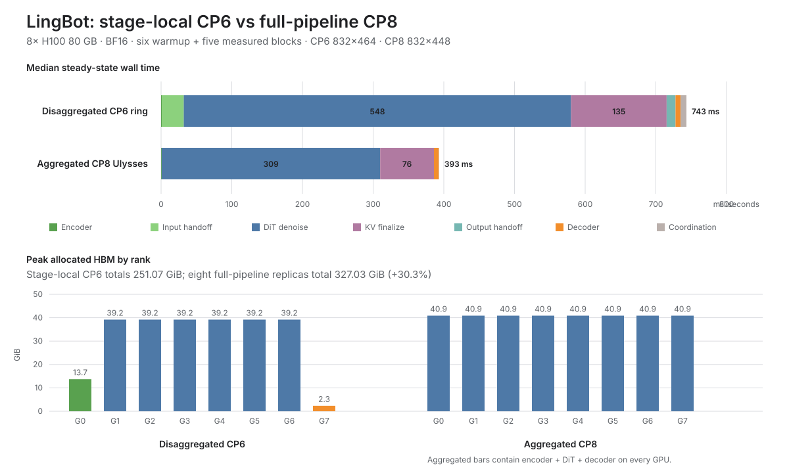
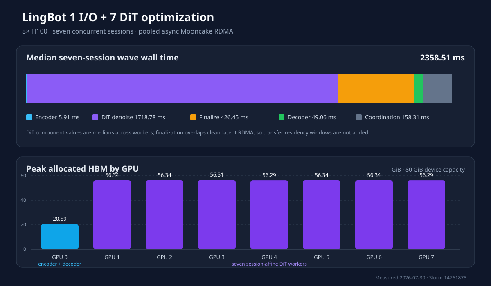

<!--
SPDX-FileCopyrightText: Copyright (c) 2026 NVIDIA CORPORATION & AFFILIATES. All rights reserved.
SPDX-License-Identifier: Apache-2.0
-->

# LingBot three-stage disaggregation experiment

## Status

**Useful opt-in.** The experiment validates that encoder, DiT, and decoder
components can run on separate H100 GPUs and exchange their real LingBot tensor
payloads through Mooncake's RDMA transport. The eight-GPU follow-up validates
six concurrent, session-affine DiT workers behind a shared encoder and decoder.
It does not establish output-quality equivalence with the aggregated runner,
cross-node performance, or production scheduler behavior, so it is not a new
default serving path.

The machine-readable measurements are in
[`benchmark_h100_3stage/benchmark.json`](benchmark_h100_3stage/benchmark.json);
the generated compact table is in
[`benchmark_h100_3stage/README.md`](benchmark_h100_3stage/README.md). The
eight-GPU measurements are in
[`benchmark_h100_1e6d1d/benchmark.json`](benchmark_h100_1e6d1d/benchmark.json)
with its
[`generated summary`](benchmark_h100_1e6d1d/README.md). The combined
[wall-time and memory chart](disaggregated_inference_breakdown.svg) is generated
from those two JSON files. The single-session CP4 and CP6 results are in
[`benchmark_h100_cp4_single_session`](benchmark_h100_cp4_single_session/README.md)
and
[`benchmark_h100_cp6_single_session`](benchmark_h100_cp6_single_session/README.md);
their [comparison chart](disaggregated_inference_single_session.svg) is generated
directly from the raw JSON documents. The full-pipeline CP8 baseline is in
[`benchmark_h100_aggregated_cp8`](benchmark_h100_aggregated_cp8/README.md), with
its [stage-local CP6 comparison chart](aggregated_vs_disaggregated.svg). The
optimized co-located 1-I/O : 7-DiT result is in
[`benchmark_h100_1io7dit_optimized`](benchmark_h100_1io7dit_optimized/README.md),
with its [wall-time and memory chart](disaggregated_inference_optimized.svg).

## Question and design

The experiment asked whether the monolithic LingBot inference pipeline could be
split into independently placed services without making inter-GPU transfer the
new bottleneck. The tested topology was:

```text
rank 0 / GPU 0                     rank 1 / GPU 1                 rank 2 / GPU 2
text + image + VAE + camera  ───▶  scheduler + DiT + KV cache ───▶ LightTAE
             14.36 MiB / block          0.55 MiB / block
```

The evolving autoregressive KV cache stays on the DiT worker. Session
conditioning crosses the encoder-to-DiT boundary once; each block then sends
the I2V latent, mask, and Plücker features to DiT and sends only the clean latent
to the decoder. Mooncake uses receiver-allocated, registered VRAM and a batched
synchronous write, so tensor contents are not serialized through the Python
control plane or staged through host memory.

This is diffusion pipeline-stage disaggregation, analogous in scheduling intent
to separating prefill and decode pools in an LLM server, but the boundaries and
resident state are diffusion-native.

## Tested configuration

| Item | Value |
| --- | --- |
| Date | 2026-07-29 |
| Slurm allocation | Job `14621292`, node `pool0-01299` |
| Repository base | `e580e27d408b3cf8bd8a549f990c361b94d3379f`; the implementation under test was the worktree change recorded with this report |
| Container | `flashdreams-base-v0.3-20260429-af40a4f.sqsh` |
| GPUs used | 3 × NVIDIA H100 80 GB HBM3, one process per GPU |
| GPU topology | GPU 0/1/2 connected by NVLink; node exposed nine `mlx5` HCAs |
| Driver | Not captured by the original harness; the reproduction checklist below captures it |
| Python / PyTorch | Python 3.12, PyTorch `2.12.1+cu130` |
| CUDA / cuDNN | CUDA 13.0, cuDNN 92000 |
| Mooncake | `mooncake-transfer-engine-cuda13==0.3.12.post1` |
| Model | `lingbot-world-fast-taehv-window15-sink3` |
| DiT checkpoint | `robbyant/lingbot-world-fast`, `diffusion_pytorch_model.safetensors.index.json` |
| Precision | BF16 model and image tensors; FP32 camera tensors |
| Scheduler | Four-step distilled flow matching, CFG 1.0, seed 42 |
| Streaming layout | 3 latent frames per chunk, temporal window 15, sink 3 |
| Decoder | LightTAE / TAEHV |
| Input | Upstream LingBot example `00`: `image.jpg`, `intrinsics.npy`, `poses.npy`, and `prompt.txt` |
| Resolution / target playback | 832 × 464, 16 FPS |
| Process state | Fresh `torchrun` process with a persistent, previously populated Triton cache |
| Measurement policy | 6 warmup blocks, then 5 measured blocks; 8 iterations per 256 MiB link probe |

The exact prompt was:

> The video presents a soaring journey through a fantasy jungle. The wind
> whips past the rider's blue hands gripping the reins, causing the leather
> straps to vibrate. The ancient gothic castle approaches steadily, its stone
> details becoming clearer against the backdrop of floating islands and distant
> waterfalls.

## Method

1. Each rank constructed only its stage-local weights. Model construction
   happened before `torch.distributed` initialization because LingBot otherwise
   interprets a three-rank process group as three-way context parallelism.
2. The ranks initialized a Gloo control group and independent Mooncake P2P
   endpoints with `protocol=rdma`.
3. Mooncake discovered nine `mlx5` HCAs, installed its RDMA transport, and
   completed RDMA-ready handshakes.
4. Before model measurements, each edge ran one connection warmup followed by
   eight synchronous 256 MiB transfers through reusable registered buffers.
5. The model ran eleven autoregressive blocks. Blocks 0–5 were excluded because
   they cover initial model/compiler warmup and the second DiT cache-shape
   transition at block 5. Blocks 6–10 were measured.
6. CUDA events measured stage compute. Host wall clocks measured synchronous
   transfer calls, complete handoffs, and barrier-to-barrier chunk latency.
7. Throughput was computed from the 60 generated measured frames divided by the
   sum of the five measured chunk latencies. It is generated throughput, not the
   configured 16 FPS playback target.

Warmup must remain at six blocks or more for this preset. Shorter trials observed
one-time DiT compilation at block 5 and produced misleading 13–24 second
outliers in the measured set.

## Findings

### Steady-state compute and latency

| Component | Median | P90 | Share of median chunk latency |
| --- | ---: | ---: | ---: |
| Encoder compute | 1.08 ms | 1.14 ms | 0.05% |
| Encoder → DiT full handoff | 25.38 ms | 25.88 ms | 1.14% |
| DiT denoise | 1734.84 ms | 1755.00 ms | 77.67% |
| DiT cache finalization | 444.79 ms | 446.72 ms | 19.91% |
| DiT → decoder full handoff | 12.05 ms | 14.73 ms | 0.54% |
| Decoder compute | 7.14 ms | 7.15 ms | 0.32% |
| End-to-end chunk | 2233.57 ms | 2250.79 ms | 100% |

The five measured blocks generated 12 frames each. Total generated throughput
was **5.36 FPS**. DiT denoising plus cache finalization consumed 97.58% of median
chunk latency, so additional DiT replicas—not encoder or decoder replicas—are
the first resource-scaling lever for concurrent sessions.

### Transfer behavior

| Edge | Real payload | Copy median | Payload bandwidth median | Full handoff median | 256 MiB probe median |
| --- | ---: | ---: | ---: | ---: | ---: |
| Encoder → DiT | 14.36 MiB | 1.35 ms | 11.12 GB/s | 25.38 ms | 41.35 GB/s |
| DiT → decoder | 0.55 MiB | 1.49 ms | 0.39 GB/s | 12.05 ms | 41.00 GB/s |

The two transfer-engine copy calls used 0.13% of median chunk latency. Complete
handoffs—including receiver allocation and registration, sender registration,
metadata broadcasts, barriers, and the copy—used 1.68%. The small clean-latent
payload cannot saturate the link, which explains its low payload GB/s despite
the 41 GB/s large-buffer probe.

The full handoff gap is mostly setup and synchronization rather than byte
movement. Production serving should pool and reuse registered destination
buffers and replace global barriers/object broadcasts with request-scoped
control messages.

### Peak allocated GPU memory

| Stage GPU | Peak allocated memory | Share of three-stage total |
| --- | ---: | ---: |
| Encoder | 13.72 GiB | 18.98% |
| DiT | 56.29 GiB | 77.86% |
| Decoder | 2.29 GiB | 3.17% |

Disaggregation makes the imbalance explicit: encoder and decoder GPUs have
substantial unused capacity while the DiT GPU owns most weights and resident
state. A production scheduler should allow encoder and decoder workers to serve
multiple session-affine DiT workers.

## Eight-GPU stage allocation

### Allocation rule

Starting with one GPU per stage, the scheduler repeatedly assigns an available
GPU to the stage with the largest baseline service time divided by its current
replica count. The baseline service-time inputs include stage compute and the
handoff that feeds that stage:

| Stage | Baseline service time | Replicas after each of five assignments | Final allocation |
| --- | ---: | --- | ---: |
| Encoder | 26.46 ms | 1, 1, 1, 1, 1 | 1 |
| DiT + finalize | 2179.63 ms | 2, 3, 4, 5, 6 | 6 |
| Decoder | 19.19 ms | 1, 1, 1, 1, 1 | 1 |

This produces **1 encoder : 6 DiT : 1 decoder**. Each DiT GPU owns one
independent session and persistent KV cache. The benchmark processes a wave by
encoding six inputs on GPU 0, running the six DiTs concurrently on GPUs 1–6,
and decoding six outputs on GPU 7. It measures throughput scaling for concurrent
sessions; it does not tensor-parallelize a single DiT or reduce a single
session's autoregressive dependency.

### Eight-GPU tested configuration

The follow-up used the same model, prompt, resolution, precision, scheduler,
warmup policy, and transfer probe as the three-GPU baseline, with these
differences:

| Item | Value |
| --- | --- |
| Date | 2026-07-29 |
| Slurm allocation | Job `14628860`, node `pool0-00205` |
| Repository revision | `08d4c6c159321221c9a2d213c5ebb1359f443ef0` plus the replicated-benchmark worktree change |
| GPUs used | 8 × NVIDIA H100 80 GB HBM3, one process per GPU |
| Driver | 535.216.03 |
| Topology | GPU 0 encoder; GPUs 1–6 DiT workers; GPU 7 decoder |
| Sessions | Six independent sessions per wave |
| Measurements | 6 warmup waves followed by 5 measured waves |

### Throughput and latency

| Metric | 1:1:1 baseline | 1:6:1 wave | Change |
| --- | ---: | ---: | ---: |
| Aggregate generated FPS | 5.36 | 27.20 | **5.07×** |
| Generated FPS per allocated GPU | 1.79 | 3.40 | **1.90×** |
| Session/wave median latency | 2233.57 ms | 2657.06 ms | 1.19× |
| Session/wave p90 latency | 2250.79 ms | 2671.08 ms | 1.19× |
| Per-session generated FPS | 5.36 | 4.53 | 0.85× |

Six-way DiT replication converts the dominant serial service into concurrent
capacity. Aggregate throughput scales to 84.6% of the ideal six-replica gain.
The remaining gap is visible in the sequential wave scheduler: six
encoder-to-DiT handoffs consume 205.94 ms per median wave and six
DiT-to-decoder handoffs consume 184.63 ms. A production implementation should
overlap those request-scoped transfers with DiT execution and reuse registered
buffers.

### Eight-GPU wall-time and memory



| Component | 1:1:1 median | 1:6:1 median wave |
| --- | ---: | ---: |
| Encoder compute | 1.08 ms | 4.91 ms |
| Encoder → DiT handoff | 25.38 ms | 205.94 ms total |
| DiT critical path | 2179.63 ms | 2185.88 ms |
| DiT → decoder handoff | 12.05 ms | 184.63 ms total |
| Decoder compute | 7.14 ms | 42.26 ms |
| Coordination / residual | 8.29 ms | 33.40 ms |
| End-to-end | 2233.57 ms | 2657.06 ms |

| Rank and role | Peak allocated memory |
| --- | ---: |
| GPU 0, shared encoder | 18.77 GiB |
| GPU 1–6, DiT workers | 56.34–56.51 GiB each |
| GPU 7, shared decoder | 2.65 GiB |

The shared encoder grows by about 5 GiB relative to the baseline because it
owns six streaming encoder caches and participates in all six input edges. The
DiT ranks remain near the baseline's 56.29 GiB, confirming that each session's
resident state stays local rather than being copied between workers.

### Eight-GPU transfer behavior

All twelve 256 MiB probes—GPU 0 to each DiT and each DiT to GPU 7—completed
through Mooncake's configured RDMA transport. The combined median was
**41.22 GB/s**, p90 was **42.27 GB/s**, and the observed range was
33.89–42.49 GB/s. The one low sample occurred on encoder → DiT rank 2; that
edge's median remained 41.12 GB/s.

During teardown after the successful report was written, Mooncake emitted
non-fatal `remote access error` and rail-pause messages while registrations
were being removed. `torchrun` exited with status 0 and every measured transfer
call had returned success, but this is still a buffer-lifetime warning:
production code must pool registrations and introduce an explicit drain before
unregistering memory or closing endpoints. The current benchmark result should
not be interpreted as failure-recovery validation.

## Minimum single-session latency

### Topologies and compatibility

The replicated 1:6:1 topology above cannot accelerate one session because each
DiT rank owns a different request. The latency experiment instead made the DiT
ranks one context-parallel group. The encoder sends one Mooncake handoff to the
CP leader, the leader broadcasts the full step input within the NCCL subgroup,
and the existing Wan context-parallel path splits the 4524-token sequence.
Only the leader sends the reconstructed clean latent to the decoder.

Two viable candidates were measured:

| Candidate | Processes used | Compatibility |
| --- | ---: | --- |
| 1 encoder : CP4 DiT : 1 decoder | 6 of 8 | Ulysses; 40 heads and 4524 tokens are divisible by 4 |
| 1 encoder : CP6 DiT : 1 decoder | 8 of 8 | Ring; 4524 tokens are divisible by 6 |

CP6 Ulysses was rejected before measurement because LingBot has 40 attention
heads and Ulysses requires `num_heads % cp_size == 0`; `40 % 6 != 0`. CP5 is
also unsuitable at this resolution because `4524 % 5 != 0`. CP4 is therefore
the largest configuration that satisfies both Ulysses head partitioning and
the token-sharding constraint while reserving distinct encoder and decoder
GPUs.

The DiT subgroup occupies global ranks 1–6 for CP6, not ranks 0–5. The
experiment exposed and fixed a ring-rotation bug that used global
`DeviceMesh.get_rank()` to index subgroup all-gather output. Ring attention now
uses `get_local_rank()`, so every rank visits each subgroup K/V shard exactly
once.

### Tested configuration

Both trials ran in Slurm job `14646820` on `pool0-01260` with the same model,
prompt, resolution, precision, scheduler, six warmup blocks, five measured
blocks, and eight 256 MiB transfer probes as the baseline. CP6 used GPUs 0–7;
CP4 used GPUs 0–5 and left GPUs 6–7 idle. The software stack was Python 3.12.13,
PyTorch 2.12.1+cu130, CUDA 13.0, driver 535.216.03, and Mooncake
0.3.12.post1. The repository base was
`66bcd32ece1d03b3362d71a7340691a0687a4069` plus the worktree changes recorded
by this report.

Each DiT rank initially launched 32 Inductor compiler workers. At CP6 that
created 192 workers and overcommitted the host during cold compilation. The
reported runs set `TORCHINDUCTOR_COMPILE_THREADS=4`, limiting the six DiT ranks
to 24 compiler workers. Compile/autotune time is excluded from the measured
steady-state blocks.

### Latency and throughput



| Metric | CP1 baseline | CP4 Ulysses | CP6 ring |
| --- | ---: | ---: | ---: |
| Median chunk latency | 2233.57 ms | 754.41 ms | **743.27 ms** |
| P90 chunk latency | 2250.79 ms | 786.46 ms | **780.60 ms** |
| Generated FPS | 5.36 | 15.70 | **15.90** |
| End-to-end speedup | 1.00× | 2.96× | **3.01×** |
| DiT critical path | 2179.63 ms | 696.76 ms | **683.16 ms** |
| DiT speedup | 1.00× | 3.13× | **3.19×** |
| CP efficiency | — | **78.2%** | 53.2% |

CP6 ring is the measured minimum: it is 11.13 ms, or 1.5%, faster than CP4
Ulysses and uses all eight GPUs. CP4 is substantially more efficient per DiT
GPU and leaves two GPUs for other work, so it is the better capacity choice
when an 11 ms latency reduction is not worth two additional GPUs. Neither
configuration approaches ideal linear scaling because attention collectives,
duplicated non-attention work, and synchronization remain on every diffusion
step.

The result answers the distinction behind the replicated experiment:
**1 encoder : 6 independent DiTs : 1 decoder** reached 27.20 aggregate FPS but
only 4.53 FPS per session, while **1 encoder : one CP6 DiT group : 1 decoder**
reached 15.90 FPS for one session. Replication increases request capacity;
context parallelism shortens the critical path of a single request.

### Component, transfer, and memory breakdown

| Component | CP1 | CP4 Ulysses | CP6 ring |
| --- | ---: | ---: | ---: |
| Encoder compute | 1.08 ms | 0.85 ms | 0.90 ms |
| Encoder → leader handoff | 25.38 ms | 31.70 ms | 30.33 ms |
| CP input fanout | — | 0.76 ms | 0.89 ms |
| DiT + finalize | 2179.63 ms | 696.76 ms | 683.16 ms |
| Leader → decoder handoff | 12.05 ms | 12.38 ms | 12.59 ms |
| Decoder compute | 7.14 ms | 7.07 ms | 7.13 ms |

| Probe / allocation | CP4 Ulysses | CP6 ring |
| --- | ---: | ---: |
| Mooncake encoder → leader, 256 MiB | 41.44 GB/s | 42.62 GB/s |
| Mooncake leader → decoder, 256 MiB | 42.52 GB/s | 42.26 GB/s |
| NCCL broadcast, 256 MiB effective per rank | 307.31 GB/s | 283.71 GB/s |
| NCCL all-gather, 256 MiB effective per rank | 389.11 GB/s | 231.72 GB/s |
| Encoder peak allocated memory | 13.72 GiB | 13.72 GiB |
| DiT peak allocated memory per rank | 40.52–40.64 GiB | 39.18 GiB |
| Decoder peak allocated memory | 2.37 GiB | 2.29 GiB |

The Mooncake stage boundaries remain small relative to the DiT critical path.
The CP probe values are effective materialized bytes per rank divided by
collective wall time; they are not raw physical-link throughput. CP6's lower
all-gather rate and lower scaling efficiency quantify the communication cost of
using all six DiT ranks.

The five measured blocks in each trial emitted 12 frames and excluded both
initial compilation and the block-5 cache-shape transition. No decoded
aggregated-versus-CP quality comparison was performed, so these are performance
results, not output-parity evidence. The measured runs wrote their reports but
then stalled during process-group teardown. The final implementation drains the
NCCL subgroup with a CUDA synchronization and subgroup barrier before destroying
it, then destroys the Gloo control group. A subsequent one-block full-model
smoke and a transport-only run both exited normally. This cleanup-only change
does not affect the five-block timing samples above.

## Fully aggregated single-H100 baseline

The complete encoder, DiT, and LightTAE decoder were also measured in one
process on one H100 80 GB at the original 832×464 resolution. The run used six
warmup chunks followed by five measured 12-frame chunks.

| Metric | Fully aggregated CP1 |
| --- | ---: |
| Generated FPS | **5.56** |
| Median / p90 chunk latency | **2157.51 / 2166.25 ms** |
| Initialization peak allocated HBM | **66.55 GiB** |
| Rollout peak allocated HBM | **59.36 GiB** |
| Steady allocated HBM | **57.15 GiB** |

This proves the tested LingBot Fast configuration fits on one H100. Against the
same-resolution three-GPU stage-disaggregated CP1 result, aggregation improved
FPS by 3.6% and reduced median latency by 76.05 ms, or 3.4%. The small change
confirms that DiT compute and cache finalization, rather than stage handoffs,
dominate CP1 latency. See the
[single-H100 report](benchmark_h100_aggregated_cp1/README.md) and
[raw result](benchmark_h100_aggregated_cp1/benchmark.json).

## Eight independent aggregated workers

The next capacity experiment ran eight complete CP1 pipelines concurrently,
one per H100 and one per session. A coordinator held every worker after six
warmup chunks and released all eight into the same five-chunk measurement
window. The start skew was 0.32 ms.

| Metric | Eight independent full pipelines |
| --- | ---: |
| Aggregate generated FPS | **43.44** |
| Median per-session FPS | **5.54** |
| Median / p90 chunk latency | **2163.64 / 2205.53 ms** |
| Rollout / initialization peak HBM per GPU | **59.35 / 66.55 GiB** |
| Rollout / initialization peak HBM node total | **474.84 / 532.38 GiB** |

The shared-window result is 97.7% of linear scaling from the single-H100 run.
It is 23.6% faster in aggregate than 1 I/O + 7 DiTs, but uses 14.4% more
rollout peak node HBM because every GPU owns the encoder, full DiT, decoder, and
session cache. This makes full replication the best measured capacity topology
when every complete pipeline fits in one GPU. Disaggregation remains relevant
when it does not fit, or when stages need independent placement and scaling.
See the [eight-replica report](benchmark_h100_aggregated_8xcp1/README.md) and
[raw result](benchmark_h100_aggregated_8xcp1/benchmark.json).

## Aggregated eight-GPU baseline

### Topology and resolution

The next experiment removed the stage boundaries and constructed the complete
encoder + DiT + decoder pipeline on every rank. WORLD is one CP8 Ulysses group:

```text
GPU 0–7: full encoder + full DiT weights + full decoder
                         ║
                  NCCL CP8 Ulysses
                         ║
                    one session
```

Every rank executes the encoder and decoder redundantly. There is no Mooncake
or NIXL data path because no tensor crosses an independently deployed stage
boundary; all inter-GPU movement is inside the DiT's NCCL context-parallel
collectives. This is the conventional aggregated baseline against which the
stage-local deployment should be compared.

The original 832×464 resolution produces 4,524 post-patch tokens. CP8 requires
an even split, and `4524 % 8 = 4`, so the benchmark rejects that shape. The
closest valid height is 448: 832×448 produces 4,368 tokens, or 546 tokens per
rank. This is 3.45% fewer tokens than the earlier experiments. FPS and latency
are reported directly, while DiT token throughput is the resolution-normalized
comparison.

### Tested configuration

| Item | Value |
| --- | --- |
| Date | 2026-07-29 |
| Slurm allocation | Job `14652956`, node `pool0-01714` |
| Repository base | `bb67d2868babea53cda7a9027831f26ee948293f` plus the aggregated-benchmark worktree change |
| GPUs | 8 × NVIDIA H100 80 GB HBM3, all-to-all NV18 connectivity |
| Driver / runtime | Driver 535.216.03; PyTorch 2.12.1+cu130; CUDA 13.0 |
| Topology | Eight full-pipeline replicas; WORLD CP8 Ulysses |
| Resolution / tokens | 832×448; 4,368 tokens per chunk; 546 tokens per rank |
| Model / precision / scheduler | Same LingBot Fast + LightTAE, BF16, four-step configuration |
| Compilation | Persistent Triton cache; `TORCHINDUCTOR_COMPILE_THREADS=4` |
| Measurement | Six warmup blocks, then five measured 12-frame blocks |

The first attempt completed all model measurements but hit a report-only
missing comparison label and then blocked in distributed teardown. After adding
the label fallback, the benchmark was rerun from a fresh `torchrun` process.
Only the successful second run is recorded. Its warmup blocks include cached
code loading and the block-5 cache-shape compilation; none of those times enter
the headline.

### Performance and resource comparison



| Metric | Stage-local CP6 ring | Aggregated CP8 Ulysses | Change |
| --- | ---: | ---: | ---: |
| Resolution | 832×464 | 832×448 | 3.45% fewer tokens |
| Median chunk latency | 743.27 ms | **393.33 ms** | **1.89× faster** |
| P90 chunk latency | 780.60 ms | **434.08 ms** | **1.80× faster** |
| Generated FPS | 15.90 | **29.50** | **1.86×** |
| DiT token throughput | 5,995 token/s | **10,739 token/s** | **1.79×** |
| FPS per allocated GPU | 1.99 | **3.69** | **1.86×** |
| GPU-seconds per chunk | 5.95 | **3.15** | **47.1% lower** |
| Rollout peak HBM, node total | 251.07 GiB | 327.03 GiB | **30.3% higher** |

The aggregated run is the new measured minimum single-session latency. Two
factors dominate the gain. First, it assigns all eight GPUs to DiT and can use
Ulysses because `40 % 8 == 0`; stage-local CP6 reserves two ranks for encoder
and decoder and must use ring attention. Second, it removes 43.81 ms of
encoder-to-leader fanout and leader-to-decoder handoff from the CP6 critical
path. The handoff removal alone is only 5.9% of CP6 latency, so most of the
1.89× gain comes from the larger, Ulysses-compatible DiT group rather than
from eliminating RDMA.

| Component / probe | Stage-local CP6 | Aggregated CP8 |
| --- | ---: | ---: |
| Encoder critical-rank compute | 0.90 ms | 0.84 ms |
| Encoder handoff + CP fanout | 31.21 ms | — |
| DiT denoise | 547.88 ms | 309.14 ms |
| KV-cache finalize | 135.25 ms | 76.06 ms |
| Decoder compute | 7.13 ms | 6.88 ms |
| Output handoff | 12.59 ms | — |
| 256 MiB NCCL broadcast probe | 283.71 GB/s | 266.83 GB/s |
| 256 MiB NCCL all-gather probe | 231.72 GB/s | 360.38 GB/s |

Probe bandwidth is effective materialized bytes per rank divided by collective
wall time, not raw NVLink wire bandwidth. It characterizes the allocation but
does not directly measure every all-to-all used by Ulysses. The node was fully
NVLink-connected; these numbers are not cross-node RDMA results.

Each aggregated rank peaked at 40.88 GiB during the measured rollout and held
38.80 GiB after it. Replicating that footprint eight times consumes 327.03 GiB
of rollout peak allocation and 310.37 GiB steady allocation node-wide. The
one-shot text/model initialization peak was higher at 48.27 GiB per rank, or
386.13 GiB across the node. The stage-local CP6 layout uses only 251.07 GiB
node-wide because encoder and decoder weights exist on one rank each.

This is a latency topology, not a blanket serving winner. It dedicates the
whole node to one session and cannot independently autoscale or place encoder,
DiT, and decoder services. The 1:6:1 topology remains the concurrent-session
choice: it serves six sessions at 27.20 aggregate FPS, while aggregated CP8
serves one session at 29.50 FPS. Production scheduling can choose between
replicated stage-local groups for capacity and aggregated CP groups for a
premium low-latency class.

## Disaggregation optimization follow-up

### Scope and implementation

The next experiment implemented the highest-value changes behind the earlier
recommendations:

1. Encoder and decoder are co-located on GPU 0; GPUs 1–7 become seven
   independent, session-affine DiT replicas.
2. Mooncake exposes `send_async` and an explicit transfer handle. A CUDA event
   waits for only the producer stream, replacing the previous device-wide
   synchronization.
3. `RegisteredTensorPool` allocates and registers fixed-shape receiver buckets
   once. Their transfer tickets are exchanged once and reused for all blocks.
4. The encoder submits a transfer after each session's encode and continues
   encoding later sessions before waiting. A DiT submits its clean latent
   before cache finalization, then the decoder waits at its actual dependency.
5. The CP benchmark can patchify once on the encoder and RDMA the corresponding
   token shard directly to each DiT rank, removing leader-mediated input
   broadcast and its full-input materialization on every rank.
6. An interchangeable `NixlTensorTransport` implements the same
   descriptor/ticket/handle contract. Its real backend remains optional.
7. `SessionAwareScheduler` adds fixed latency/throughput pools, sticky cache
   placement, predicted queue-time scoring, shape/CP/HBM compatibility,
   rack/NIC locality, and mandatory RDMA capability.
8. Compatible-session microbatch formation is implemented at the scheduler
   layer. Fused model execution is not: LingBot still needs cache
   gather/scatter, mask batching, and latency/HBM admission inside DiT.

This follows the design principle reported by the
[LightX2V disaggregation study](https://light-ai.top/LightX2V-BLOG/posts/Disaggregation/):
retain large mutable state at its compute stage, transfer boundary tensors
instead of model state, and recover utilization by independently scaling the
dominant stage. The transport design also follows
[NIXL's recommendation](https://github.com/ai-dynamo/nixl/blob/main/docs/nixl.md)
to register transfer memory during initialization and reuse its metadata.

### Reused allocation and method

All follow-up trials reused Slurm job `14761875` on `pool0-01924`; no second
node was allocated. The node exposed eight H100 80 GB HBM3 GPUs and nine
`mlx5` HCAs. The container was missing `libibverbs.so.1`, so `libibverbs1`,
`ibverbs-providers`, and `rdma-core` were installed in its writable layer.
Mooncake then discovered all nine HCAs, installed `type=rdma`, completed
RDMA-ready handshakes, and did not fall back to TCP.

The model, 832×464 input, seed, four-step scheduler, six warmup waves, five
measured waves, and 256 MiB eight-iteration probes match the tracked
disaggregated workload. The base revision was
`b762d079245681e1db70f1ffc5728753ce2a90b8` plus the changes recorded here.
`TORCHINDUCTOR_COMPILE_THREADS=1` limited host oversubscription.

### Throughput result



| Metric | Tracked 1E:6DiT:1D | 1IO:7DiT synchronous | 1IO:7DiT pooled async |
| --- | ---: | ---: | ---: |
| Aggregate generated FPS | 27.20 | 31.57 | **35.15** |
| Per-session generated FPS | 4.53 | 4.51 | **5.02** |
| Median seven-session wave | — | 2671.78 ms | **2358.51 ms** |
| P90 seven-session wave | — | 2705.95 ms | **2454.10 ms** |
| Median DiT critical path | 2185.88 ms | 2177.66 ms | 2178.39 ms |
| Median encoder wave | 4.91 ms for six | 5.92 ms | 5.91 ms |
| Median decoder wave | 42.26 ms for six | 49.20 ms | 49.06 ms |
| Median 256 MiB stage-edge probe | 41.22 GB/s | 42.28 GB/s | 41.97 GB/s |

Co-location plus the seventh DiT raises aggregate throughput 29.2% over the
tracked 1:6:1 result. Pooling and overlap then raise throughput 11.4% over the
same 1:7 topology's synchronous path. The optimized result is 10.9% above the
earlier 31.7 FPS linear projection. The stable five-wave range was
2354.46–2514.78 ms; p90 includes one slower 2.51 s measured wave.

The DiT critical path did not become faster; it remains about 2.18 seconds.
The gain comes from removing serialized handoff work from the wave's critical
path and adding one independent session. This result therefore increases
concurrent interactive-session capacity, not one session's FPS. The aggregated
CP8 topology remains the measured one-session latency winner.

| Optimized component | Median | P90 |
| --- | ---: | ---: |
| Encoder compute, seven inputs | 5.91 ms | 6.08 ms |
| DiT denoise, per-worker samples | 1718.78 ms | 1816.21 ms |
| DiT cache finalization, per-worker samples | 426.45 ms | 436.32 ms |
| DiT critical path, slowest worker | 2178.39 ms | 2256.77 ms |
| Decoder compute, seven outputs | 49.06 ms | 49.11 ms |
| End-to-end wave | 2358.51 ms | 2454.10 ms |

GPU 0 peaked at 20.59 GiB with both I/O stages and seven pairs of streaming
caches. DiT ranks peaked at 56.29–56.51 GiB each. Co-location therefore fits
with about 59 GiB of HBM headroom on the I/O GPU while keeping every DiT below
57 GiB.

### Transfer interpretation and correctness

The optimized fourteen-edge large-buffer probe measured 41.97 GB/s median,
42.66 GB/s p90, and 39.66–42.79 GB/s range. This is the reliable link
measurement. For asynchronous model transfers, `transfer_ms` spans submission
until the later wait. Useful encoder work or cache finalization happens inside
that interval, so it is an in-flight residency window, not isolated byte-copy
time or an additive latency component. The 0.55 MiB output's roughly 442 ms
window, for example, intentionally contains roughly 426 ms of finalization.

The synchronous control emitted repeated Mooncake `remote access error`,
`local access violation`, rail-pause, and rail-recovery messages when
per-request registered buffers were quickly unregistered and their addresses
reused. It still wrote a report and exited with status zero, but it is not a
production-safe control. The pooled run completed without those errors.
Persistent registration is therefore both the performance optimization and
the required receiver-buffer lifetime fix.

### Direct CP shard result

The direct CP6 input contract also completed all model measurements. The
encoder patchified once, split 4,524 tokens into six 754-token bundles, and
each CP rank consumed its own bundle without a leader broadcast. DiT compute
was unchanged, confirming the sharded tensor contract:

| CP6 ring metric | Leader handoff + NCCL fanout | Six direct Mooncake shards |
| --- | ---: | ---: |
| Median chunk latency | **743.27 ms** | 939.36 ms |
| Generated FPS | **15.90** | 12.70 |
| Encoder input handoff | **30.33 ms** | 174.23 ms |
| NCCL input fanout | 0.89 ms | **0.00 ms** |
| DiT critical path | 683.16 ms | 683.19 ms |
| DiT peak HBM per rank | 39.18 GiB | **39.16 GiB** |

The direct layout saves a full input replica and 0.89 ms of NCCL fanout, but
six separately allocated, registered, ticketed, and synchronized 2.39 MiB
Mooncake handoffs cost 174.23 ms. It regresses latency by 26.4% and throughput
by 20.2%, so `--direct-cp-input` is an experimental correctness path, not a
recommended optimization on Mooncake 0.3.12.

The full direct run wrote its five-wave report, then stalled in distributed
teardown and was manually terminated. Attempts to reuse registered destination
shards—both concurrent and sequential, including an explicit
post-registration barrier—failed with Mooncake status `-1`, `remote access
error`, and `local access violation`. That attempted pooling code was not kept.
A production direct-shard path needs a transport with reliable long-lived
multi-destination registrations, or a Mooncake fix, before it can outperform
the leader + NCCL path.

The allocated image did not contain NIXL, so the adapter was validated with a
fake-agent CPU round trip but not benchmarked on H100. No NIXL bandwidth result
is claimed. NVIDIA's
[Dynamo communication guide](https://docs.nvidia.com/dynamo/kubernetes-deployment/operate/disagg-communication)
recommends independently checking GPU-to-GPU bandwidth and verifying that the
NIXL/UCX backend is instantiated rather than silently accepting TCP; the same
acceptance rule is encoded by the scheduler.

## Two-stage pipeline-parallel DiT follow-up

### Implementation and topology

The next prototype partitions each 40-block DiT across a fixed two-GPU group.
The first rank retains blocks 0–19 and the input patch embedding; the second
retains blocks 20–39 and the output head. Each rank constructs only its local
autoregressive cache. Unowned blocks and endpoint modules are removed before
the module moves to CUDA, so this is model-state sharding rather than a full
DiT replica on both ranks.

```text
GPU 0      shared encoder + decoder
GPU 1–2    DiT group A: blocks 0–19 -> blocks 20–39
GPU 3–4    DiT group B: blocks 0–19 -> blocks 20–39
GPU 5–6    DiT group C: blocks 0–19 -> blocks 20–39
GPU 7      spare
```

GPU 0 sends each group's batched encoder payload to the group leader through
the pooled asynchronous Mooncake path. The two ranks fan out the small common
input with NCCL, then exchange the DiT boundary activation directly through
NCCL point-to-point operations over NVLink/NVSwitch. At batch size two the
forward activation is 88.36 MiB and the returned output is 1.10 MiB per denoise
step. The clean latent returns from each leader to GPU 0 through Mooncake.
Large mutable KV state never crosses a rank boundary.

`LingbotDiTStage.configure_pipeline_parallel()` exposes the stage contract,
and the transformer rejects configuration after cache initialization or while
CUDA graph capture is enabled. TorchInductor compilation remains supported;
NCCL calls form graph breaks. The benchmark fixes session placement for the
whole rollout and reuses registered receive buffers and transfer tickets.

### Six-session result

The main trial assigned two sessions to each of the three DiT groups. It used
six warmup chunks so all cache-shape-specific compilation completed before the
five measured chunks.

| Metric | Three two-rank groups, batch 1 | Three two-rank groups, batch 2 | 1 I/O + 7 full DiTs |
| --- | ---: | ---: | ---: |
| Concurrent sessions | 3 | 6 | 7 |
| Aggregate generated FPS | 16.80 | **17.24** | **35.15** |
| Generated FPS per session | **5.60** | 2.87 | 5.02 |
| Median / p90 wave latency | **2140.73 / 2147.37 ms** | 4177.56 / 4183.50 ms | 2358.51 / 2454.10 ms |
| Median DiT denoise / finalization | **1647.70 / 408.37 ms** | 3249.23 / 803.66 ms | 1718.78 / 426.45 ms |
| Maximum DiT-rank required HBM | **28.70 GiB** | 39.55 GiB | 56.51 GiB |
| I/O-rank required HBM | **16.30 GiB** | 19.63 GiB | 20.59 GiB |
| Median 256 MiB intra-pair P2P bandwidth | 345.43 GB/s | 344.64 GB/s | — |

The new topology reduces the largest DiT-rank allocation by **30.0%**, and its
six sessions consume **256.91 GiB** of peak allocated HBM node-wide, or 42.82
GiB per session. Six independent full pipelines would require 399.30 GiB at
their measured 66.55 GiB initialization peak, so model and cache sharding saves
**35.7%** for that equal-session comparison. The rollout peak, not the slightly
lower 38.75 GiB cache-initialization peak, determines this topology's minimum
GPU capacity.

This is not a throughput win. The six-session result is 51.0% slower in
aggregate than the seven-replica result and 42.8% slower per session. Doubling
the group batch from one to two raises aggregate throughput by only **2.6%**
while latency rises **95.1%** and the largest rank grows from 28.70 to 39.55
GiB. It does reduce allocated HBM per session from 62.81 to 42.82 GiB because
the two sessions share one weight copy.

NVLink bandwidth is not the bottleneck: an isolated 256 MiB point-to-point
probe sustained 344.64 GB/s, and input fanout took only 0.34 ms median. The
current execution sends a complete microbatch through stage 0 and then stage
1; stage 0 cannot start another session while it waits for stage 1. Batch size
two therefore nearly doubles DiT work and cache finalization without hiding
the pipeline bubble.

GPU 7 was intentionally left spare. Moving encoder or decoder work to it would
not materially improve this result because their combined measured work is
only about 46 ms of a 4.18-second wave. Useful next work is a double-buffered
microbatch schedule that overlaps stage-0 session N+1 with stage-1 session N,
plus per-session cache gather/scatter. Until that exists, use this topology to
fit memory-constrained GPUs, not to maximize an H100 node's throughput.

### Reproduction

The experiment reused Slurm job `14799647` on `pool0-01062`, with eight H100
80 GB GPUs and all GPU pairs reported as NV18. The same RDMA userspace packages
listed above were installed, and Mooncake discovered nine HCAs and installed
its RDMA transport. From the mounted repository checkout, run:

```bash
env GLOG_minloglevel=2 \
  TORCHINDUCTOR_COMPILE_THREADS=1 \
  TORCH_NCCL_SHOW_EAGER_INIT_P2P_SERIALIZATION_WARNING=0 \
uv run --no-sync --package flashdreams-lingbot torchrun \
  --standalone --nproc_per_node=8 \
  -m lingbot.disagg.benchmark_pipeline \
  --sessions-per-group 2 \
  --compile-network \
  --warmup-blocks 6 \
  --measured-blocks 5 \
  --bandwidth-probe-mib 256 \
  --bandwidth-probe-iters 10 \
  --output-dir outputs/lingbot_disagg_pipeline_3x2_microbatch2
```

The output must contain five non-warmup records, 72 decoded frames per wave,
six nonzero DiT-rank memory records, and three P2P probe pairs (`1->2`, `3->4`,
and `5->6`). See the tracked
[pipeline-parallel benchmark report](benchmark_h100_pipeline_3x2/README.md)
and [summary](benchmark_h100_pipeline_3x2/summary.json).

### Deployment decision and remaining work

Use disaggregation when enough simultaneous interactive sessions exist to keep
multiple DiTs occupied, I/O and DiT need independent scaling, cache-affine
routing or stage fault isolation matters, and a verified fast data plane is
available. Use aggregated CP8 when a single session needs minimum latency,
traffic is sparse, or operational simplicity outweighs independent stage
placement. Mixed deployments should keep two warm pools: `aggregated-cp8` for
premium latency and `io-plus-7-dit` for throughput. Do not hot-repartition a
node between requests because weight loading, compilation, cache construction,
and warmup are expensive.

The next optimization items, in order, are:

1. Replace the benchmark's wave barriers with request-scoped bounded queues so
   encoder N+1, DiT N, and decoder N−1 overlap across whole stage invocations.
2. Add completion timestamps from Mooncake/NIXL rather than treating delayed
   waits as copy latency.
3. Implement real DiT microbatches with cache gather/scatter and shape-aware
   CUDA graph buckets.
4. Remove remaining cache-layout materialization inside LingBot finalization;
   its 426 ms median is still 18% of the optimized wave.
5. Complete direct rank-to-rank CP output shards where the decoder layout
   permits it, instead of gathering the clean latent on a leader.
6. Install and benchmark NIXL/UCX with registration caching, multi-rail
   selection, GPUDirect RDMA verification, and telemetry.
7. Feed measured GPU/NIC affinity and topology domains into the production
   worker snapshots, rather than relying on benchmark-wide HCA autodiscovery.
8. Add cancellation drain, worker-loss cache recovery, bounded backpressure,
   and matched-seed decoded-output quality regression.

## How to reproduce

The commands below assume the repository is at
`/home/gtong/lustre/flashdreams-dist` and the cluster helper is
`/home/gtong/work/srun.sh`.

### 1. Allocate or reuse a compute node

Run on the login node:

```bash
squeue -u gtong
cd /home/gtong/work
export FLASHDREAMS_HOST_DIR=/home/gtong/lustre/flashdreams-dist
./srun.sh
```

If `squeue` already shows a running job, attach to that exact allocation:

```bash
./srun.sh 1 <job-id>
```

Do not run model loading or package synchronization on the login node.

### 2. Verify the mounted checkout and hardware

Inside the container shell:

```bash
hostname
pwd
git rev-parse --show-toplevel
git rev-parse HEAD
git status --short
nvidia-smi -L
nvidia-smi --query-gpu=name,driver_version --format=csv,noheader
nvidia-smi topo -m
ibv_devices
```

The Git toplevel and revision must match the intended checkout, and at least
three GPUs must be visible. In job `14646820`, `/workspace/flashdreams` pointed
at a different checkout; the experiment explicitly changed to the canonical
Lustre checkout before running. Do not assume a convenient container mount is
the requested branch. Preserve the driver and topology output with the
benchmark artifacts.

### 3. Install RDMA userspace support and the optional transport

The writable container used for the experiment needed:

```bash
apt-get update
apt-get install -y libibverbs1 ibverbs-providers librdmacm1 ibverbs-utils
uv sync --package flashdreams-lingbot --extra dev --extra disagg
```

The optional `disagg` extra installs the CUDA 13 Mooncake wheel. A missing
`libibverbs.so.1` means the OS packages above are absent.

### 4. Validate the transport before loading checkpoints

```bash
uv run --package flashdreams-lingbot torchrun \
  --standalone --nproc_per_node=3 \
  -m lingbot.disagg.benchmark \
  --transport-only \
  --bandwidth-probe-mib 256 \
  --bandwidth-probe-iters 8
```

Confirm that Mooncake logs `installTransport, type=rdma`, discovers the expected
HCAs, completes RDMA-ready handshakes, and reports finite bandwidth in both
directions. Protocol configuration alone is not evidence that bytes traversed
the intended RDMA path.

For the eight-GPU topology, probe all twelve stage edges:

```bash
uv run --package flashdreams-lingbot torchrun \
  --standalone --nproc_per_node=8 \
  -m lingbot.disagg.benchmark_replicated \
  --transport-only \
  --dit-replicas 6 \
  --bandwidth-probe-mib 256 \
  --bandwidth-probe-iters 8
```

For the single-session CP6 topology, probe both Mooncake edges and the NCCL
subgroup collectives:

```bash
uv run --package flashdreams-lingbot torchrun \
  --standalone --nproc_per_node=8 \
  -m lingbot.disagg.benchmark_cp \
  --transport-only \
  --cp-ranks 6 --cp-method ring \
  --bandwidth-probe-mib 256 \
  --bandwidth-probe-iters 8
```

### 5. Run the model benchmark

Keep the default persistent `TRITON_CACHE_DIR` supplied by `srun.sh`, then run:

```bash
uv run --package flashdreams-lingbot torchrun \
  --standalone --nproc_per_node=3 \
  -m lingbot.disagg.benchmark \
  --model lingbot-world-fast-taehv-window15-sink3 \
  --example-idx 0 \
  --pixel-width 832 \
  --pixel-height 464 \
  --fps 16 \
  --warmup-blocks 6 \
  --measured-blocks 5 \
  --bandwidth-probe-mib 256 \
  --bandwidth-probe-iters 8 \
  --output-dir outputs/lingbot_disagg_h100
```

The first run downloads checkpoints and example assets and may compile kernels.
For a warm-cache steady-state comparison, rerun in a fresh `torchrun` process
without clearing `TRITON_CACHE_DIR`. For a cold-start study, use a new explicit
cache directory and report startup/compile latency separately; do not mix it
into the steady-state rows.

Run the eight-GPU concurrent-session benchmark in the same allocation:

```bash
uv run --package flashdreams-lingbot torchrun \
  --standalone --nproc_per_node=8 \
  -m lingbot.disagg.benchmark_replicated \
  --dit-replicas 6 \
  --model lingbot-world-fast-taehv-window15-sink3 \
  --example-idx 0 \
  --pixel-width 832 \
  --pixel-height 464 \
  --fps 16 \
  --warmup-blocks 6 \
  --measured-blocks 5 \
  --bandwidth-probe-mib 256 \
  --bandwidth-probe-iters 8 \
  --baseline-json integrations/lingbot/docs/benchmark_h100_3stage/benchmark.json \
  --output-dir outputs/lingbot_disagg_1e6d1d
```

The command requires exactly `dit-replicas + 2` ranks. It rejects an allocation
that disagrees with the greedy recommendation derived from `--baseline-json`.
Model loading fans the DiT checkpoint out to six ranks and may take several
minutes from shared storage; that cold-start time is not included in the
steady-state throughput result.

Run the optimized co-located topology in the same allocation:

```bash
env GLOG_minloglevel=2 TORCHINDUCTOR_COMPILE_THREADS=1 \
uv run --no-sync --package flashdreams-lingbot torchrun \
  --standalone --nproc_per_node=8 \
  -m lingbot.disagg.benchmark_replicated \
  --dit-replicas 7 \
  --co-locate-io \
  --pooled-async \
  --transport mooncake \
  --warmup-blocks 6 \
  --measured-blocks 5 \
  --bandwidth-probe-mib 256 \
  --bandwidth-probe-iters 8 \
  --output-dir outputs/lingbot_disagg_1io7dit_optimized
```

Use `--transport-only` first on a new node and reject the run unless the logs
show an RDMA transport and the fourteen edge probes complete. The
`--transport nixl` option selects the NIXL adapter, but requires a separately
installed compatible NIXL release.

Run the all-eight-GPU, minimum-latency candidate:

```bash
env TORCHINDUCTOR_COMPILE_THREADS=4 \
uv run --package flashdreams-lingbot torchrun \
  --standalone --nproc_per_node=8 \
  -m lingbot.disagg.benchmark_cp \
  --cp-ranks 6 --cp-method ring \
  --model lingbot-world-fast-taehv-window15-sink3 \
  --example-idx 0 \
  --pixel-width 832 \
  --pixel-height 464 \
  --fps 16 \
  --warmup-blocks 6 \
  --measured-blocks 5 \
  --bandwidth-probe-mib 256 \
  --bandwidth-probe-iters 8 \
  --baseline-json integrations/lingbot/docs/benchmark_h100_3stage/benchmark.json \
  --output-dir outputs/lingbot_disagg_cp6
```

Run the largest Ulysses-compatible comparison:

```bash
env TORCHINDUCTOR_COMPILE_THREADS=4 \
uv run --package flashdreams-lingbot torchrun \
  --standalone --nproc_per_node=6 \
  -m lingbot.disagg.benchmark_cp \
  --cp-ranks 4 --cp-method ulysses \
  --model lingbot-world-fast-taehv-window15-sink3 \
  --example-idx 0 \
  --pixel-width 832 \
  --pixel-height 464 \
  --fps 16 \
  --warmup-blocks 6 \
  --measured-blocks 5 \
  --bandwidth-probe-mib 256 \
  --bandwidth-probe-iters 8 \
  --baseline-json integrations/lingbot/docs/benchmark_h100_3stage/benchmark.json \
  --output-dir outputs/lingbot_disagg_cp4
```

The CP benchmark requires exactly `cp-ranks + 2` processes. Do not remove the
six warmup blocks: block 5 changes the cache shape and can otherwise leave
compile/autotune latency in the measured set.

To reproduce the direct-shard diagnostic, add `--direct-cp-input` and use a
different output directory. Expect lower performance on Mooncake 0.3.12 as
reported above; do not use that flag as the production default.

Run the eight-GPU aggregated baseline. The height must remain CP8-compatible
unless another resolution is explicitly validated:

```bash
env TORCHINDUCTOR_COMPILE_THREADS=4 \
uv run --package flashdreams-lingbot torchrun \
  --standalone --nproc_per_node=8 \
  -m lingbot.disagg.benchmark_aggregated \
  --cp-method ulysses \
  --model lingbot-world-fast-taehv-window15-sink3 \
  --example-idx 0 \
  --pixel-width 832 \
  --pixel-height 448 \
  --fps 16 \
  --warmup-blocks 6 \
  --measured-blocks 5 \
  --bandwidth-probe-mib 256 \
  --bandwidth-probe-iters 8 \
  --comparison-json integrations/lingbot/docs/benchmark_h100_cp6_single_session/benchmark.json \
  --output-dir outputs/lingbot_aggregated_cp8
```

All eight ranks instantiate the full pipeline, so expect eight simultaneous
checkpoint reads and up to 48.27 GiB of initialization allocation per GPU.
The harness requires exactly eight ranks and rejects token grids that do not
divide over CP8. No Mooncake installation is needed for this command.

### 6. Inspect and preserve results

```bash
sed -n '1,240p' outputs/lingbot_disagg_h100/README.md
jq '.environment, .summary' outputs/lingbot_disagg_h100/benchmark.json
jq '.records[] | select(.warmup == false)' \
  outputs/lingbot_disagg_h100/benchmark.json
```

The output directory contains the generated Markdown summary and raw per-block
JSON. Check that exactly five records have `warmup=false`, that every measured
block emits 12 frames, and that no measured latency contains a compile outlier.

For the eight-GPU output, verify five measured records, 72 output frames per
wave, six `dit_workers` per record, and eight memory entries:

```bash
jq '.environment.allocation, .environment.peak_memory_gib_by_rank, .summary' \
  outputs/lingbot_disagg_1e6d1d/benchmark.json
jq '.records[] | select(.warmup == false) |
    {autoregressive_index, wave_latency_ms, output_frames,
     dit_workers: (.dit_workers | length)}' \
  outputs/lingbot_disagg_1e6d1d/benchmark.json
```

For a CP result, verify the subgroup allocation, five measured records, one
worker record per CP rank, and one 12-frame output per block:

```bash
jq '.environment.allocation, .environment.peak_memory_gib_by_rank, .summary' \
  outputs/lingbot_disagg_cp6/benchmark.json
jq '.records[] | select(.warmup == false) |
    {autoregressive_index, end_to_end_ms, output_frames,
     cp_workers: (.cp_workers | length)}' \
  outputs/lingbot_disagg_cp6/benchmark.json
```

For the aggregated result, verify five measured records, eight per-rank timing
entries, the CP8 token layout, and both rollout and initialization memory:

```bash
jq '.environment.allocation, .environment.token_layout, .summary.memory,
    .summary.cp_probe_gbps' \
  outputs/lingbot_aggregated_cp8/benchmark.json
jq '.records[] | select(.warmup == false) |
    {autoregressive_index, end_to_end_ms, output_frames,
     rank_records: (.per_rank | length)}' \
  outputs/lingbot_aggregated_cp8/benchmark.json
```

Regenerate the checked-in chart from the two raw result documents:

```bash
python integrations/lingbot/scripts/plot_disagg_breakdown.py \
  integrations/lingbot/docs/benchmark_h100_3stage/benchmark.json \
  integrations/lingbot/docs/benchmark_h100_1e6d1d/benchmark.json \
  integrations/lingbot/docs/disaggregated_inference_breakdown.svg

python integrations/lingbot/scripts/plot_disagg_single_session.py \
  integrations/lingbot/docs/benchmark_h100_3stage/benchmark.json \
  integrations/lingbot/docs/benchmark_h100_cp4_single_session/benchmark.json \
  integrations/lingbot/docs/benchmark_h100_cp6_single_session/benchmark.json \
  integrations/lingbot/docs/disaggregated_inference_single_session.svg

python integrations/lingbot/scripts/plot_aggregated_comparison.py \
  integrations/lingbot/docs/benchmark_h100_cp6_single_session/benchmark.json \
  integrations/lingbot/docs/benchmark_h100_aggregated_cp8/benchmark.json \
  integrations/lingbot/docs/aggregated_vs_disaggregated.svg
```

### 7. Run focused CPU validation and release the node

```bash
uv run --package flashdreams-lingbot pytest \
  flashdreams/tests/test_cp_attention_subgroup.py \
  flashdreams/tests/test_pipeline_stages.py \
  flashdreams/tests/test_transfer.py \
  integrations/lingbot/tests/test_disagg_stages.py \
  integrations/lingbot/tests/test_disagg_scheduler.py \
  integrations/lingbot/tests/test_disagg_replicated.py \
  integrations/lingbot/tests/test_disagg_cp.py \
  integrations/lingbot/tests/test_disagg_aggregated.py \
  integrations/lingbot/tests/test_disagg_independent.py

uv lock --check
exit
```

The original focused validation completed with 17 passing tests; the later
aggregated CP1 and independent-replica harness validation completed with six
passing tests. A repository-wide
``pytest -m ci_cpu`` collection was also attempted, but the local environment
lacked the unrelated Omnidreams optional dependencies ``pyvirtualdisplay`` and
``flip_evaluator``. The changed LingBot and transport modules had already
completed collection and passed in the focused run above.

## Acceptance and limitations

| Decision | Status | Evidence / missing evidence |
| --- | --- | --- |
| Three independent GPU stages | Useful opt-in | Real LingBot rollout completed with stage-local weights and state |
| Mooncake RDMA data plane | Useful opt-in | RDMA transport/handshakes observed; 41 GB/s single-node probes |
| Eight-GPU throughput scaling | Useful opt-in | Six concurrent DiTs reached 27.20 FPS, 5.07× the 1:1:1 result |
| Default serving path | Deferred | Needs scheduler, bounded queues, cancellation, buffer pooling, and failure recovery |
| Output-quality equivalence | Deferred | No matched-seed aggregated-vs-disaggregated decoded comparison yet |
| Cross-node efficiency | Deferred | Only one eight-H100 node was measured |
| Single-session acceleration | Useful opt-in | CP6 ring reached 15.90 FPS and 743.27 ms, a 3.01× latency speedup |
| Aggregated CP8 baseline | Useful opt-in | 29.50 FPS and 393.33 ms at 832×448; 30.3% more node HBM than stage-local CP6 |
| Eight independent full pipelines | Useful opt-in | Eight sessions reached 43.44 aggregate FPS and 5.54 median FPS/session at 59.35 GiB rollout peak per GPU |
| Clean CP teardown | Useful opt-in | Post-fix full-model and transport-only lifecycle smokes exited normally |
| Co-located 1IO:7DiT topology | Useful opt-in | 35.15 aggregate FPS, 5.02 FPS/session, and 20.59 GiB on the I/O GPU |
| Pooled async Mooncake | Useful opt-in | 11.4% faster than same-topology synchronous control; no RDMA access errors |
| NIXL backend | Experimental | Contract and fake-agent CPU round trip pass; no NIXL package or H100 result on the allocated image |
| Session-aware scheduler | Experimental | Placement, affinity, compatibility, topology, and TCP-rejection tests pass; not wired to a production request frontend |
| Fused DiT microbatch | Deferred | Scheduler forms compatible groups; model/cache batch execution is not implemented |

Results apply to this H100/CUDA 13/Mooncake stack and should not be generalized
to other GPU, NIC, driver, topology, or model configurations without repeating
the experiment.
