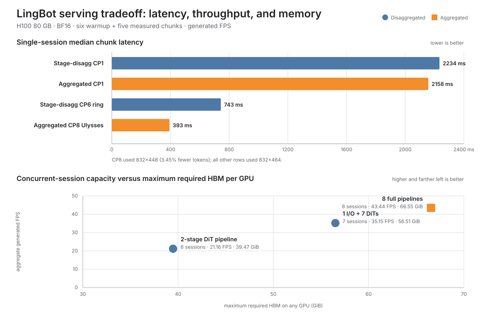

<!--
SPDX-FileCopyrightText: Copyright (c) 2026 NVIDIA CORPORATION & AFFILIATES. All rights reserved.
SPDX-License-Identifier: Apache-2.0
-->

# LingBot disaggregated inference: experiment summary

## Executive conclusion

Disaggregation works, but it is not a general latency optimization for the
current LingBot interactive-video pipeline.

- **Minimum single-session latency:** use the aggregated CP8 pipeline. It
  reached **29.50 FPS** and **393.33 ms** median chunk latency. The comparable
  stage-disaggregated CP6 run reached 15.90 FPS and 743.27 ms.
- **Maximum eight-H100 throughput:** use eight independent aggregated workers
  when every GPU can hold the complete pipeline. They reached **43.44 aggregate
  FPS** across eight sessions.
- **Shared-stage, multi-session serving:** the optimized 1 I/O + 7 DiT layout
  reached **35.15 aggregate FPS** and 5.02 FPS per session. It is useful for
  independent stage scaling and session-affine placement, but it is slower than
  eight full replicas when those replicas fit.
- **Memory-constrained serving:** the double-buffered pipeline-parallel DiT
  reduced the largest DiT rank to **39.47 GiB** and node-wide HBM to 256.21 GiB
  for six sessions. The tradeoff is lower throughput: **21.16 aggregate FPS**.

The chart deliberately separates single-session latency from concurrent-session
capacity. Aggregate FPS from multiple sessions must not be interpreted as one
session's frame rate.

## What was implemented and tested

The original `generate()` operation was separated into stateful encoder, DiT,
and decoder stages. Each worker retains only its session-affine state:

- the encoder owns streaming VAE/camera state and produces I2V conditioning;
- the DiT owns the autoregressive KV cache and performs denoising/finalization;
- the decoder owns streaming VAE state and produces pixels.

Small control messages stay outside the tensor data path. Large tensors use
Mooncake RDMA between stages, while context-parallel and pipeline-parallel DiT
ranks use NCCL over NVLink/NVSwitch.

| Experiment | Purpose | Headline result | What it established |
| --- | --- | ---: | --- |
| Three-stage CP1 | Prove encoder → DiT → decoder separation | 5.36 FPS, 2233.57 ms | Stage separation is functional; DiT dominates latency |
| Aggregated CP1 | Same-shape control without stage handoffs | 5.56 FPS, 2157.51 ms | Disaggregation added 76.05 ms, or 3.4%, to one session |
| Stage-local CP4 Ulysses | Accelerate one session inside the DiT | 15.70 FPS, 754.41 ms | CP can accelerate a session, with 78.2% scaling efficiency |
| Stage-local CP6 ring | Use all six available DiT ranks | 15.90 FPS, 743.27 ms | Two extra ranks barely beat CP4 because ring efficiency fell to 53.2% |
| Aggregated CP8 Ulysses | Minimum-latency eight-GPU control | 29.50 FPS, 393.33 ms | Whole-pipeline CP is the measured latency winner |
| 1 encoder + 6 DiTs + 1 decoder | Scale independent sessions | 27.20 aggregate FPS | Replicated session-affine DiTs scale concurrent capacity |
| 1 co-located I/O + 7 DiTs | Use all eight GPUs and overlap transfers | 35.15 aggregate FPS | Pooling, asynchronous handoff, and the seventh DiT improved capacity |
| Eight full aggregated workers | Maximum-throughput control | 43.44 aggregate FPS | Replication wins when 66.55 GiB per GPU is available |
| Three 2-rank DiT pipelines | Reduce DiT memory per rank | 21.16 aggregate FPS, 39.47 GiB/rank | Pipeline sharding trades throughput for a lower memory floor |

The final pipeline experiment also replaced a fixed batch with a two-slot
double-buffered schedule. Stage 0 processes session N+1 while stage 1 processes
session N. Against a matched fixed-batch run, this raised throughput from 16.77
to **21.16 FPS** (+26.2%) and reduced median wave latency from 4286.95 to
**3401.46 ms** (-20.7%) without increasing peak HBM.

## Measured serving tradeoffs

### One interactive session

| Topology | GPUs used | Generated FPS | Median latency | Key caveat |
| --- | ---: | ---: | ---: | --- |
| Three-stage disaggregated CP1 | 3 | 5.36 | 2233.57 ms | Adds stage handoffs but does not parallelize DiT |
| Fully aggregated CP1 | 1 | 5.56 | 2157.51 ms | Complete pipeline requires 66.55 GiB at initialization |
| Stage-disaggregated CP4 Ulysses | 6 | 15.70 | 754.41 ms | Four GPUs cooperate on one DiT |
| Stage-disaggregated CP6 ring | 8 | 15.90 | 743.27 ms | More ranks, but lower CP efficiency |
| Fully aggregated CP8 Ulysses | 8 | **29.50** | **393.33 ms** | Measured at 832x448, 3.45% fewer tokens than the 832x464 runs |

Disaggregation itself did not reduce one-session latency. Context parallelism
did, but applying it to the entire aggregated pipeline was substantially faster
than reserving separate encoder and decoder GPUs.

### Concurrent sessions on one eight-H100 node

| Topology | Sessions | Aggregate FPS | FPS/session | Median wave | Maximum required HBM/GPU | Node HBM |
| --- | ---: | ---: | ---: | ---: | ---: | ---: |
| Three 2-rank DiT groups, double buffered | 6 | 21.16 | 3.53 | 3401.46 ms | **39.47 GiB** | **256.21 GiB** |
| 1 co-located I/O + 7 full DiTs | 7 | 35.15 | 5.02 | 2358.51 ms | 56.51 GiB | 415.02 GiB |
| Eight independent full pipelines | 8 | **43.44** | **5.54** | **2163.64 ms** | 66.55 GiB initialization | 532.38 GiB initialization |

The rows serve different session counts, so aggregate FPS is a node-capacity
metric rather than a strict per-request comparison. The direction is clear:
replication provides the best throughput, while deeper sharding lowers the
memory required by any one GPU.

## Transfer and scheduling findings

- Mooncake's reusable 256 MiB probe sustained about **42 GB/s**. The actual
  small-payload handoff time was dominated by registration, metadata, and
  control overhead rather than link bandwidth.
- Co-locating encoder and decoder, pooling registered buffers/tickets, and
  using asynchronous handoffs improved the same seven-DiT topology from 31.57
  to **35.15 FPS** (+11.4%). Pooling also eliminated observed registration
  lifetime errors.
- Pipeline-parallel DiT ranks sustained **344.40 GB/s** on the 256 MiB NVLink
  probe. The fixed schedule was compute-bubble limited, not bandwidth limited;
  double buffering recovered 26.2% throughput.
- Sending six direct CP input shards regressed CP6 from 15.90 to 12.70 FPS and
  raised input handoff to 174.23 ms. That path remains experimental.
- A NIXL transport adapter exists behind the same tensor descriptor/ticket
  contract, but the allocated image did not contain NIXL. No real NIXL GPU or
  RDMA performance is claimed.

## When disaggregation is useful

Use it when:

- the complete model and session cache cannot fit on the available GPU;
- many concurrent interactive sessions can keep multiple DiTs occupied;
- encoder, DiT, and decoder need independent scaling or fault isolation;
- session-affine placement can keep large KV/streaming caches resident;
- the deployment has verified RDMA, topology-aware placement, and stable
  registered-buffer lifetimes.

Avoid it when:

- one session needs the lowest possible interactive latency;
- the complete pipeline fits on every GPU and maximum throughput is the goal;
- traffic is sparse, so stage workers would remain idle;
- operational simplicity matters more than independent stage scaling.

## Limitations

1. Results are steady-state measurements on one eight-H100 NVSwitch node. They
   do not establish inter-node performance or behavior on smaller GPUs.
2. Six warmup chunks were excluded to cover compilation, autotuning, cache
   fill, and the block-5 cache-shape transition. Startup latency is not part of
   the headline numbers.
3. Most experiments use 832x464. Aggregated CP8 uses 832x448 because the larger
   token count is not divisible by eight; token throughput is the fairest CP6
   versus CP8 compute comparison.
4. Full autoregressive decode completed successfully, but there is no strict
   matched-seed visual-quality equivalence study across all topologies.
5. Benchmarks use fixed shapes, sticky session placement, and synchronized
   waves. A production queue with variable arrival times and backpressure was
   not measured.
6. The two-stage DiT schedule still pays fill and drain costs during every
   denoise step and finalization. GPU 7 is unused in that topology.
7. Dynamo does not natively understand FlashDreams' encoder/DiT/decoder state
   or three-stage tensor contract. Integration requires custom stateful workers,
   a sticky session coordinator, and a direct NIXL/Mooncake tensor data plane.

## Deployment recommendation

Maintain separate, prewarmed pools instead of repartitioning a node at request
time:

| Status | Request class | Recommended topology | Reason |
| --- | --- | --- | --- |
| **Recommended** | Premium single-session latency | Aggregated CP8 | Fastest measured interactive chunk latency |
| **Recommended** | Maximum H100-node throughput | Eight aggregated CP1 workers | Highest measured aggregate and per-session FPS |
| **Useful opt-in** | Shared-stage concurrent serving | 1 I/O + 7 DiTs | Independent scaling and cache-affine routing with moderate memory savings |
| **Useful opt-in** | Memory-constrained GPUs | Pipeline-parallel DiT with double buffering | Lowest measured per-DiT-rank HBM; accept lower throughput |
| **Rejected** | Direct CP input sharding | Six direct Mooncake shards | 20.1% lower FPS and 174.23 ms input handoff |
| **Deferred** | NIXL production data plane | NIXL/UCX adapter | Requires real GPU, GPUDirect RDMA, and inter-node validation |
| **Deferred** | Strict quality acceptance | Matched-seed decoded comparison | Full rollouts passed, but topology-wide visual equivalence was not measured |

Kubernetes can deploy these fixed worker groups. Dynamo becomes valuable at
larger scale for worker discovery, cache-aware routing, autoscaling signals,
cancellation, and graceful shutdown. It does not provide the FlashDreams stage
split or make the video model faster by itself.

## Evidence and reproduction

The consolidated machine-readable values are in
[disaggregation_experiment_summary.json](disaggregation_experiment_summary.json).
Exact commands, commits, Slurm jobs, environments, warmup policies, and raw
records are retained in the individual benchmark reports:

- [three-stage CP1](benchmark_h100_3stage/README.md)
- [aggregated CP1](benchmark_h100_aggregated_cp1/README.md)
- [stage-local CP4](benchmark_h100_cp4_single_session/README.md) and
  [stage-local CP6](benchmark_h100_cp6_single_session/README.md)
- [aggregated CP8](benchmark_h100_aggregated_cp8/README.md)
- [six replicated DiTs](benchmark_h100_1e6d1d/README.md)
- [optimized seven-DiT serving](benchmark_h100_1io7dit_optimized/README.md)
- [eight independent aggregated workers](benchmark_h100_aggregated_8xcp1/README.md)
- [double-buffered pipeline-parallel DiT](benchmark_h100_pipeline_3x2/README.md)

The full chronological engineering record remains in
[disaggregated_inference_experiment.md](disaggregated_inference_experiment.md).
The three-stage API and direct tensor-data-plane design follow the
[LightX2V disaggregation study](https://light-ai.top/LightX2V-BLOG/posts/Disaggregation/).
