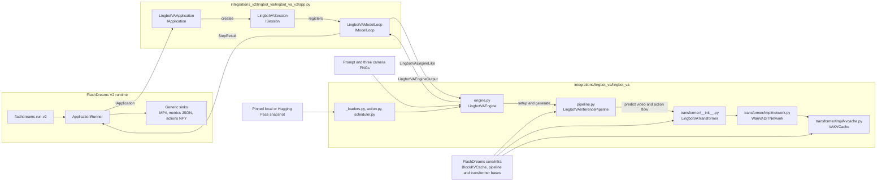
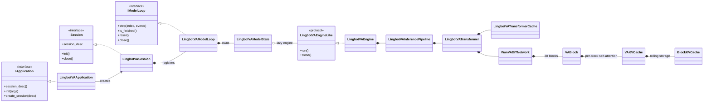
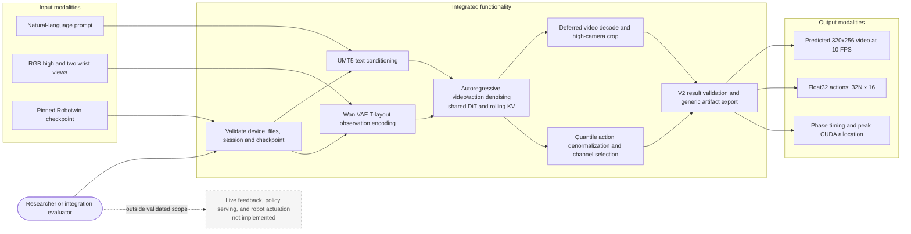

<!--
SPDX-FileCopyrightText: Copyright (c) 2026 Hongyu Zhou
SPDX-FileCopyrightText: Copyright (c) 2026 NVIDIA CORPORATION & AFFILIATES. All rights reserved.
SPDX-License-Identifier: Apache-2.0
-->

# LingBot-VA Robotwin I2AV

This workspace package implements the LingBot-VA dual video/action model. The
V2 application adapter lives in `integrations_v2/lingbot_va`; model code here
has no CLI, MP4, metrics-file, or action-file ownership.

The implementation transplants the useful model work from draft PR #312 and is
otherwise self-contained. CFG cache ownership, checkpoint loading, configuration
propagation, lifecycle, and output contracts were corrected for the V2 API. The
draft performance claims are intentionally omitted; only matched measurements
from the checked-in implementation are recorded below.

## Model card

### Identity and supported task

| Field | Integrated behavior |
| --- | --- |
| Model family | [LingBot-VA](https://arxiv.org/abs/2601.21998), an autoregressive diffusion video-action world-model policy with a shared video/action backbone |
| Checkpoint | [`robbyant/lingbot-va-posttrain-robotwin`](https://huggingface.co/robbyant/lingbot-va-posttrain-robotwin), pinned to `8c9dea8abbc5c91cc9e18bc3264b8915083bbe70` |
| Implemented task | Offline, batch-one Robotwin image-and-instruction to predicted video-and-action rollout (I2AV) |
| Input modalities | One natural-language prompt and three RGB camera PNGs: high, left wrist, and right wrist |
| Output modalities | Predicted high-camera video, 16 denormalized Robotwin action channels, and inference metrics |
| Core models | UMT5-XXL text encoder (4,096-wide states), Wan VAE (48 latent channels, 16x spatial and 4x temporal scaling), and the shared video/action DiT |
| DiT architecture | 5,088,872,670 parameters; 30 blocks; width 3,072; FFN width 14,336; 24 heads of width 128; `[1, 2, 2]` video patches |
| Chunk and cache geometry | Two latent frames per chunk; 240 video plus 32 action tokens; 36 rolling chunk slots per conditional/unconditional branch |
| Checkpoint footprint | About 22.7 GiB of resolved weight files (9.48 GiB transformer, 10.58 GiB text encoder, 2.63 GiB VAE), measured from the pinned snapshot |
| Runtime profile | BF16 on one CUDA device; optional `torch.compile` and component offload; one complete rollout per engine |
| License | This package is Apache-2.0. The [upstream repository](https://github.com/Robbyant/lingbot-va) and published checkpoint model card also identify Apache-2.0; users remain responsible for checkpoint and dataset terms. |

### Provenance, data, and evaluation boundary

- The architecture and inference behavior are ported from
  [`Robbyant/lingbot-va@7c6ffa9`](https://github.com/Robbyant/lingbot-va/tree/7c6ffa9bfc4b83582cafc860fab4c82cc7deeeeb).
- The upstream project identifies
  [`robotwin-clean-and-aug-lerobot`](https://huggingface.co/datasets/robbyant/robotwin-clean-and-aug-lerobot)
  as its cleaned and augmented RoboTwin post-training dataset. FlashDreams does
  not train, alter, or independently audit the checkpoint or dataset.
- The upstream [paper](https://arxiv.org/abs/2601.21998) reports simulated and
  real-robot results. This integration has not reproduced task success rates;
  the evidence below establishes native-flow parity, output contracts, and
  system execution on the pinned checkpoint.

### Intended use and safety boundary

| Intended and validated | Outside this integration's validated scope |
| --- | --- |
| Research and development of offline Robotwin video/action rollout inference | Direct, unattended, or safety-critical robot actuation |
| Numerical parity, lifecycle, packaging, and V2 runtime regression testing | Claims of physical accuracy, task success, or safe action execution |
| Generating inspectable MP4, NumPy action, and JSON metric artifacts | Training, fine-tuning, LIBERO checkpoints, multi-GPU/FSDP, or online serving |

Predicted actions can be wrong, temporally inconsistent, or unsafe. This port
starts from one fixed camera observation and does not implement the upstream
closed-loop observation feedback or asynchronous motor-execution system.
Distribution shift, camera calibration, prompt ambiguity, and accumulated
autoregressive error can affect both modalities. Evaluate in simulation or a
hardware-interlocked environment with task-specific limits and human oversight
before considering any physical use.

## Install and run

From the repository root:

```bash
uv sync --project integrations_v2/lingbot_va

uv run --project integrations_v2/lingbot_va flashdreams-run-v2 \
    lingbot-va-robotwin-i2av \
    --mode mp4 \
    --output-path outputs/lingbot_va/demo.mp4 \
    --stats-path outputs/lingbot_va/metrics.json \
    --tensor-artifact-dir outputs/lingbot_va \
    -- \
    --checkpoint-root robbyant/lingbot-va-posttrain-robotwin \
    --checkpoint-revision 8c9dea8abbc5c91cc9e18bc3264b8915083bbe70 \
    --input-image-dir /path/to/robotwin-images \
    --num-chunks 10
```

`--input-image-dir` is required; this repository does not bundle example
images. Use `--no-compile` for correctness debugging and `--enable-offload`
when GPU memory is constrained.
`flashdreams-run-v2 lingbot-va-robotwin-i2av -- --help` lists every model
override.

The tested dependency window is Diffusers 0.38.x and Transformers 5.x. The
engine uses private Wan VAE streaming fields, so widening the Diffusers range
requires a real-model retest.

## Inputs and checkpoints

The input directory must contain exactly named Robotwin camera files:

- `observation.images.cam_high.png`
- `observation.images.cam_left_wrist.png`
- `observation.images.cam_right_wrist.png`

The high camera is encoded at 256x320. Each wrist camera is encoded at 128x160,
and their latents form the upper bar of the upstream Robotwin T layout.

The measured runs used the unmodified examples from
`robbyant/lingbot-va@7c6ffa9bfc4b83582cafc860fab4c82cc7deeeeb`,
under `example/robotwin/`. Their upstream introduction commit is
`5ed0eb32046b34fe5c14f929d81e87ab6ebe02ef`.

| File | SHA-256 |
| --- | --- |
| `observation.images.cam_high.png` | `78cab76d394114ba912f882ac9b00ddc017f98c946482cb9267c87de82486b72` |
| `observation.images.cam_left_wrist.png` | `fbe55b713e1b3d4505fda6be3b00132213ee1725a78cb357ed2bbd5b3a3a7a93` |
| `observation.images.cam_right_wrist.png` | `b9e6821b38073567232f6dd8f6389b123d09d3d1a70758c27d388e547e228249` |

`--checkpoint-root` accepts either a local snapshot containing
`transformer/`, `vae/`, `text_encoder/`, and `tokenizer/`, or a Hugging
Face repository ID optionally pinned with `--checkpoint-revision`. Existing
paths are always local. Prefix a missing relative local path with `./` so it
fails locally rather than being interpreted as a repository ID. Component
loads use one resolved root, explicit subfolders, and `local_files_only=True`.

## V2 outputs

One model step returns the complete rollout:

- video: float tensor `[time, 3, 256, 320]`, range `[-1, 1]`, 10 FPS;
- `actions`: float tensor artifact `[step, channel]`;
- timing and peak-allocation metrics.

Each chunk produces two latent frames and 32 action steps. Wan temporal decoding
turns `2N` accumulated latent frames into `8N - 3` pixel frames. The decoded
T layout is cropped to its 256x320 high-camera view. Actions contain 16 selected
Robotwin channels in the order `0..6, 28, 7..13, 29`.

MP4, JSON, and NumPy serialization belong to generic V2 runtime sinks. The
adapter declares `actions[step, channel]` once and attaches the tensor to its
single model-result channel. Backpressure and presentation policies selected by
the runtime are preserved; the fixed video layout, dimensions, rate, and
artifact schema are validated.

## Architecture design review

The architecture keeps model-specific numerical code in
[`integrations/lingbot_va`](.) and the FlashDreams V2 protocol adapter in
[`integrations_v2/lingbot_va`](../../integrations_v2/lingbot_va). Generic
runtime code has no LingBot-specific branches.

### Goals and key decisions

| Decision | Rationale and consequence |
| --- | --- |
| Separate model and V2 adapter packages | The model package owns checkpoint/model/tensor behavior; `app.py` owns only V2 contracts and lifecycle adaptation. |
| Declare the natural session before model initialization | CLI/runtime compatibility and output schemas fail fast without loading approximately 23 GiB of checkpoint data. |
| Session-owned, lazily created engine | Mutable CUDA state is isolated to the model thread and reset creates a fresh one-run engine. |
| One complete rollout per `StepResult` | Decode requires destructive DiT/KV teardown, so per-chunk presentation would claim a streaming capability the engine does not provide. |
| Separate conditional/unconditional caches | CFG branches never contaminate one another; inactive stream CFG is skipped except on the terminal cache-commit pass. |
| Plain tensors across the compiled block boundary | Cache extraction and writes remain eager while the 30-block video/action loops can be compiled without cache-object graph breaks. |
| Generic runtime sinks | The adapter returns TCHW video, metrics, and a typed `actions` artifact; MP4/JSON/NumPy serialization stays reusable. |

### Static view: packages and components



The only adapter-to-model interface needed by CPU stand-ins is
`LingbotVAEngineLike.run() -> LingbotVAEngineOutput` plus `close()`. The
production engine is therefore replaceable in lifecycle and contract tests
without importing or constructing the checkpoint.

### Static view: class and interface ownership



### Use cases, modalities, and functionality



### Dynamic view: one V2 rollout

```mermaid
sequenceDiagram
  autonumber
  actor User
  participant R as ApplicationRunner
  participant A as LingbotVAApplication
  participant S as LingbotVASession / ModelLoop
  participant E as LingbotVAEngine
  participant P as LingbotVAInferencePipeline
  participant T as LingbotVATransformer / DiT
  participant V as UMT5 / Wan VAE
  participant O as Generic output sinks

  User->>R: run slug, runtime flags, and model flags
  R->>A: session_desc() then init(model args)
  A->>A: validate fixed contract, device, inputs, prompt, checkpoint reference
  R->>A: create_session(requested SessionDesc)
  A-->>R: session preserving runtime backpressure/presentation
  R->>S: init() and step(0)
  S->>E: lazily construct engine and run()
  E->>V: load tokenizer, UMT5, and Wan VAE; encode prompt/cameras
  E->>P: initialize conditional and optional unconditional caches

  loop chunk 0 through N-1
    E->>P: generate(chunk, observation latent, action mask)
    P->>T: cache.start(chunk)
    loop video schedule: 25 updates plus terminal persist
      P->>T: predict_flow(noisy video, persist=last)
      T->>T: conditional DiT forward
      opt video guidance > 1 or terminal persist
        T->>T: unconditional DiT forward
      end
    end
    loop action schedule: 50 updates plus terminal persist
      P->>T: predict_action_flow(noisy action, current video KV, persist=last)
      T->>T: conditional DiT forward
      opt action guidance > 1 or terminal persist
        T->>T: unconditional DiT forward
      end
    end
    P->>T: commit combined video/action KV and finalize chunk
    P-->>E: two latent frames and 32 action steps
    E->>E: move completed chunk outputs to CPU
  end

  E->>E: drop caches, DiT, text owners; collect; empty CUDA cache
  E->>V: decode all latent frames, crop high camera, release VAE
  E-->>S: video, denormalized actions, metrics
  S-->>R: one validated StepResult
  R->>O: route video, metrics, and typed actions artifact
  R->>S: close()
  S->>E: idempotent close()
```

### Data and tensor contracts

Let `N` be `--num-chunks` (positive, default 10). Batch size is fixed at one.

| Boundary | Shape and semantics |
| --- | --- |
| Prompt encoding | token ids `[1, 512]` to padded UMT5 states `[1, 512, 4096]`; an empty negative prompt is encoded when either CFG scale is active |
| Observation encoding | high view 256x320 plus two 128x160 wrist views arranged as a T; normalized latent `[1, 48, 1, 24, 20]` |
| Video working chunk | BF16 latent `[1, 48, 2, 24, 20]`; `[1, 2, 2]` patching produces 240 video tokens |
| Action working chunk | BF16 `[1, 30, 2, 16, 1]`; 32 action tokens; unused model channels are masked |
| Self-attention cache | per block and CFG branch, K/V up to `[1, 9792, 24, 128]` = 36 slots x (240 video + 32 action tokens) |
| Engine aggregate | latent `[1, 48, 2N, 24, 20]`; selected denormalized actions `[32N, 16]` on CPU |
| V2 result | floating TCHW video `[8N - 3, 3, 256, 320]` in `[-1, 1]`, float32 `actions[32N, 16]`, numeric phase metrics |

### Lifecycle and memory phases

Each session owns one `LingbotVAEngine`; the application owns only immutable
configuration and an engine factory. The successful engine state machine is
`NEW -> RUNNING -> FINISHED -> CLOSED`. Calling `run` outside `NEW` is an
error. Any inference failure triggers cleanup and transitions to `CLOSED`.

VAE decoding cannot fit beside the complete DiT, text encoder, and KV footprint
on the supported capacity path. Generation therefore releases denoising state
before moving the VAE to the decode device. This transition is destructive, so
the adapter emits one honest long model step rather than claiming per-chunk
interactive presentation. Reset closes the current engine; the next step lazily
creates a fresh one. Close is idempotent, and cleanup errors do not replace an
earlier inference failure.

| Phase | GPU/active | CPU/host | Released at boundary |
| --- | --- | --- | --- |
| load | DiT; optionally VAE/T5 | tokenizer; offloaded components | partial state on failure |
| encode | T5 and VAE as needed | three input PNGs | prompt/observation temporaries |
| denoise | DiT, CFG caches, latent/action state | completed chunks | per-step temporaries |
| teardown | VAE after transfer | DiT/T5/tokenizer references | KV and denoising state |
| decode | VAE plus one decoded frame | output frames/actions | VAE cache and GPU frames |
| finished | none | returned video/actions/metrics | all model components |

### Cache and ownership invariants

- The default scales are video 5 and action 1. Video evaluates both CFG
  branches; action skips its unconditional branch on intermediate denoise steps
  but runs both branches on the terminal persist pass so their caches advance.
- Conditional and unconditional branches own distinct self-attention, text, and
  current-video KV. Action attention receives committed history followed by the
  matching branch's current-video KV and then its fresh action tokens.
- `cache.start()` rolls before denoising and excludes the stale trailing write
  region. Terminal video writes provisional KV, terminal action overwrites the
  full video/action slot, and `finalize()` advances bookkeeping exactly once.
- The upstream attention setting of 72 frames becomes 36 two-frame chunk slots,
  or 9,792 tokens per block and branch.

Deliberate exclusions are the V1 runner, application-owned output files,
application-owned model components, multi-GPU/FSDP claims, live RoboTwin
control, unmeasured speedup claims, and root CUDA/Torch policy changes.

## Validation evidence

Baseline parity and matched resident/offload evidence were produced on
2026-08-25; final stacked-PR revalidation was produced on 2026-08-26. All runs
used an NVIDIA RTX PRO 6000 Blackwell Workstation Edition (97,887 MiB), driver
595.84, PyTorch 2.12.1+cu130, CUDA 13.0, BF16, one CUDA device, and seed 42.
This is implementation evidence, not a general model-performance or robot-task
success claim.

The official checkpoint revision
`8c9dea8abbc5c91cc9e18bc3264b8915083bbe70` contained 841 transformer entries.
Two obsolete `patch_embedding.*` entries are deliberately dropped. All 839
remaining keys map bijectively to the 839 native entries, producing a
5,088,872,670-parameter transformer under strict loading.

### Upstream flow parity

`tools/compare_upstream.py` loads pinned upstream and native transformers
sequentially, then drives the same first-chunk video and action tensors through
the same cache lifecycle. Acceptance gates are maximum absolute error <= 0.07
and mean absolute error <= 0.012 for each stream.

| Native mode | Stream | Maximum absolute error | Mean absolute error | RMS error |
| --- | --- | ---: | ---: | ---: |
| eager | video | 0.04296875 | 0.00751040 | 0.00951632 |
| eager | action | 0.06250000 | 0.00875314 | 0.01267146 |
| compiled | video | 0.05468750 | 0.00970979 | 0.01229867 |
| compiled | action | 0.06250000 | 0.01116651 | 0.01560142 |

The comparison exposed an action-attention defect: current-video KV was passed
into the native action block loop but omitted from attention. Before the fix,
action maximum/mean errors were 1.015625/0.203186. The table records the fixed
behavior, now covered by CPU cache regressions.

```bash
PYTHONPATH=flashdreams:integrations/lingbot_va \
python integrations/lingbot_va/tools/compare_upstream.py \
    --checkpoint-root /path/to/resolved/snapshot \
    --upstream-root /path/to/robbyant-lingbot-va-7c6ffa9 \
    --compile-native \
    --maximum-video-error 0.07 --mean-video-error 0.012 \
    --maximum-action-error 0.07 --mean-action-error 0.012
```

### Real multi-chunk V2 run

Matched resident and offloaded two-chunk runs used default CFG, 25 video steps,
50 action steps, and no compilation. Both produced finite BF16 video
`[13, 3, 256, 320]`, finite float32 actions `[64, 16]`, distinct chunk means
0.179792 and 0.333868, a valid 13-frame 320x256 10 FPS H.264 MP4, and
byte-identical resident/offload outputs.

| Artifact | SHA-256 |
| --- | --- |
| `demo.mp4` | `df0c193137a673f4f8d6b2372b4bf7afc01a9937c4280b7fa5a51912b5e93c1a` |
| `actions.npy` | `463b307b667c1ca13a47bbbc5a17f68604621dfe3c3a10fc5860077216928d95` |

| Mode | Prompt | Observation | Denoise | Decode | Total | Peak allocation |
| --- | ---: | ---: | ---: | ---: | ---: | ---: |
| resident | 0.240 s | 0.221 s | 4.735 s | 0.260 s | 33.220 s | 40.35 GiB |
| offload | 5.055 s | 0.776 s | 4.744 s | 0.429 s | 34.009 s | 37.07 GiB |

After close, only the process CUDA allocator context remained (about 0.031
GiB). A separate complete compiled one-chunk run returned finite
`[5, 3, 256, 320]` video and `[32, 16]` actions. Cold compilation is excluded
from the timing table and no speedup claim is made.

Run the opt-in production test with explicit input images:

```bash
LINGBOT_VA_REAL_MODEL_RUN=1 \
LINGBOT_VA_INPUT_DIR=/path/to/robotwin-images \
uv run --no-sync pytest integrations_v2/lingbot_va -m ci_gpu -s
```

Set `LINGBOT_VA_CHECKPOINT_ROOT` to reuse a local snapshot.
`LINGBOT_VA_REAL_MODEL_COMPILE_RUN=1` separately enables the cold compile test.

### Final stacked-PR revalidation

After the review fixes, the same pinned checkpoint and input hashes were run
through the final stacked code with two chunks, default CFG, offload, and no
compilation:

- GPU test: 1 passed in 34.02 s;
- MP4: H.264, 320x256, 10 FPS, 13 frames, SHA-256
  `15bcdc4307e080218255e83946c2c2e5dbc30f3b7acd26c8925167017234e586`;
- actions: float32 `[64, 16]`, finite, distinct chunks, SHA-256
  `463b307b667c1ca13a47bbbc5a17f68604621dfe3c3a10fc5860077216928d95`;
- peak allocation: 39,804,413,440 bytes (37.07 GiB).

The action hash exactly matches the earlier resident/offload parity run.

## Remaining limits and provenance

The current implementation supports one GPU, one complete deferred-decode
rollout, and Diffusers 0.38 private VAE streaming state. It makes no FSDP,
context-parallel, or per-chunk presentation claim.

- Architecture and inference source:
  [`Robbyant/lingbot-va@7c6ffa9`](https://github.com/Robbyant/lingbot-va/tree/7c6ffa9bfc4b83582cafc860fab4c82cc7deeeeb).
- Model description and evaluation source:
  [LingBot-VA paper](https://arxiv.org/abs/2601.21998).
- Checkpoint:
  [`robbyant/lingbot-va-posttrain-robotwin@8c9dea8`](https://huggingface.co/robbyant/lingbot-va-posttrain-robotwin/tree/8c9dea8abbc5c91cc9e18bc3264b8915083bbe70).
- Post-training data named by upstream:
  [`robotwin-clean-and-aug-lerobot`](https://huggingface.co/datasets/robbyant/robotwin-clean-and-aug-lerobot).
- Initial FlashDreams draft source: PR #312 at
  `f98cae4a18ddf6c189a6cfa2099265d6d570e337`.
