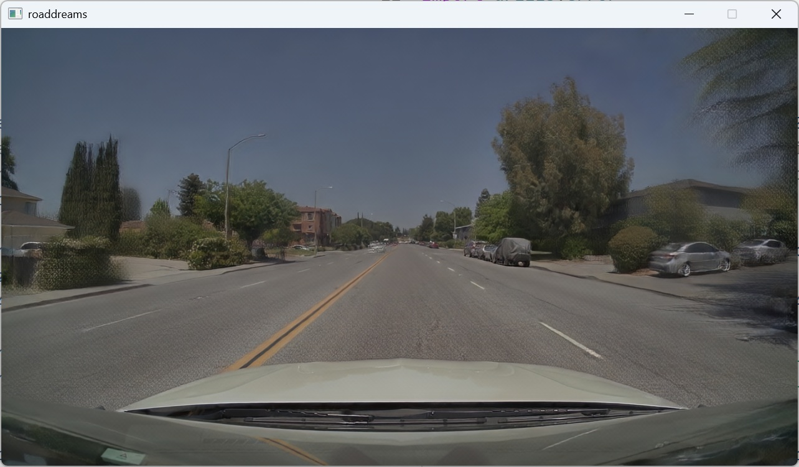

# interactive-drive

Interactive NVIDIA OmniDreams demo with keyboard or steering-wheel controls.
Run these commands from the FlashDreams workspace root.



## Prerequisites

Install the repository prerequisites from the
[FlashDreams README](../../../../README.md). Set `HF_TOKEN` to a token with
access to `nvidia/omni-dreams-scenes` and `nvidia/omni-dreams-models`:

```bash
export HF_TOKEN=<your-token>  # Linux
```

```powershell
$env:HF_TOKEN = "<your-token>"  # Windows PowerShell
```

For the Linux container setup, see the
[Docker README](../../../../docker/README.md).

## Commands

```bash
#  installs the demo; required once.
uv sync --package flashdreams-omnidreams --extra interactive-drive

#stages the default scene, prewarms model assets, and syncs native sources; required for
#omnidreams-perf`, otherwise optional.
uv run --package flashdreams-omnidreams omnidreams-prepare --perf

# launches the default interactive configuration; required to run the demo.
uv run --package flashdreams-omnidreams flashdreams-run omnidreams local-window

# launches the prepared performance configuration; optional alternative.
uv run --package flashdreams-omnidreams flashdreams-run omnidreams-perf local-window --manifest configs/launch_manifest/omnidreams_local_window.yaml

# launches the prepared performance configuration with vulkan backend; optional alternative.
uv run --package flashdreams-omnidreams flashdreams-run omnidreams-perf local-window --manifest configs/launch_manifest/omnidreams_local_window_vulkan.yaml

# configures a wheel or game controller; optional.
uv run --package flashdreams-omnidreams interactive-drive-configuration

## Launch manifest

Copy `configs/launch_manifest/omnidreams_local_window.yaml` and adjust these
basic fields:

```yaml
schema_version: 1
runner: omnidreams-perf
mode: local-window

scenario:
  auto_start: true
  game_mode: true
  preload_scenes: false

output:
  world_model_manifest_path: ../../integrations/omnidreams/omnidreams/interactive_drive/configs/example_world_model_perf.yaml
  ludus_backend: vulkan  # cuda (default) or vulkan
  no_hud: false
```

Useful optional fields are `scenario.scene`, `scenario.disable_visual_flare`,
`scenario.no_wheel`, `output.stream_mjpeg`, and `output.bev`. Run
`uv run flashdreams-run omnidreams-perf local-window --help` for all model
options.

## Controls

- `W` / `S`: forward / reverse
- `A` / `D`: steer left / right
- Arrow keys: same as `W` / `A` / `S` / `D`
- `Space`: stop
- `1`: generated driving view
- `2`: HD-map conditioning view
- `3`: PhysX debug view
- `R`: reset rollout
- `X`: return to scene selection in HUD mode
- `Esc`: quit
