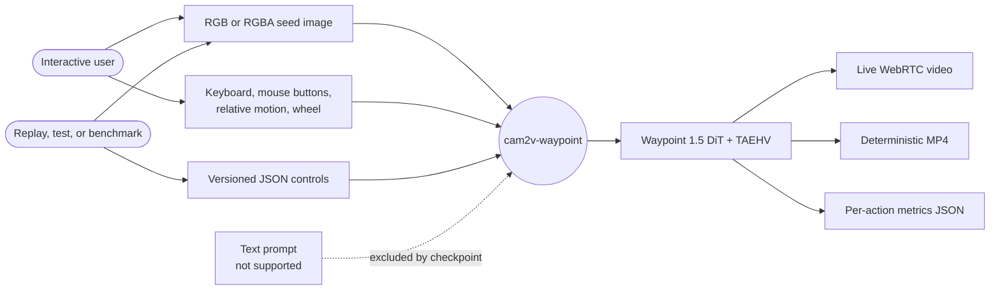
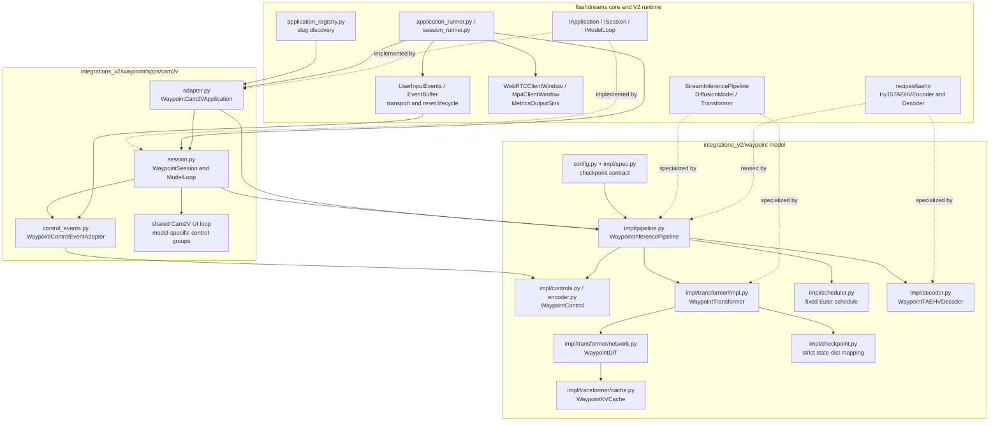
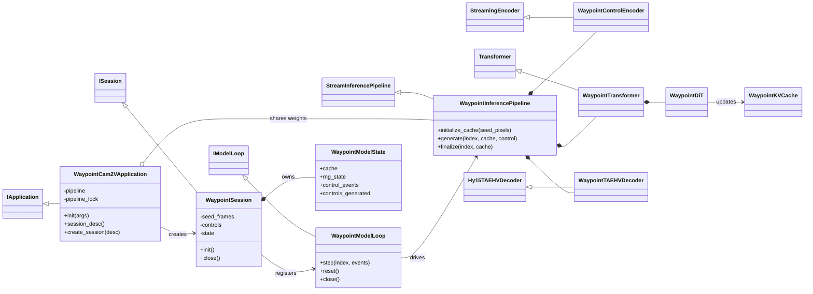
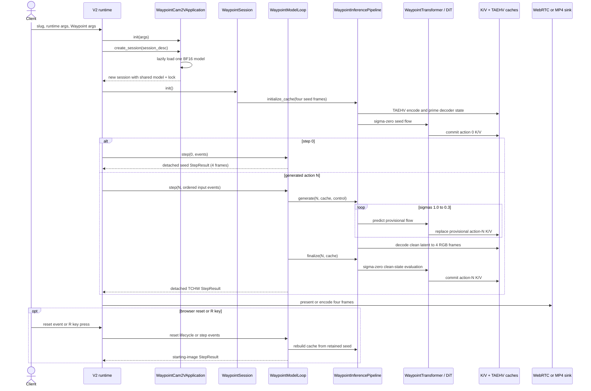

<!--
SPDX-FileCopyrightText: Copyright (c) 2026 NVIDIA CORPORATION & AFFILIATES. All rights reserved.
SPDX-License-Identifier: Apache-2.0
-->

# Waypoint 1.5 architecture

This package is the model layer for the published
[Overworld/Waypoint-1.5-1B](https://huggingface.co/Overworld/Waypoint-1.5-1B)
checkpoint. It implements checkpoint loading, controls, the autoregressive
diffusion pipeline, sparse K/V history, the shared TAEHV codec, and the
[Cam2V application binding](apps/cam2v/README.md). Model implementation lives
under `impl/`; CLI, session, input, and presentation code lives under
`apps/cam2v/`.

This document is the concise design-review reference. Exact validation commands,
hardware, parity metrics, and long-rollout evidence are recorded in
[VALIDATION.md](VALIDATION.md).

## Scope and decisions

| Area | Design |
|---|---|
| Model | Dense BF16 autoregressive DiT, 24 blocks, width 2048, 32 query heads, 16 K/V heads |
| Parameter accounting | Upstream model card: 1.2B; pinned BF16 checkpoint: 1,860,823,096 serialized tensor elements |
| Inputs | Four-frame image seed plus one keyboard/mouse/wheel control per action |
| Output | One 32-channel latent and four RGB frames per action |
| Denoising | Fixed four-step rectified-flow Euler schedule: 1.0, 0.9, 0.75, 0.3, 0.0 |
| History | Dense 16-action local window; sparse 128-action global horizon in every fourth block |
| Context | 128 latent actions / 512 presented RGB frames on global-attention blocks |
| Presentation | Native TAEHV canvas, 1024x512 TCHW in [-1, 1], four frames per result |
| State | Model weights shared by the application; cache, RNG, controls, and seed isolated per session |
| Concurrency | An application lock serializes shared model/RNG work; output tensors leave the model loop detached |

The published config has `prompt_conditioning: null`; this integration therefore
does not load a text encoder or expose a prompt. The generic upstream
`WorldEngine` has a `set_prompt` method for other configurations, but for this
checkpoint it does not instantiate a prompt encoder and `set_prompt` raises.
The pinned checkpoint also has no prompt or cross-attention tensor keys. A
prompt argument would therefore be ignored or rejected rather than condition
generation. The integration also does not currently implement the upstream
360P checkpoint, quantization, or multi-GPU execution.

## Use cases and modalities



The seed establishes visual state; it is not a continuing image-conditioning
stream. File controls select finite, reproducible MP4/metrics runs. Omitting a
control file selects an open-ended live session driven by V2 browser events.

## Component and file view



The package boundary is internal to one V2 integration: reusable model code
stays under `impl/` and imports no V2 runtime classes, while `apps/cam2v/` owns
the application, session, input mapping, and shared HUD configuration.

## V2 reuse and action-mapping boundary

The V2 runtime already provides device-neutral, timestamped input events;
event fan-out to model and UI loops; reset/focus lifecycle; WebRTC transport;
and generic presentation, MP4, and metrics sinks. It deliberately delivers raw
events to each model loop. It does not currently provide an action-to-video
application, a stateful action coalescer, or a protocol from user events to a
model's control object.

`WaypointControlEventAdapter` is therefore integration-owned. It contains two
seams that a later shared action-to-video package can separate:

1. A model-neutral accumulator can retain held key names and mouse-button
   indices, convert absolute pointer positions to relative normalized motion,
   collect wheel deltas, and clear state on focus loss or reset.
2. A model-owned mapper can convert that snapshot to Waypoint's Windows
   virtual-key vocabulary, apply canvas and sensitivity scaling, reduce the
   wheel to a ternary value, and construct `WaypointControl`. The existing
   `WaypointControlEncoder` remains responsible for control-to-tensor encoding.

The legacy `flashdreams.runtime.mapping.InputMapping` API is not a V2
dependency and should not be revived inside this integration. The shared
`apps/cam2v` HUD and presentation loop are reusable, but its keyboard-to-camera
trajectory resampling is a different semantic contract. A future
`apps/action2v`-style model loop should be extracted when a second interactive
world-model integration can validate the common snapshot, mapper, and replay
contracts. Until then, keeping the action adapter explicitly named and scoped
to Waypoint avoids freezing its virtual-key assumptions into V2.

## Class and ownership view



The application owns expensive immutable modules. A session owns all mutable
rollout state, including the transformer K/V cache, TAEHV state, seed tensors,
RNG state, and control adapter. `StepResult` tensors are detached before
publication so runtime queues and encoders do not retain model autograd state.

## Initialization and action sequence



The four denoise evaluations may overwrite only the current provisional slot.
`finalize` performs the separate sigma-zero evaluation that commits clean K/V
state for the next action. Skipping or reordering that transition changes the
autoregressive world state.

## Tensor and control contracts

| Boundary | Contract |
|---|---|
| Display seed | `[4, 3, 512, 1024]` TCHW float, normalized to `[-1, 1]` |
| Codec seed | `[B, 4, 3, 512, 1024]` float in `[0, 1]` |
| One model action | `[B, 1, 32, 32, 64]` latent before 2x2 patchification |
| DiT token stream | 512 tokens per action, width 2048 |
| Public control | 256-way multi-hot buttons, `mouse_dx`, `mouse_dy`, ternary wheel |
| Model result | `[4, 3, 512, 1024]` detached TCHW float in `[-1, 1]` |

The upstream runtime can resize a 1280x720 client image to the model's
1024x512 codec canvas and resize decoded frames back to 1280x720. FlashDreams
deliberately exposes the native 1024x512 canvas and performs no post-generation
spatial resample.

## Cache policy

Each action has 512 spatial tokens. Most transformer blocks retain the latest
16 actions densely. Global blocks occur at indices 3, 7, 11, 15, 19, and 23;
they span 128 actions but pin only every eighth historical action plus the
current action. On CUDA, fixed-capacity ring storage and a compiled
`FlexAttention` block mask avoid reallocating or concatenating history. CPU
tests use a compact dictionary representation as the readable reference.

During denoising the cache is frozen: repeated evaluations replace a tail slot
without advancing history. During seed establishment and `finalize`, it is
unfrozen so the clean action is committed exactly once.

## Control files

Pass a JSON action timeline with `--controls-file`. Every field within an
action is optional:

```json
{
  "schema_version": 1,
  "actions": [
    {"buttons": [32], "mouse_dx": 0.1, "mouse_dy": 0.0, "scroll_wheel": 0},
    {},
    {"buttons": [1, 32]}
  ]
}
```

`buttons` must contain IDs in `[0, 256)`; mouse values must be finite; wheel
is `-1`, `0`, or `1`. See
[ADR-1](ADR-1-control-events.md) for browser-event
mapping and reset/focus semantics.

## Review boundaries and known limitations

- One V2 application may create multiple sessions, but shared model execution
  is serialized. The current WebRTC server accepts one browser client.
- Reset is deterministic for a fixed seed and control sequence and rebuilds the
  cache without temporarily retaining two full GPU caches.
- The session advertises 60 FPS for playback pacing. Generation throughput is
  hardware- and stack-dependent; it is not guaranteed to sustain that rate.
- The integration preserves upstream model behavior, including possible
  long-rollout drift, unstable geometry, inconsistent objects, and implausible
  motion. It is not a physically accurate or safety-critical simulator.
- The shared Cam2V HUD and presentation loop are compatible with Waypoint;
  Cam2V's pose-matrix model loop is not, so raw action mapping remains local.

## Validation

CPU tests cover checkpoint contracts, controls, lifecycle, reset, detached
outputs, MP4 frame accounting, and session isolation. CUDA tests cover local
and global fixed-cache attention through ring wraparound. Published-weight
validation covers official-reference parity, 15 distinct scenes at 40 actions,
one 118-action rollout, native-resolution MP4 output, and steady-state
performance on an RTX PRO 6000 Blackwell.

See [the V2 validation record](VALIDATION.md) for
the exact revisions, hashes, commands, metrics, and acceptance evidence.
